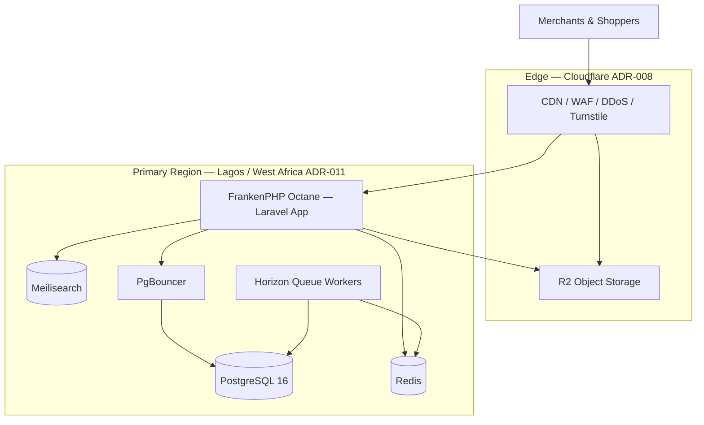

# Chapter 01: Infrastructure Overview

**Document ID:** SCP-INF-001-01  
**Version:** 1.0.0  
**Status:** 📝 Draft  
**Traceability:** ADR-001, ADR-008, ADR-011, NFR-013 – NFR-028, NFR-062 – NFR-071  

---

## 1. Purpose

Define the **official SCP infrastructure blueprint**: what runs where, how components connect, and how the platform evolves from a single Lagos-region Docker deployment to multi-region Kubernetes without architectural rewrites.

## 2. Scope

- High-level topology and component inventory
- Deployment phases (Docker → Kubernetes)
- SLO summary and operational ownership
- Cross-volume dependencies

## 3. Out of Scope

- Per-module resource sizing spreadsheets (see Chapter 11)
- Security control implementation detail (Volume 11)

## 4. User & Business Value

| Stakeholder | Value |
|-------------|-------|
| Merchants (Nigeria) | Low-latency storefronts, reliable checkout, data stays in Africa |
| Platform team | One deployable artifact; predictable ops at small scale |
| Compliance / Legal | Residency and subprocessor story aligned with NDPA (ADR-011) |
| Investors / partners | Clear scaling path without microservices tax at MVP |

## 5. Architecture Impact

SCP deploys as a **modular monolith** (ADR-001) with externalized stateful services. The application never stores durable data in Octane worker memory beyond request scope.

## 6. Component Inventory

| Component | Role | Phase 1 | Phase 4 |
|-----------|------|---------|---------|
| FrankenPHP + Laravel Octane | HTTP API, admin, SSR hooks | 1 VM | K8s Deployment (HPA) |
| PostgreSQL 16 | System of record, RLS tenancy | Single instance | Primary + replicas, PgBouncer pool |
| PgBouncer | Connection pooling | Co-located | Sidecar or dedicated pooler tier |
| Redis 7 | Cache, sessions, queues, rate limits | Single instance | Sentinel or managed cluster |
| Meilisearch | Product/content search | Single instance | Dedicated cluster or managed |
| Laravel Horizon | Queue supervision | Same VM as app | Separate worker Deployment |
| Cloudflare | CDN, WAF, DNS, TLS | Required | Required |
| Cloudflare R2 | Media, exports, static assets | Required | Multi-bucket per env/region |
| Docker Compose | Orchestration | Primary | Dev/staging only |
| Kubernetes | Orchestration | Not used | Production at scale |

## 7. Data Ownership

| Data | Owner Service | Storage |
|------|---------------|---------|
| Transactional commerce data | Laravel modules | PostgreSQL |
| Search indexes | Search sync jobs | Meilisearch |
| Session & cache | Application | Redis |
| Media & downloadable assets | Commerce/CMS modules | R2 |
| Audit logs | Platform security | PostgreSQL (immutable table) + cold archive |
| Metrics & traces | Observability pipeline | Prometheus / log store |

## 8. Deployment Phases

| Phase | Merchants | Infra Pattern | Trigger to Advance |
|-------|-----------|---------------|-------------------|
| **1 — MVP** | 0–500 | Single VM, Docker Compose | Sustained CPU > 70% or p95 API > 200 ms |
| **2 — Growth** | 500–5,000 | Multi-VM Docker, read replica | Queue lag p95 > 5 s or DB CPU > 60% |
| **3 — Scale** | 5,000–10,000 | LB + extracted workers | Need zero-downtime multi-AZ or > 3 app nodes |
| **4 — Enterprise** | 10,000+ | Kubernetes multi-region | Team ≥ 5 ops-capable engineers OR compliance requires multi-AZ SLA |

Full criteria: [Chapter 10](./10-scaling-path-kubernetes.md).

## 9. SLO Framework

Service Level Objectives bind infrastructure choices to measurable outcomes (NFR-021 – NFR-028).

| SLI | SLO Target | Owner |
|-----|------------|-------|
| Successful HTTP responses (non-5xx) / total | 99.9% monthly | Platform |
| Storefront LCP mobile p75 | ≤ 2.0 s | Platform + Frontend |
| API read p95 | ≤ 200 ms | Platform |
| API write p95 | ≤ 500 ms | Platform |
| Meilisearch autocomplete p95 | ≤ 100 ms | Platform |
| Horizon job time p95 | ≤ 5 s | Platform |
| Backup age | ≤ 6 hours | Platform |
| Restore time (DR drill) | ≤ 4 hours | Platform |

**Error budget policy:** When availability error budget is exhausted in a 30-day window, feature freezes prioritize reliability work until budget resets.

## 10. Security Considerations

- All public traffic terminates at Cloudflare (ADR-008); origin accepts Cloudflare IP ranges only
- Secrets never in Git (ADR-007); `.env` encrypted at rest on servers
- Tenant isolation extends to Redis keys, Meilisearch indexes, and R2 prefixes (Volume 11)
- Production SSH via bastion; no direct root login

## 11. Observability Requirements

Minimum Phase 1 instrumentation (NFR-062 – NFR-068):

- JSON structured logs with `trace_id`, `tenant_id`, `request_id`
- RED metrics (Rate, Errors, Duration) per route group
- Health endpoints: `/health` (liveness), `/ready` (readiness — DB, Redis, Meilisearch)
- Sentry for unhandled exceptions
- External synthetic checks from Lagos and Nairobi

Detail: [Chapter 08](./08-monitoring-observability.md).

## 12. Operational Implications

| Activity | Frequency | Tooling |
|----------|-----------|---------|
| Deploy to staging | Every merge to `main` | CI/CD (Chapter 06) |
| Deploy to production | Approved releases | CI/CD + manual gate |
| Backup verification | Weekly restore sample | Automated + runbook |
| DR tabletop | Quarterly | Chapter 09, 12 |
| Certificate renewal | Automatic | Cloudflare |
| Dependency updates | Weekly patch window | Dependabot + CI |

## 13. Risks & Tradeoffs

| Risk | Mitigation |
|------|------------|
| Single VM SPOF in Phase 1 | Accept for MVP; monitor uptime SLO; fast restore from backups |
| Octane memory leaks | Worker max-requests restart; memory limits in Docker |
| PgBouncer + RLS footgun | `SET LOCAL` only (ADR-005); CI isolation test |
| Cloudflare vendor coupling | Document egress path; R2 compatible with S3 API for migration |
| Lagos cloud capacity limits | Nearest West Africa fallback documented in RoPA |

## 14. Acceptance Criteria (Chapter)

- [ ] Architecture diagram reviewed and matches production Phase 1 topology
- [ ] All components in inventory have named owner and on-call escalation path
- [ ] SLO targets published to engineering dashboard
- [ ] Phase advancement triggers documented and agreed by Lead Architect

## 15. Related ADRs

- [ADR-001](../00-meta/adr/001-modular-monolith-over-microservices.md)
- [ADR-008](../00-meta/adr/008-edge-security-cloudflare.md)
- [ADR-011](../00-meta/adr/011-data-residency-africa.md)

## 16. Sources

- Laravel Octane: https://laravel.com/docs/octane
- FrankenPHP: https://frankenphp.dev/
- Cloudflare R2: https://developers.cloudflare.com/r2/
- C4 Model: https://c4model.com/
