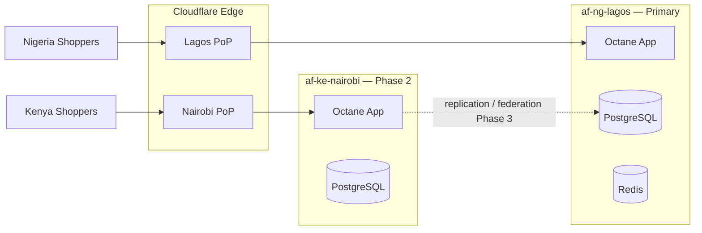

# Chapter 02: Cloud Architecture — Nigeria & Africa

**Document ID:** SCP-INF-001-02  
**Version:** 1.0.0  
**Status:** 📝 Draft  
**Traceability:** ADR-011, NFR-071, NFR-083 – NFR-085  

---

## 1. Purpose

Define **where SCP runs** and how traffic flows across Nigeria (primary), Kenya/East Africa, and future pan-African expansion — while meeting NDPA and Kenya DPA residency expectations.

## 2. Scope

- Logical and physical region model
- Provider selection criteria
- Network topology and latency targets
- Multi-region expansion path

## 3. Out of Scope

- Merchant custom domain DNS setup for individual stores (Volume 6 / ops runbook)
- EU/US GDPR-dedicated regions (Phase 3 — noted only)

## 4. Region Model

SCP uses **logical regions** mapped to physical deployments. This decouples product configuration from vendor-specific region codes.

| Logical Region | Code | Primary Use | Physical Placement |
|----------------|------|-------------|------------------|
| **Nigeria West** | `af-ng-lagos` | Default for all Phase 1 tenants | Lagos metro or nearest West Africa DC with ≤ 15 ms RTT to Lagos ISPs |
| **Kenya East** | `af-ke-nairobi` | KE merchants, M-Pesa latency | Nairobi / East Africa DC |
| **Ghana West** | `af-gh-accra` | Phase 2 expansion | Accra or shared West Africa pool |
| **Global Edge** | `cf-edge` | CDN, WAF, static cache | Cloudflare PoPs (incl. Lagos) |

**ADR-011 decision:** Production PostgreSQL, Redis, app compute, and primary backups default to **`af-ng-lagos`**.



## 5. Provider Selection Criteria

SCP evaluates hosting against evidence-weighted criteria (E1/E2), not brand preference alone.

| Criterion | Weight | Phase 1 Minimum |
|-----------|--------|-----------------|
| Round-trip latency Lagos p95 | 25% | ≤ 80 ms app origin from Lagos probe |
| NDPA-aligned data location | 25% | Compute + DB in Nigeria or documented West Africa equivalent |
| PostgreSQL 16 managed or self-hosted | 15% | Supported |
| Snapshot backup API | 10% | Automated, encrypted |
| Cost at 2 vCPU / 8 GB baseline | 10% | Within Phase 1 budget (Chapter 11) |
| Operational maturity (API, IAM) | 10% | Terraform/Ansible compatible |
| Egress pricing to Cloudflare | 5% | Predictable |

**Phase 1 acceptable patterns:**

1. **Nigerian or West African cloud VM** (e.g., local DC partners with Lagos presence) — preferred for NDPA narrative
2. **Hyperscaler nearest region** (e.g., South Africa, Europe) — only with legal transfer mechanism documented in RoPA; not default for production tenant data

```text
Assumption: Phase 1 uses a Lagos/West Africa VM provider meeting ≤ 80 ms Lagos p95.
Validation needed: Synthetic latency benchmarks from MTN, Airtel, Glo egress before GA.
```

## 6. Network Topology

### 6.1 Production Path

```text
Client → Cloudflare (TLS 1.3, WAF) → Origin (private IP or allowlisted CF IPs)
         ↓ cache HIT
         R2 / static assets
```

### 6.2 Internal Network (Phase 1)

All services on a private Docker network:

| Service | Internal Port | Exposed Publicly |
|---------|---------------|------------------|
| FrankenPHP Octane | 8000 | Via Cloudflare only |
| PostgreSQL | 5432 | No |
| PgBouncer | 6432 | No |
| Redis | 6379 | No |
| Meilisearch | 7700 | No |
| Horizon | — | No |

### 6.3 Latency Targets (Origin)

| Path | p95 Target |
|------|------------|
| Lagos user → Cloudflare edge | ≤ 30 ms |
| Cloudflare edge → Lagos origin | ≤ 50 ms |
| App → PostgreSQL (same AZ) | ≤ 5 ms |
| App → Redis | ≤ 2 ms |
| App → Meilisearch | ≤ 10 ms |

## 7. Africa Expansion Strategy

| Market | Phase | Infrastructure |
|--------|-------|----------------|
| **Nigeria** | 1 (GA) | Full stack in `af-ng-lagos` |
| **Kenya** | 2 | `af-ke-nairobi` stack; KE tenant routing |
| **Ghana** | 2 | Route to West Africa pool or dedicated micro-region |
| **South Africa** | 3 | Optional `af-za` for enterprise |
| **EU / US** | 3 | GDPR enterprise tier (NFR-072) |

**Tenant routing rule:** Tenant `primary_region` field determines data placement and default origin. Custom domains CNAME to Cloudflare; geo-steering optional in Phase 2.

## 8. Cross-Border Data Flows

Per ADR-011 and NFR-083:

| Flow | Subprocessor | Legal Basis |
|------|--------------|-------------|
| Edge security & CDN | Cloudflare (global) | NDPA §41 adequate safeguards; SCCs |
| Error tracking | Sentry (US/EU) | DPA + SCCs; no PII in stack traces |
| AI inference | Provider-specific | Documented in RoPA; tenant opt-in |
| Backups (DR copy) | Same vendor, secondary AZ/region | Encrypted; disclosed in RoPA |

All flows recorded in the **Cross-Border Transfer Register** (Volume 11).

## 9. DNS & Custom Domains

| Record Type | Purpose |
|-------------|---------|
| `A` / `AAAA` or `CNAME` | Platform apex → Cloudflare |
| `CNAME` | Merchant custom domain → Cloudflare proxy |
| `TXT` | Domain verification, SPF (transactional email) |

Cloudflare SSL mode: **Full (Strict)** with origin certificate or Let's Encrypt on origin.

## 10. Security Considerations

- Origin firewall: allow **Cloudflare IP ranges only** on 443
- Admin panel: optional Cloudflare Access or IP allowlist for platform staff
- No database ports on public internet
- VPC/private networking between app and data tier in Phase 2+

## 11. Observability Requirements

- Synthetic probes from **Lagos, Nairobi, Accra** (Phase 2)
- Per-region latency dashboard
- Alert when Lagos p95 origin latency exceeds 150 ms for 10 minutes

## 12. Failure Modes

| Failure | Impact | Response |
|---------|--------|----------|
| Lagos origin down | Nigeria merchants offline | Failover to DR snapshot in secondary AZ; RTO ≤ 4 h |
| Cloudflare outage (rare) | Global edge down | Status page; wait or emergency DNS bypass (runbook) |
| ISP routing issue Nigeria | Partial user impact | Cloudflare Argo / alternate PoP; communicate via status |

## 13. Acceptance Criteria

- [ ] Production resources tagged `region=af-ng-lagos`
- [ ] Latency probe from Lagos meets p95 ≤ 80 ms to origin
- [ ] Cross-border transfer register lists all Phase 1 subprocessors
- [ ] Kenya region architecture documented before KE merchant GA

## 14. Sources

- Nigeria NDPC: https://ndpc.gov.ng/
- Kenya ODPC: https://www.odpc.go.ke/
- Cloudflare Network Map: https://www.cloudflare.com/network/
- ADR-011: [Data Residency Africa](../00-meta/adr/011-data-residency-africa.md)
