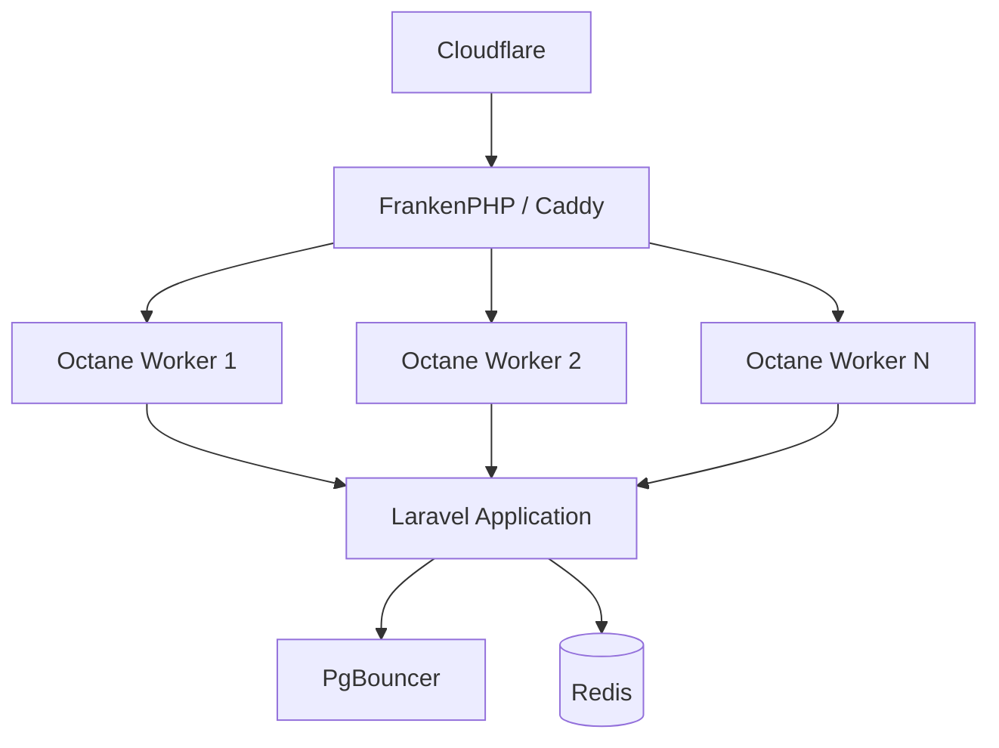

# Chapter 03: Compute — FrankenPHP & Octane

**Document ID:** SCP-INF-001-03  
**Version:** 1.0.0  
**Status:** 📝 Draft  
**Traceability:** ADR-001, NFR-003, NFR-004, NFR-017, NFR-059  

---

## 1. Purpose

Specify how SCP serves HTTP traffic using **Laravel Octane with FrankenPHP** — the default production runtime that delivers 2–10× throughput over PHP-FPM while preserving Laravel developer ergonomics.

## 2. Scope

- Octane server selection (FrankenPHP)
- Worker model, memory, and lifecycle
- Docker image and Compose service definition
- Horizon queue workers (separate process model)
- Performance tuning and known Octane constraints

## 3. Out of Scope

- Frontend Next.js hosting (separate static/SSR tier or same origin — Volume 3)
- GPU workloads for AI (Phase 3 extraction)

## 4. Decision Summary

| Option | Verdict |
|--------|---------|
| **FrankenPHP + Octane** | ✅ Production default |
| PHP-FPM + Nginx | Dev fallback only |
| RoadRunner | Alternative; not selected (FrankenPHP integrates Caddy, HTTP/2, early hints) |
| Swoole | Rejected — extension compatibility friction with Laravel ecosystem |

Evidence: Laravel documents Octane with FrankenPHP as first-class server (E1). Benchmarks show sustained request handling without per-request bootstrap cost (E2).

## 5. Architecture



**Key principle:** Octane workers are **long-lived**. Application state must not leak between requests. Use Octane-safe patterns (`Octane::flush`, scoped singletons, no global mutable state).

## 6. Worker Configuration

### 6.1 Phase 1 Baseline (2 vCPU / 8 GB RAM VM)

| Setting | Value | Rationale |
|---------|-------|-----------|
| `OCTANE_SERVER` | `frankenphp` | ADR-001 performance path |
| Workers | `2 × CPU cores` (4 workers) | CPU-bound PHP; leave headroom for Redis/Meilisearch |
| `max_requests` | 500 | Mitigate memory drift |
| `task_workers` | 2 | Async Octane tasks |
| Memory limit per worker | 256 MB | OOM kill isolated worker |
| Request timeout | 30 s | API writes; storefront SSR may need 60 s for admin |

### 6.2 Environment Variables

```bash
OCTANE_SERVER=frankenphp
OCTANE_WORKERS=4
OCTANE_MAX_REQUESTS=500
FRANKENPHP_CONFIG=/etc/caddy/Caddyfile
APP_ENV=production
```

### 6.3 Docker Compose Service (Reference)

```yaml
services:
  app:
    image: scp/app:${GIT_SHA}
    command: php artisan octane:frankenphp --host=0.0.0.0 --port=8000 --workers=${OCTANE_WORKERS:-4} --max-requests=500
    ports:
      - "127.0.0.1:8000:8000"
    env_file: .env.production
    depends_on:
      pgbouncer:
        condition: service_healthy
      redis:
        condition: service_healthy
    healthcheck:
      test: ["CMD", "curl", "-f", "http://localhost:8000/health"]
      interval: 30s
      timeout: 5s
      retries: 3
    deploy:
      resources:
        limits:
          memory: 2G
    restart: unless-stopped
```

## 7. Horizon Queue Workers

HTTP Octane workers **must not** run long-blocking jobs. All async work goes through Redis queues supervised by Horizon.

| Queue | Workers Phase 1 | Notes |
|-------|-----------------|-------|
| `default` | 2 | General jobs |
| `notifications` | 1 | Email, SMS, push |
| `webhooks` | 2 | Outbound merchant webhooks |
| `search` | 1 | Meilisearch index sync |
| `billing` | 1 | Invoices, usage metering |

Horizon runs as a **separate container** with same app image, different command:

```yaml
horizon:
  image: scp/app:${GIT_SHA}
  command: php artisan horizon
  depends_on: [redis, pgbouncer]
```

## 8. Octane Compatibility Rules

Engineering standards (EDR — future) enforce:

| Rule | Reason |
|------|--------|
| No static properties that accumulate request data | Memory leak / data bleed |
| Flush scoped instances in `OctaneServiceProvider` | Stale tenant context |
| Re-bind `SET LOCAL app.tenant_id` each request | ADR-005 |
| Avoid `die()`, `exit()`, `dd()` in production code | Kills worker |
| File uploads stream to R2; no large in-memory buffers | Worker memory |
| Use database transactions per request for tenant DB work | RLS correctness |

## 9. Health & Readiness

| Endpoint | Checks | Use |
|----------|--------|-----|
| `GET /health` | Process alive | Liveness |
| `GET /ready` | PostgreSQL, Redis, Meilisearch connectivity | Readiness / deploy gate |

Readiness failure removes instance from load balancer during deploy or dependency outage.

## 10. Performance Targets

| Metric | Target | Measurement |
|--------|--------|-------------|
| API read p95 | ≤ 200 ms | NFR-003 |
| API write p95 | ≤ 500 ms | NFR-004 |
| Throughput Phase 1 | ≥ 100 req/s sustained | Load test |
| Octane worker restart | < 2 s | Deploy metric |

## 11. Deployment & Graceful Shutdown

1. CI builds immutable image tagged with Git SHA
2. New container starts; `/ready` must pass
3. Old container receives SIGTERM; Octane `--watch` disabled in prod
4. Drain period: 30 s max (configurable)
5. Rollback: redeploy previous SHA tag (< 5 min)

Zero-downtime required from Phase 2 (NFR-028).

## 12. Security Considerations

- Run container as non-root user (`www-data` or dedicated `scp`)
- Read-only filesystem except `/tmp` and explicit cache dirs
- No PHP `eval`, disable dangerous functions in `php.ini`
- OPcache enabled; validate timestamps off in production

## 13. Observability

- Log worker PID and request ID per line
- Metric: `octane_worker_restarts_total`
- Metric: `http_request_duration_seconds` histogram by route
- Alert: worker restart rate > 10/hour

## 14. Failure Modes

| Symptom | Cause | Fix |
|---------|-------|-----|
| 502 after deploy | Readiness fail | Check DB/Redis; rollback |
| Rising memory | Leaking singleton | Lower max_requests; fix provider flush |
| Stale tenant data | Missing Octane flush | Hotfix + isolation test |
| Slow API | Worker saturation | Scale workers or horizontal replicas |

## 15. Acceptance Criteria

- [ ] Production uses FrankenPHP Octane; PHP-FPM absent from prod Compose/K8s manifests
- [ ] Load test: 100 req/s for 10 min with p95 read ≤ 200 ms on staging
- [ ] Worker max_requests restart verified in logs
- [ ] `/ready` fails when PostgreSQL stopped; deploy gate blocks promotion
- [ ] Horizon processes jobs independently of Octane worker count

## 16. Sources

- Laravel Octane FrankenPHP: https://laravel.com/docs/octane#frankenphp
- FrankenPHP docs: https://frankenphp.dev/docs/
- ADR-001: Modular monolith performance implications
