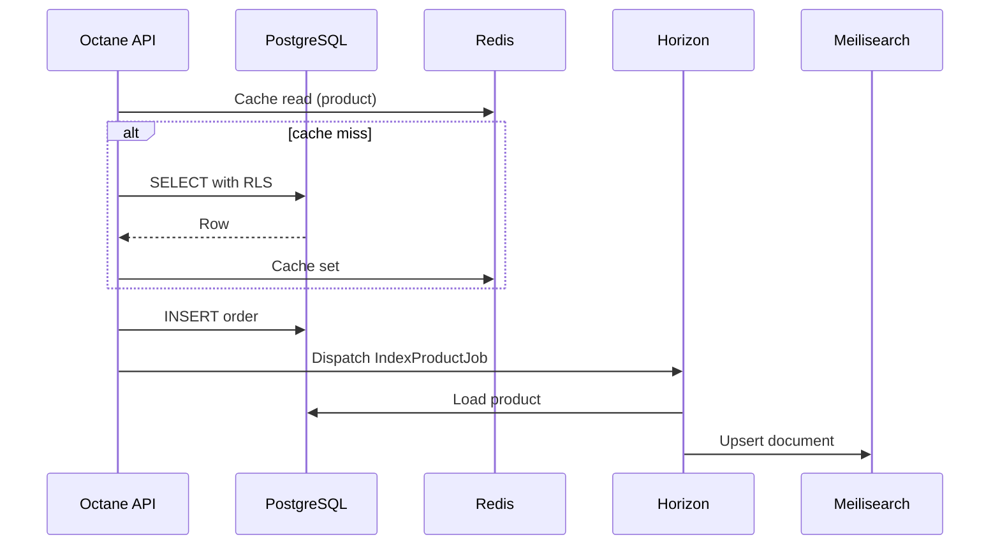

# Chapter 04: PostgreSQL, Redis & Meilisearch

**Document ID:** SCP-INF-001-04  
**Version:** 1.0.0  
**Status:** 📝 Draft  
**Traceability:** ADR-002, ADR-005, NFR-005, NFR-007, NFR-019, NFR-040, NFR-060  

---

## 1. Purpose

Define operational standards for SCP's **stateful data services**: PostgreSQL (system of record), Redis (cache/queue/session), and Meilisearch (tenant-scoped search).

## 2. Scope

- Sizing, configuration, and high availability per phase
- Tenant isolation at each layer
- Backup hooks and connection pooling
- Index design and sync pipeline overview

## 3. Out of Scope

- Full schema design (Volume 16)
- SQL migration authoring process (Volume 13)

---

## 4. PostgreSQL 16

### 4.1 Role

Single shared database with **Row-Level Security** (ADR-002) for tenant isolation. All commerce, marketplace, CMS, and platform entities live here unless extracted in Phase 3+.

### 4.2 Phase Configuration

| Phase | Topology | Storage |
|-------|----------|---------|
| 1 | Single primary | 100 GB SSD, autoscale |
| 2 | Primary + 1 read replica | Replica for reporting/analytics reads |
| 3 | Primary + 2 replicas, PgBouncer pool | Connection pool 200 → 20 DB conns |
| 4 | Managed HA or Patroni cluster | Multi-AZ |

### 4.3 PgBouncer (ADR-005)

| Setting | Value |
|---------|-------|
| Pool mode | `transaction` |
| Default pool size | 20 per user/db |
| Max client connections | 200 |
| Server reset query | `DISCARD ALL` |

**Mandatory application pattern:**

```sql
BEGIN;
SET LOCAL app.tenant_id = 'tenant_uuid';
-- queries
COMMIT;
```

Laravel middleware wraps request DB lifecycle. Queue workers re-assert from job payload.

### 4.4 PostgreSQL Tuning (Phase 1 — 8 GB RAM host)

```ini
shared_buffers = 2GB
effective_cache_size = 6GB
work_mem = 16MB
maintenance_work_mem = 256MB
max_connections = 100
wal_level = replica
```

### 4.5 Extensions

| Extension | Purpose |
|-----------|---------|
| `pgcrypto` | UUID, hashing |
| `pg_trgm` | Fuzzy search fallback |
| `vector` (pgvector) | AI RAG embeddings (Phase 2) |
| `btree_gin` | Composite index patterns |

### 4.6 Performance Target

| Metric | Target (NFR) |
|--------|--------------|
| Query p95 | ≤ 50 ms (NFR-007) |
| Connection wait p95 | ≤ 10 ms |
| Replication lag | ≤ 1 s (Phase 2+) |

### 4.7 Migrations

- Zero-downtime migrations required (NFR-076): expand → deploy → contract pattern
- Long migrations use `CONCURRENTLY` indexes
- Rollback script required for every migration PR

---

## 5. Redis 7

### 5.1 Use Cases

| DB Index / Prefix | Purpose | Eviction |
|-------------------|---------|----------|
| `cache:` | Application cache | `allkeys-lru` |
| `session:` | User sessions | TTL 24 h |
| `queue:` | Horizon queues | noeviction |
| `ratelimit:` | API + tenant limits | TTL-based |
| `lock:` | Distributed locks | TTL |

**Tenant isolation:** All keys prefixed `{tenant_id}:` or use Redis ACL hash tags.

### 5.2 Configuration

```ini
maxmemory 1gb
maxmemory-policy allkeys-lru
appendonly yes
appendfsync everysec
```

Phase 1: single instance. Phase 3: Sentinel or managed Redis with replica.

### 5.3 Persistence Tradeoff

| Mode | RPO for cache | Queue data |
|------|---------------|------------|
| AOF everysec | ≤ 1 s | Durability required — queues must survive restart |

**Rule:** Critical financial jobs use PostgreSQL outbox or `after_commit` dispatch; never rely on queue alone for payment state.

### 5.4 Performance Targets

| Metric | Target |
|--------|--------|
| Cache get p95 | ≤ 2 ms |
| Queue push p95 | ≤ 5 ms |

---

## 6. Meilisearch

### 6.1 Role

Full-text search for products, collections, CMS pages, and marketplace listings. External to Laravel monolith (already aligned with ADR-001 extraction path).

### 6.2 Tenant Isolation

Each tenant receives a **dedicated index** (or index prefix with filter attribute `tenant_id` enforced at query layer):

```text
Index naming: tenant_{tenant_id}_products
Filter: tenant_id = :tenant_id (mandatory on every search API)
```

Sync via Horizon `search` queue on product create/update/delete events.

### 6.3 Phase Sizing

| Phase | Documents | RAM | Notes |
|-------|-----------|-----|-------|
| 1 | ≤ 1M (NFR-019) | 2 GB | Single node |
| 2 | ≤ 10M | 8 GB | Dedicated VM |
| 3 | ≤ 100M | Cluster | Sharded or managed |

### 6.4 Performance Target

| Metric | Target (NFR) |
|--------|--------------|
| Autocomplete p95 | ≤ 100 ms (NFR-005) |
| Full search p95 | ≤ 200 ms |

### 6.5 Reindex Strategy

| Trigger | Action |
|---------|--------|
| Schema change | Blue/green index + alias swap |
| Tenant data import | Batch index job with progress |
| Corruption / drift | Full reindex from PostgreSQL |

Runbook: [Chapter 12](./12-runbooks.md#meilisearch-full-reindex).

---

## 7. Data Flow Diagram



---

## 8. Security Considerations

- PostgreSQL: `FORCE ROW LEVEL SECURITY` on all tenant tables
- Redis: password auth; bind internal network only
- Meilisearch: master key in secrets; search-only keys for read replicas if exposed
- No service exposed to public internet

## 9. Backup Integration

| Service | Method | Frequency |
|---------|--------|-----------|
| PostgreSQL | `pg_dump` + WAL archiving (Phase 2) | Every 6 h (NFR-025) |
| Redis | RDB snapshot | Every 6 h (cache acceptable loss) |
| Meilisearch | Rebuild from PostgreSQL | No backup required if source of truth is PG |

Detail: [Chapter 09](./09-backup-disaster-recovery.md).

## 10. Observability

| Metric | Alert Threshold |
|--------|-----------------|
| `pg_stat_activity` connections | > 80% pool |
| PostgreSQL replication lag | > 10 s |
| Redis memory usage | > 85% |
| Meilisearch indexing queue depth | > 10,000 for 15 min |
| Slow query log | > 100 ms repeated |

## 11. Acceptance Criteria

- [ ] PgBouncer transaction pooling active; `SET LOCAL` verified in isolation CI suite
- [ ] Redis keys use tenant prefix; spot-check audit finds zero cross-tenant keys
- [ ] Meilisearch search API rejects queries without tenant context
- [ ] PostgreSQL backup restores to staging successfully
- [ ] Query p95 ≤ 50 ms under Phase 1 load test

## 12. Sources

- PostgreSQL RLS: https://www.postgresql.org/docs/16/ddl-rowsecurity.html
- PgBouncer: https://www.pgbouncer.org/
- Meilisearch: https://www.meilisearch.com/docs
- ADR-005: [RLS + PgBouncer](../00-meta/adr/005-rls-pgbouncer-set-local.md)
