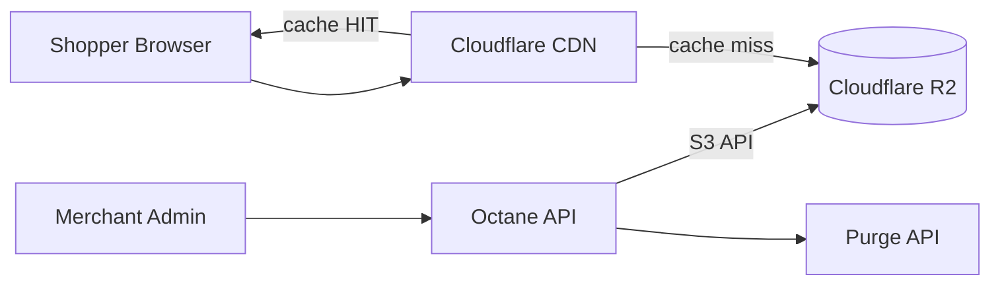

# Chapter 05: Storage, CDN & Cloudflare

**Document ID:** SCP-INF-001-05  
**Version:** 1.0.0  
**Status:** 📝 Draft  
**Traceability:** ADR-008, NFR-001, NFR-011, NFR-018, NFR-030, NFR-031  

---

## 1. Purpose

Define how SCP stores **merchant media, exports, and static assets** using **Cloudflare R2** and delivers them globally via **Cloudflare CDN** — integrated with edge security (ADR-008).

## 2. Scope

- R2 bucket structure and tenant isolation
- Upload pipeline and image optimization
- CDN caching rules for storefront performance
- Cloudflare configuration (DNS, SSL, WAF, cache)

## 3. Out of Scope

- Theme asset bundling (Volume 6)
- Video streaming at scale (Phase 3 — Stream or Mux evaluation)

## 4. Architecture



**Why R2 with Cloudflare CDN:** Zero egress fees from R2 to Cloudflare edge (E1 — Cloudflare docs). Same vendor as WAF/DNS simplifies ops for a small team (ADR-008).

## 5. R2 Bucket Layout

| Bucket | Environment | Purpose |
|--------|-------------|---------|
| `scp-prod-media` | Production | Product images, CMS media, downloads |
| `scp-prod-exports` | Production | Merchant data exports (TTL 7 days) |
| `scp-staging-media` | Staging | Parity testing |
| `scp-prod-backups` | Production | Optional DB artifact storage (encrypted) |

### 5.1 Object Key Convention

```text
{tenant_id}/{resource_type}/{resource_id}/{variant}/{filename}

Examples:
  t_abc123/products/prod_456/original/hero.webp
  t_abc123/products/prod_456/thumb_200/webp/hero.webp
  t_abc123/exports/2026-07-12/orders.csv
```

**Tenant isolation:** IAM/API tokens scoped per bucket prefix; application validates tenant owns path before signed URL issuance.

## 6. Upload Pipeline

| Step | Implementation |
|------|----------------|
| 1. Request upload URL | API validates quota (NFR-018: 5 GB Phase 1) |
| 2. Client PUT | Direct to R2 via presigned URL (reduces origin load) |
| 3. Virus scan | Optional ClamAV job on `default` queue |
| 4. Variant generation | WebP thumbs: 200, 400, 800, 1200 px |
| 5. CDN purge | Purge old URL on replace |

### 6.1 Allowed MIME Types

| Category | Types |
|----------|-------|
| Images | `image/jpeg`, `image/png`, `image/webp`, `image/gif` |
| Documents | `application/pdf` (digital goods) |
| Video | Phase 2 — limited mp4 with size cap |

Max upload size: **20 MB** Phase 1 (configurable per plan).

## 7. CDN Caching Strategy

### 7.1 Cache Rules

| Asset Type | Cache TTL | Cache Key |
|------------|-----------|-----------|
| Product images (immutable hash in path) | 1 year | Full URL |
| Theme static assets | 1 year | Version query param |
| Storefront HTML (SSR/API) | No cache / short | Bypass |
| API responses | No cache | Bypass |

### 7.2 Performance Targets

| Metric | Target (NFR) |
|--------|--------------|
| Product hero image size | ≤ 200 KB WebP (NFR-011) |
| Storefront LCP mobile p75 | ≤ 2.0 s (NFR-001) |
| CDN cache hit ratio | ≥ 85% for media |

### 7.3 Image Optimization

Cloudflare **Polish** (lossless/lossy) or application-side WebP generation. Prefer app-side for cost predictability; enable Polish for merchant custom domains in Phase 2.

## 8. Cloudflare Edge Configuration (ADR-008)

| Feature | Setting |
|---------|---------|
| SSL/TLS | Full (Strict), TLS 1.3 minimum |
| WAF | Managed rules + OWASP CRS; log-only → block after tuning |
| Bot Management | Super Bot Fight Mode (or equivalent) |
| Turnstile | Signup, login failures, checkout |
| Rate Limiting | Per-IP rules (see Volume 11) |
| HTTP/2 & HTTP/3 | Enabled |
| Brotli | Enabled |

### 8.1 Origin Protection

- Firewall on origin: allow Cloudflare IP ranges only
- Authenticated Origin Pulls (optional Phase 2)
- Hide origin IP; no DNS A record leaks

## 9. Custom Merchant Domains

| Step | Action |
|------|--------|
| Merchant adds domain | API creates Cloudflare custom hostname (SSL for SaaS) or manual CNAME instructions |
| Verification | TXT record proof |
| Routing | Cloudflare → tenant resolution middleware |

## 10. Security Considerations

- Presigned URLs expire ≤ 15 minutes for uploads
- Download URLs for digital goods: short-lived signed URLs tied to order
- R2 encryption at rest: AES-256 (default)
- No public bucket listing; objects private by default
- CSP `img-src` allowlist includes R2/ CDN domain only

## 11. Lifecycle & Cost Control

| Rule | Action |
|------|--------|
| Abandoned upload prefix | Delete after 24 h (cron) |
| Export files | Delete after 7 days |
| Soft-deleted tenant | Archive to cold tier after 90 days |
| Orphan scan | Weekly job compares PG references vs R2 keys |

Detail: [Chapter 11 — Cost Models](./11-cost-models.md).

## 12. Observability

- R2 request metrics via Cloudflare analytics
- Alert: egress spike > 2× 7-day baseline
- Track storage per tenant for billing (Phase 2)

## 13. Failure Modes

| Failure | Mitigation |
|---------|------------|
| R2 unavailable | Storefront shows placeholder images; queue retries |
| CDN cache poison | Purge by tag; versioned asset URLs |
| Upload quota exceeded | 413 with upgrade CTA |

## 14. Acceptance Criteria

- [ ] All production media served via Cloudflare CDN URLs
- [ ] Tenant A cannot request presigned URL for Tenant B path (integration test)
- [ ] WAF blocking mode active post-tuning
- [ ] LCP mobile p75 ≤ 2.0 s on reference storefront (Lighthouse CI)
- [ ] Lifecycle job removes expired exports

## 15. Sources

- Cloudflare R2: https://developers.cloudflare.com/r2/
- Cloudflare Cache: https://developers.cloudflare.com/cache/
- ADR-008: [Edge Security Cloudflare](../00-meta/adr/008-edge-security-cloudflare.md)
