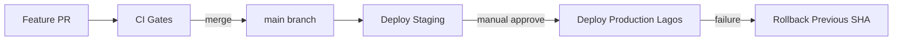

# Chapter 06: CI/CD Pipeline

**Document ID:** SCP-INF-001-06  
**Version:** 1.0.0  
**Status:** 📝 Draft  
**Traceability:** NFR-028, NFR-042, NFR-076, ADR-007  

---

## 1. Purpose

Define the **continuous integration and deployment pipeline** that builds, tests, and promotes SCP from developer commit to Lagos production — with quality gates that enforce security and tenant isolation.

## 2. Scope

- Pipeline stages and branch strategy
- Build artifacts (Docker images)
- Quality gates and deployment promotion
- Rollback procedures

## 3. Out of Scope

- Mobile app release trains (Volume 17)
- Theme marketplace submission pipeline (Volume 6)

## 4. Branch & Environment Flow



| Branch | Environment | Auto Deploy |
|--------|-------------|-------------|
| `feature/*` | Preview (optional) | No |
| `main` | Staging | Yes |
| `release/*` or tagged | Production | Manual approval |

## 5. Pipeline Stages

### Stage 1 — Validate (every PR)

| Job | Tool | Fail Condition |
|-----|------|----------------|
| Lint PHP | Laravel Pint | Any violation |
| Lint JS/TS | ESLint | Any error |
| Static analysis | PHPStan level 6+ | New errors |
| Unit tests | PHPUnit/Pest | Any failure |
| Type check | TypeScript | Any error |

### Stage 2 — Security (every PR)

| Job | Tool | Fail Condition |
|-----|------|----------------|
| Dependency audit | Composer audit, npm audit | Critical/high unfixed |
| Secret scan | gitleaks | Any leak |
| SBOM generation | Syft/CycloneDX | Artifact stored |
| Container scan | Trivy | Critical in runtime image |

### Stage 3 — Integration (every PR)

| Job | Requirement |
|-----|-------------|
| Feature tests | Docker Compose test stack |
| **Tenant isolation suite** | **Zero cross-tenant access (NFR-040)** |
| API contract tests | OpenAPI conformance |
| Migration dry-run | Up + down on empty DB |

### Stage 4 — Build (merge to main)

```text
docker build -t scp/app:${GIT_SHA} .
docker push registry/scp/app:${GIT_SHA}
```

Image tags: Git SHA (immutable), `staging-latest`, `production` (after promote).

### Stage 5 — Deploy Staging

| Step | Action |
|------|--------|
| 1 | Pull image `${GIT_SHA}` on staging VM |
| 2 | Run migrations (`php artisan migrate --force`) |
| 3 | Rolling restart Octane + Horizon |
| 4 | Smoke tests: `/health`, `/ready`, checkout happy path |
| 5 | Notify Slack |

### Stage 6 — Deploy Production

| Step | Action |
|------|--------|
| 1 | Manual approval in CI (Lead Architect or on-call) |
| 2 | Maintenance window not required Phase 2+ (zero-downtime) |
| 3 | Database backup snapshot before migrate |
| 4 | Deploy new containers; readiness gate |
| 5 | Synthetic monitor green for 10 minutes |
| 6 | Tag release in Git |

## 6. Docker Build Standards

### 6.1 Multi-Stage Dockerfile (Reference)

```dockerfile
FROM php:8.4-cli AS base
# Install FrankenPHP, extensions: pdo_pgsql, redis, intl, opcache

FROM base AS vendor
COPY composer.json composer.lock ./
RUN composer install --no-dev --optimize-autoloader

FROM base AS runtime
COPY --from=vendor /app/vendor ./vendor
COPY . .
RUN php artisan config:cache && php artisan route:cache
USER scp
EXPOSE 8000
CMD ["php", "artisan", "octane:frankenphp", "--host=0.0.0.0", "--port=8000"]
```

### 6.2 Image Requirements

- Non-root runtime user
- No secrets baked into image
- OPcache enabled
- Health check instruction included

## 7. Deployment Mechanism (Phase 1–3)

**Docker Compose on VM** with deploy script:

```bash
export GIT_SHA=$(git rev-parse HEAD)
docker compose pull app horizon
docker compose up -d --no-deps app
docker compose exec -T app php artisan migrate --force
docker compose up -d --no-deps horizon
docker compose ps
```

Phase 4 Kubernetes: GitOps (Argo CD or Flux) — see [Chapter 10](./10-scaling-path-kubernetes.md).

## 8. Database Migrations in CI/CD

| Rule | Implementation |
|------|----------------|
| Backward compatible | Expand schema before code deploy |
| Breaking changes | Two-phase deploy across releases |
| Long index | `CREATE INDEX CONCURRENTLY` |
| Pre-deploy backup | Automated snapshot |
| Rollback | Down migration tested in CI |

## 9. Secrets in Pipeline

Per ADR-007:

| Secret | Injection |
|--------|-----------|
| Production `.env` | CI secret store → SSH deploy or sealed secret |
| R2 credentials | Environment-specific keys |
| Cloudflare API token | Scoped: cache purge, DNS |
| Database URL | PgBouncer URL, not direct PG in app |

Never echo secrets in CI logs.

## 10. Feature Flags

Non-ready features deploy dark:

- Laravel Pennant or equivalent
- Flag state in Redis/PostgreSQL
- Kill switch for AI features without redeploy

## 11. Rollback Procedure

| Trigger | Action | Target Time |
|---------|--------|-------------|
| Error rate > 5% post-deploy | Auto-rollback previous SHA | ≤ 5 min |
| Migration failure | Restore snapshot + previous image | ≤ 30 min |
| Manual decision | Redeploy `production-previous` tag | ≤ 5 min |

Runbook: [Chapter 12](./12-runbooks.md#rollback-production-deploy).

## 12. Observability of Deploys

- Annotate metrics with deploy version label
- Post-deploy dashboard: error rate, p95 latency, queue depth
- Sentry release tracking linked to Git SHA

## 13. Acceptance Criteria

- [ ] PR cannot merge with failing isolation suite
- [ ] Critical/high CVE blocks merge unless documented exception
- [ ] Staging auto-deploys on every `main` merge
- [ ] Production requires manual approval
- [ ] Rollback drill executed once in staging (< 5 min)
- [ ] SBOM artifact attached to each release

## 14. Sources

- GitHub Actions / GitLab CI patterns (team choice at implementation)
- OWASP CI/CD Security: https://owasp.org/www-project-top-10-ci-cd-security-risks/
- NFR-042: Dependency scanning
