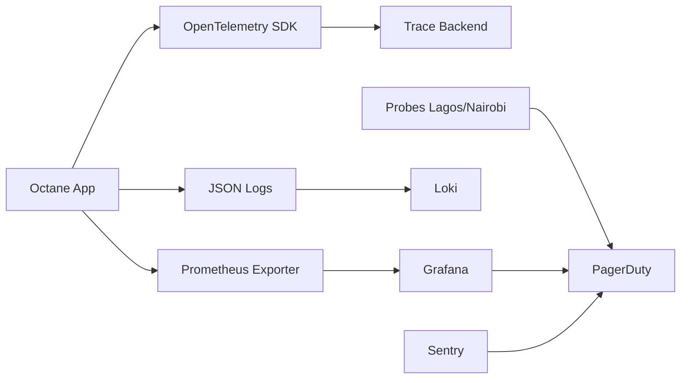

# Chapter 08: Monitoring & Observability

**Document ID:** SCP-INF-001-08  
**Version:** 1.0.0  
**Status:** 📝 Draft  
**Traceability:** NFR-062 – NFR-070, NFR-021 – NFR-023  

---

## 1. Purpose

Define **Service Level Indicators (SLIs), Service Level Objectives (SLOs), alerting, and observability stack** so the platform team detects and resolves incidents before merchants experience sustained outage.

## 2. Scope

- Metrics, logs, traces, and synthetic monitoring
- SLO/error budget policy
- Alert severity and escalation
- Dashboards for engineering and business

## 3. Out of Scope

- Merchant-facing analytics (Volume 5 / BI)
- Full Volume 14 operations program (this chapter is infrastructure-focused)

## 4. Observability Stack (Phase 1)

| Pillar | Tool | Phase |
|--------|------|-------|
| Logs | JSON Monolog → Loki or cloud log store | 1 |
| Metrics | Prometheus + Grafana (or managed equivalent) | 1 |
| Traces | OpenTelemetry → Tempo/Jaeger | 1 |
| Errors | Sentry | 1 |
| Uptime | External synthetics (Checkly, UptimeRobot, or CF) | 1 |
| Alerting | PagerDuty / Opsgenie | 1 |



## 5. SLI Definitions

| SLI | Formula | Data Source |
|-----|---------|-------------|
| **Availability** | `successful_requests / total_requests` (exclude 4xx client errors) | Prometheus / LB logs |
| **API Latency (read)** | p95 of `http_request_duration` where method=GET | Prometheus histogram |
| **API Latency (write)** | p95 where method in POST,PUT,PATCH,DELETE | Prometheus histogram |
| **Search Latency** | p95 Meilisearch query time | App metric |
| **Job Lag** | p95 time from dispatch to complete | Horizon metrics |
| **Storefront LCP** | p75 LCP mobile | Lighthouse CI + RUM (Phase 2) |
| **Backup Freshness** | `now - last_successful_backup_timestamp` | Backup job metric |

## 6. SLO Targets

Binding targets from NFRs:

| SLO | Target | Window | Error Budget |
|-----|--------|--------|--------------|
| Platform availability | **99.9%** | 30 days | 43.2 minutes downtime |
| API read p95 | **≤ 200 ms** | 7 days | 1% requests may exceed |
| API write p95 | **≤ 500 ms** | 7 days | 1% requests may exceed |
| Search autocomplete p95 | **≤ 100 ms** | 7 days | 1% requests may exceed |
| Background job p95 | **≤ 5 s** | 24 hours | 5% jobs may exceed |
| Storefront LCP mobile p75 | **≤ 2.0 s** | 7 days | 5% sessions may exceed |
| MTTR P1 | **≤ 30 min** | Per incident | NFR-023 |
| Backup RPO | **≤ 6 hours** | Continuous | NFR-027 |
| Backup RTO | **≤ 4 hours** | Per DR event | NFR-026 |

### 6.1 Error Budget Policy

When **availability error budget** is exhausted:

1. Feature freeze except reliability fixes
2. Incident review within 48 hours
3. Root cause action items tracked to completion before major releases resume

## 7. Golden Signals (RED + USE)

### Application (RED)

| Metric | Labels |
|--------|--------|
| `http_requests_total` | `method`, `route`, `status` |
| `http_request_duration_seconds` | `method`, `route` |
| `http_errors_total` | `route`, `status=5xx` |

### Data Layer (USE)

| Resource | Utilization | Saturation | Errors |
|----------|-------------|------------|--------|
| PostgreSQL | CPU, connections | wait events | deadlock count |
| Redis | memory % | evicted keys | rejected connections |
| Meilisearch | CPU, disk | indexing queue | failed tasks |

## 8. Structured Logging

Required fields on every log line:

```json
{
  "timestamp": "2026-07-12T10:00:00Z",
  "level": "info",
  "message": "Order created",
  "trace_id": "abc123",
  "request_id": "req_xyz",
  "tenant_id": "t_abc",
  "user_id": "u_456",
  "route": "POST /api/v1/orders",
  "duration_ms": 45,
  "git_sha": "a1b2c3d"
}
```

**PII scrubbing:** Emails, phone numbers, card data never logged (Volume 11).

## 9. Distributed Tracing

OpenTelemetry instrumentation:

- HTTP middleware span (incoming)
- PostgreSQL query spans (sampled 10% prod, 100% staging)
- Redis spans (cache hits/misses)
- Queue job spans (linked to dispatch trace)

Trace context propagated via `traceparent` header.

## 10. Health Endpoints

| Endpoint | Response |
|----------|----------|
| `GET /health` | `200 {"status":"ok"}` — process only |
| `GET /ready` | `200` if DB + Redis + Meilisearch reachable; else `503` |

Cloudflare/load balancer uses `/ready` for deploy gates.

## 11. Synthetic Monitoring

| Probe | Location | Frequency | Checks |
|-------|----------|-----------|--------|
| Storefront home | Lagos | 1 min | 200, LCP budget |
| API health | Lagos | 1 min | `/ready` 200 |
| Checkout flow | Lagos | 5 min | Synthetic cart (staging + prod) |
| Storefront home | Nairobi | 5 min | Phase 2 KE validation |

## 12. Alert Severity

| Severity | Condition Examples | Response |
|----------|-------------------|----------|
| **P1** | Availability < 99% over 1 h; payment webhook failure spike; DB down | Page on-call immediately |
| **P2** | p95 latency 2× SLO for 30 min; queue lag sustained | Page business hours; Slack |
| **P3** | Disk > 80%; non-critical job failures | Ticket next business day |
| **P4** | Certificate expiry 30 days | Automated ticket |

**Alert quality rule:** Every P1/P2 alert must link to a runbook (Chapter 12).

## 13. Dashboards

| Dashboard | Audience | Panels |
|-----------|----------|--------|
| Platform Overview | Engineering | Availability, p95, error rate, deploy markers |
| Nigeria Latency | Engineering | Lagos synthetics, origin RTT |
| Data Layer | DBA / Platform | PG connections, replication, Redis memory |
| Queue Health | Engineering | Horizon throughput, failed jobs |
| Business (Phase 2) | Product | Orders/min, signups, GMV |

## 14. Tenant Isolation Observability

- Metric label `tenant_id` on business metrics only — not high-cardinality on every HTTP metric
- Alert on authz denial spike per tenant (possible attack)
- Audit log shipping for security events (ADR-009)

## 15. Acceptance Criteria

- [ ] SLO dashboard published with 30-day rolling availability
- [ ] P1 alert test page reaches on-call within 5 minutes
- [ ] Trace visible for sample checkout flow across API → DB → queue
- [ ] Logs exclude PII in automated scan
- [ ] Synthetic probes running from Lagos at 1-minute interval

## 16. Sources

- Google SRE Workbook — SLO chapters (E2)
- OpenTelemetry Laravel: https://opentelemetry.io/docs/
- NFR-062 – NFR-070
