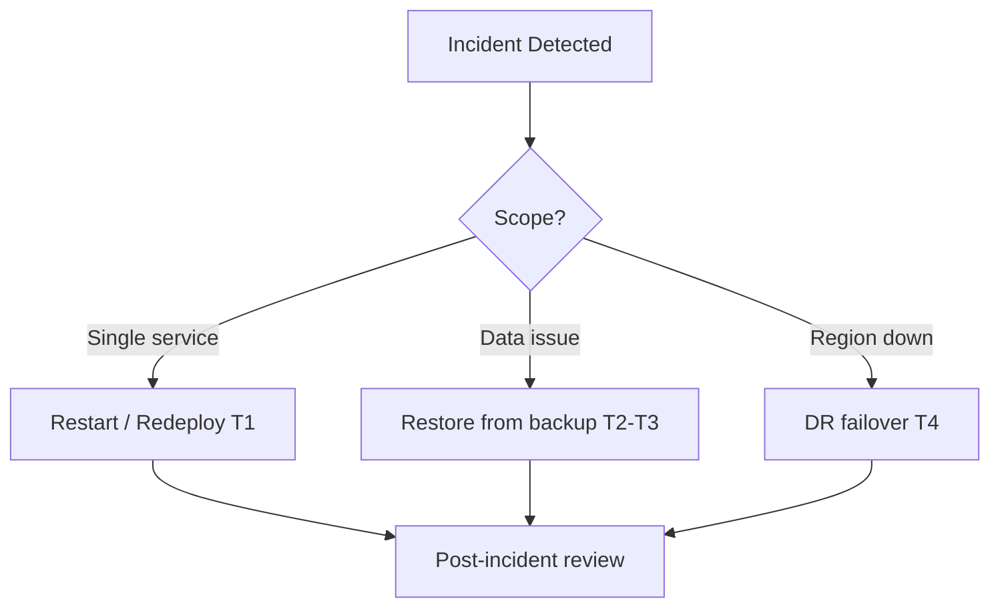

# Chapter 09: Backup & Disaster Recovery

**Document ID:** SCP-INF-001-09  
**Version:** 1.0.0  
**Status:** 📝 Draft  
**Traceability:** ADR-011, NFR-025 – NFR-028, NFR-071  

---

## 1. Purpose

Ensure SCP can **recover from data loss, region failure, and operator error** within documented RPO/RTO targets while respecting Nigeria-first data residency (ADR-011).

## 2. Scope

- Backup strategy per service
- Recovery procedures and DR tiers
- Cross-region copy policy
- Testing cadence

## 3. Out of Scope

- Merchant self-service backup export (product feature — NFR-077)
- Cyber insurance and legal BCP documents (Volume 19)

## 4. Recovery Objectives

| Metric | Target | NFR |
|--------|--------|-----|
| **RPO** (max data loss) | ≤ 6 hours | NFR-027 |
| **RTO** (time to restore service) | ≤ 4 hours | NFR-026 |
| **Backup frequency** | Every 6 hours | NFR-025 |
| **Retention** | 30 days rolling daily; 12 monthly snapshots | Platform policy |

## 5. DR Tiers

| Tier | Scenario | Strategy | RTO |
|------|----------|----------|-----|
| **T1** | Single container crash | Docker restart / redeploy | ≤ 5 min |
| **T2** | VM failure | New VM from IaC + restore latest backup | ≤ 2 h |
| **T3** | Database corruption | Point-in-time restore from WAL + snapshot | ≤ 4 h |
| **T4** | Region/AZ outage | Failover to secondary AZ or DR copy | ≤ 4 h |
| **T5** | Ransomware / total loss | Immutable backups + clean rebuild | ≤ 24 h |

Phase 1 operates at T1–T3. T4 documented; full automation Phase 2+.

## 6. Backup Matrix

| Asset | Method | Frequency | Storage Location | Encryption |
|-------|--------|-----------|------------------|------------|
| PostgreSQL | `pg_dump` + WAL archive (Phase 2) | 6 h | R2 `scp-prod-backups` same region | AES-256 |
| Redis | RDB snapshot | 6 h | Same region | At rest |
| Meilisearch | Rebuild from PG | N/A | — | — |
| R2 media | R2 versioning + lifecycle | Continuous | Same bucket/version | Default |
| Application config | Git + encrypted env backup | On change | Secret store | Yes |
| Meilisearch config | Export settings JSON | Weekly | R2 backups | Yes |

### 6.1 PostgreSQL Backup Script (Reference)

```bash
#!/bin/bash
TIMESTAMP=$(date +%Y%m%d_%H%M)
FILE="scp_pg_${TIMESTAMP}.dump"
pg_dump -Fc -h pgbouncer -U scp_backup scp > "/tmp/${FILE}"
aws s3 cp "/tmp/${FILE}" "s3://scp-prod-backups/postgresql/${FILE}" \
  --endpoint-url "${R2_ENDPOINT}"
rm "/tmp/${FILE}"
```

Run via cron or Kubernetes CronJob. Verify checksum after upload.

### 6.2 Immutability

Phase 2: enable R2 object lock or backup vault immutability for ransomware protection.

## 7. Cross-Region DR Copy

Per ADR-011:

| Copy Type | Allowed | Requirement |
|-----------|---------|-------------|
| Secondary AZ same region | ✅ Preferred | Encrypted; same legal jurisdiction |
| Cross-border DR copy | ⚠️ Conditional | NDPA transfer register entry; DPO approval |
| US/EU DR for NG data | ❌ Default | Not without explicit legal mechanism |

Document chosen DR copy location in **RoPA**.

## 8. Restore Procedures

### 8.1 PostgreSQL Restore (Staging Drill)

```bash
# 1. Download latest dump
aws s3 cp s3://scp-prod-backups/postgresql/scp_pg_LATEST.dump /tmp/restore.dump

# 2. Stop app traffic to target DB
docker compose stop app horizon

# 3. Restore
pg_restore -h postgres -U scp_admin -d scp_restore --clean /tmp/restore.dump

# 4. Run migration sanity check
docker compose run app php artisan migrate:status

# 5. Smoke test
docker compose up -d app
curl -f http://localhost:8000/ready
```

### 8.2 Full Region Rebuild

1. Provision VM from IaC (Terraform/Ansible)
2. Restore PostgreSQL from latest snapshot
3. Deploy latest known-good app image
4. Restore Redis from snapshot (or cold start cache)
5. Trigger Meilisearch full reindex
6. Update Cloudflare origin IP
7. Verify synthetics green

Runbook: [Chapter 12](./12-runbooks.md#full-region-rebuild).

## 9. Point-in-Time Recovery (Phase 2)

Enable PostgreSQL WAL archiving to R2:

- PITR window: 7 days minimum
- Test PITR to arbitrary timestamp quarterly

## 10. Disaster Scenarios



| Scenario | Detection | Response |
|----------|-----------|----------|
| Accidental `DROP TABLE` | Audit alert | PITR restore; RTO ≤ 4 h |
| Backup job failed | Metric alert | Page P2; manual backup |
| R2 bucket deletion | Cloudflare audit | Restore from version/lock |
| Lagos DC outage | Synthetics fail | DR rebuild or secondary AZ |

## 11. Security of Backups

- Backup credentials separate from app DB user (read-only `scp_backup` role)
- Backups encrypted at rest and in transit
- Access limited to on-call + Lead Architect
- Restore to production requires two-person approval

## 12. Testing Cadence

| Test | Frequency | Success Criteria |
|------|-----------|------------------|
| Backup job completion | Continuous | Alert on miss |
| Restore to staging | Weekly automated | `/ready` passes |
| Full DR tabletop | Quarterly | RTO ≤ 4 h on paper |
| PITR drill | Quarterly (Phase 2) | Data matches expected timestamp |

## 13. Communication

During T3+ incidents:

- Status page update within 15 minutes
- NDPA breach assessment if PII exposure (Volume 11) — 72 h notification clock
- Merchant email if merchant data affected

## 14. Acceptance Criteria

- [ ] Automated PostgreSQL backup every 6 hours with success metric
- [ ] Weekly restore to staging completed and logged
- [ ] Quarterly DR tabletop documented with RTO proof
- [ ] DR copy location recorded in RoPA
- [ ] Backup access audit trail enabled

## 15. Sources

- PostgreSQL backup docs: https://www.postgresql.org/docs/16/backup.html
- NFR-025 – NFR-028
- ADR-011: [Data Residency](../00-meta/adr/011-data-residency-africa.md)
