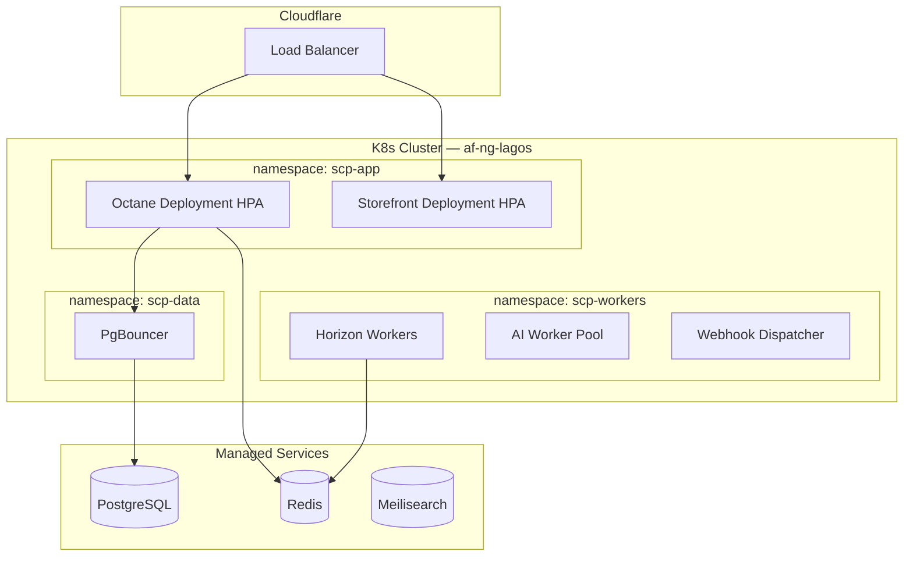

# Chapter 10: Scaling Path & Kubernetes

**Document ID:** SCP-INF-001-10  
**Version:** 1.0.0  
**Status:** ✅ Active  
**Traceability:** ADR-001, NFR-013 – NFR-020, NFR-021

---

## Purpose

Define SCP's **infrastructure scaling path** from Docker Compose through Kubernetes, including migration criteria, cluster topology, and Nigeria/East Africa regional deployment.

## Scope

- Phase 1–3 Docker scaling patterns
- Kubernetes adoption triggers and timeline
- K8s cluster architecture (Phase 4)
- Horizontal Pod Autoscaling policies
- Service mesh evaluation (optional)
- Multi-region K8s for Kenya corridor

## Out of Scope

- Application-level scaling (Volume 3 Ch. 11)
- Detailed Helm chart source (implementation repo)
- Cloud vendor contract negotiation

---

## 1. Scaling Path Summary

| Phase | Infra Model | Merchant Range | Ops Team Size |
|-------|-------------|----------------|---------------|
| Phase 1 | Docker Compose, 1–2 VMs | 0–500 | 1–2 engineers |
| Phase 2 | Docker Compose/Swarm, multi-VM | 500–5,000 | 2–3 engineers |
| Phase 3 | Hybrid: K8s for workers, VMs for core | 5,000–10,000 | 3–5 engineers |
| Phase 4 | Full K8s multi-AZ, multi-region | 10,000+ | 5+ SRE |

**Principle:** Do not adopt Kubernetes until operational pain exceeds orchestration overhead — typically **> 5,000 active merchants** or **> 12 app instances** to manage manually.

---

## 2. Phase 1–2 Docker Scaling

### 2.1 Horizontal Scaling (Docker Compose)

```yaml
# Conceptual — scale app tier
services:
  octane:
    deploy:
      replicas: 4
    labels:
      - "traefik.enable=true"
  horizon:
    deploy:
      replicas: 2
```

| Component | Scale Method |
|-----------|--------------|
| Octane | `docker compose up --scale octane=4` |
| Horizon | Separate worker containers per queue |
| Next.js | Additional storefront containers |
| PostgreSQL | Vertical scale → read replica |
| Redis | Vertical → Sentinel (Phase 2) |

### 2.2 Load Balancer

Phase 2: Cloudflare Load Balancing or HAProxy on origin — health check `/ready`.

---

## 3. Kubernetes Adoption Triggers

Migrate to K8s when **≥ 3** conditions are true:

| # | Trigger | Threshold |
|---|---------|-----------|
| 1 | App instances | > 12 Octane containers |
| 2 | Deploy frequency | > 3 production deploys/day |
| 3 | Worker types | ≥ 4 distinct worker deployments |
| 4 | Multi-region | Kenya region production live |
| 5 | Extraction | ≥ 2 services extracted from monolith |
| 6 | Ops toil | > 30% engineer time on manual scaling |

---

## 4. Phase 4 Kubernetes Topology (Nigeria)



### 4.1 Namespace Strategy

| Namespace | Workloads | Network Policy |
|-----------|-----------|----------------|
| `scp-app` | Octane, Next.js | Ingress from Cloudflare only |
| `scp-workers` | Horizon, AI, webhooks | Egress to DB, Redis, external APIs |
| `scp-data` | PgBouncer sidecar | DB port only to `scp-app`, `scp-workers` |
| `scp-obs` | Prometheus, Grafana agents | Scrape all namespaces |

---

## 5. HPA Policies

| Deployment | Metric | Min | Max | Target |
|------------|--------|-----|-----|--------|
| `octane` | CPU 70% | 4 | 24 | p95 latency < 200ms |
| `storefront` | CPU 60% | 2 | 12 | — |
| `horizon-critical` | Queue lag | 2 | 20 | lag < 5s |
| `ai-workers` | Queue depth | 1 | 8 | — |

Scale-down stabilization: 300 seconds (avoid flapping during Lagos lunch peaks).

---

## 6. Deployment on K8s

| Concern | Approach |
|---------|----------|
| Rolling updates | `maxUnavailable: 0`, `maxSurge: 1` |
| Migrations | Init container or Job before rollout |
| Secrets | External Secrets Operator → vault |
| Config | ConfigMaps per env; no secrets |
| Probes | `/health`, `/ready` |
| PDB | `minAvailable: 80%` for octane |

---

## 7. Kenya Regional Cluster (Phase 4)

| Attribute | Nigeria Cluster | Kenya Cluster |
|-----------|-----------------|---------------|
| Region | `af-ng-lagos` | `af-ke-nairobi` |
| Tenants | `region=NG` default | `region=KE` |
| Database | NG primary | KE primary for KE tenants |
| K8s | Independent cluster | Independent cluster |
| Global admin | Federated Grafana | Cross-region read-only |

No stretched K8s cluster across continents — latency and split-brain risk.

---

## 8. Service Mesh (Optional Phase 4+)

Evaluate Istio/Linkerd only if:

- ≥ 5 extracted microservices
- mTLS between services required by enterprise contract
- Advanced traffic splitting for canary deploys

Default: **no service mesh** — Cloudflare + K8s ingress sufficient for Phase 4.

---

## 9. Migration Runbook (Docker → K8s)

| Step | Action | Rollback |
|------|--------|----------|
| 1 | Provision K8s cluster in staging | Destroy cluster |
| 2 | Deploy observability stack | — |
| 3 | Deploy data connections (PgBouncer) | — |
| 4 | Deploy Octane with 0 replicas; smoke test | — |
| 5 | Shift 10% Cloudflare traffic to K8s origin | Shift back |
| 6 | 50% → 100% over 48h | Instant CF pool switch |
| 7 | Decommission Docker app tier | Keep 1 week standby |

---

## 10. Acceptance Criteria

- [ ] Phase 1–4 infra models documented with merchant ranges
- [ ] K8s adoption triggers: ≥ 3 conditions listed
- [ ] Namespace strategy: app, workers, data, obs
- [ ] HPA policies for octane, storefront, horizon
- [ ] Kenya independent regional cluster specified
- [ ] Docker → K8s migration runbook with traffic shift steps
- [ ] Service mesh marked optional with clear criteria
- [ ] PDB minAvailable 80% for octane

---

## References

- [Volume 3 Ch. 11 — Scalability](../03-architecture/11-scalability-and-service-extraction.md)
- [Volume 3 Ch. 12 — Deployment Topology](../03-architecture/12-deployment-and-runtime-topology.md)
- [Chapter 11 — Cost Models](./11-cost-models.md)
- [Chapter 12 — Runbooks](./12-runbooks.md)
