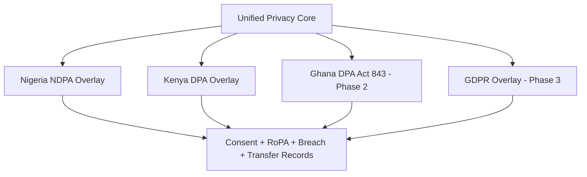

# Chapter 01: Compliance Framework

**Document ID:** SCP-SEC-001-01  
**Version:** 1.0.0  
**Status:** 📝 Draft  
**Traceability:** NFR-029 – NFR-046, NFR-083 – NFR-085  

---

## 1. Purpose

Establish the master compliance map for SCP. Every module specification (Volumes 5–12) must reference applicable requirements from this matrix.

## 2. Master Compliance Matrix

| Standard / Law | Version | Applicability | Compliance Level | Verification |
|----------------|---------|---------------|------------------|--------------|
| OWASP ASVS | 5.0 Level 2 | All application code | Full L2 | CI + quarterly traceability review |
| OWASP Top 10 | 2025 | All surfaces | Mapped controls | Annual re-map |
| PCI DSS | v4.0.1 SAQ A r1 | Platform + merchant checkout | Self-assessment annual | ASV scans quarterly |
| **Nigeria NDPA** | 2023 + GAID 2025 | **Mandatory at launch** (primary market) | Full (NFR-083) | NDPC registration + CAR |
| Kenya DPA | 2019 | Kenya launch gate (NFR-084) | Full | ODPC registration |
| GDPR | 2016/679 | Phase 3 EU data subjects | Readiness | Phase 3 gate |
| ISO/IEC 25010 (Security) | — | Quality model alignment | Via NFR mapping | Architecture review |

## 3. OWASP Top 10:2025 → SCP Controls

| Category | SCP Controls | Primary Modules |
|----------|--------------|-----------------|
| A01 Broken Access Control | Policies, tenant middleware, RLS, IDOR test suite | All |
| A02 Security Misconfiguration | Hardened Docker, CSP, debug off, IaC review | Infrastructure |
| A03 Software Supply Chain | Lockfiles, composer/npm audit, SBOM, theme review | Developer Platform, Themes |
| A04 Cryptographic Failures | TLS 1.3, AES-256-GCM, Argon2id, encrypted casts | All |
| A05 Injection | Eloquent only, HTMLPurifier (CMS), strict CSP | CMS, Themes |
| A06 Insecure Design | STRIDE per module, ADRs | All |
| A07 Authentication Failures | Fortify/Sanctum, MFA, rate limits (ADR-006) | Identity |
| A08 Integrity Failures | Signed webhooks, SRI, no unsigned plugins | Commerce, Developer Platform |
| A09 Logging Failures | Audit log (ADR-009), SIEM alerts | All |
| A10 Exceptional Conditions | Fail-closed tenant context, payment state machine | Commerce, Payments |

## 4. ASVS 5.0 Level 2 Coverage Plan

Pin all references to **ASVS 5.0** — the 4.0.3 chapter numbering no longer applies (restructured May 2025).

| ASVS 5.0 Chapter | SCP Approach | Phase |
|------------------|--------------|-------|
| V1 Encoding & Sanitization | Blade/JSX auto-escape; CMS allowlist | 1 |
| V2 Validation | FormRequest on every endpoint | 1 |
| V3 Web Frontend | Nonce CSP, HSTS, frame-ancestors | 1 |
| V4 API & Web Service | Versioned REST, scopes, JSON validation | 1 |
| V6 Authentication | ADR-006 | 1 |
| V7 Session Management | Secure cookies, rotation, 24h max | 1 |
| V8 Authorization | Deny-by-default policies + tenant check | 1 |
| V11 Cryptography | Documented crypto inventory | 1 |
| V14 Data Protection | RoPA, retention, export/delete (NFR-077) | 1–2 |
| V16 Logging | ADR-009 | 1 |

Full chapter-by-chapter traceability sheet maintained in `docs/11-security/appendices/asvs-traceability.csv` (planned).

## 5. PCI DSS SAQ A Position

SCP never stores, processes, or transmits cardholder data (NFR-044).

**Design rules (ADR-004):**

1. Default to **PSP redirect/hosted checkout** (Paystack, Flutterwave, Stripe Checkout, M-Pesa STK).
2. Embedded iframes only on locked checkout template with CSP evidence + PSP confirmation.
3. No merchant/third-party scripts on checkout pages.
4. Quarterly ASV scans on e-commerce-facing infrastructure.
5. Maintain PSP Attestations of Compliance on file.

**Nigeria note:** CBN-regulated PSPs (Paystack, Flutterwave) handle card processing; SCP remains out of card data scope when integration follows ADR-004.

## 6. Pan-Africa Privacy Framework (NFR-085)

SCP implements **one privacy engine** with country-specific overlays:

**Shared capabilities:**

- Consent capture and audit trail
- Data subject access/export (NFR-077)
- Deletion with 30-day soft-delete recovery (ADR-002)
- Subprocessor transparency page
- Breach notification runbook (72h regulators)

## 7. Engineering Principles Alignment

| Principle | Compliance Expression |
|-----------|----------------------|
| Secure by Default | RLS, deny-by-default authz, SAQ A checkout |
| Multi-Tenant | Isolation test suite (NFR-040) |
| Observable | Audit log + alerting (A09:2025) |
| AI Native | DPIA for AI features; no cross-tenant prompts |

## 8. Sources

- OWASP ASVS 5.0: https://asvs.dev/v5.0.0/
- OWASP Top 10 2025: https://owasp.org/Top10/2025/
- PCI SSC SAQ A updates: https://blog.pcisecuritystandards.org/
- Nigeria NDPA: https://ndpc.gov.ng/
- Kenya ODPC: https://www.odpc.go.ke/
