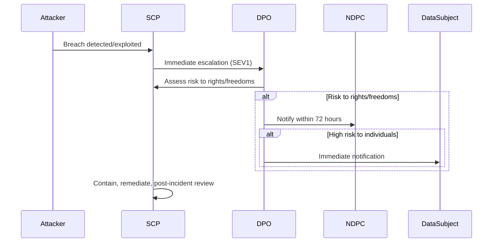

# Chapter 02: Africa Regulatory Compliance

**Document ID:** SCP-SEC-001-02  
**Version:** 1.0.0  
**Status:** 📝 Draft  
**Traceability:** NFR-071, NFR-083, NFR-084, NFR-085, ADR-011  

---

## 1. Purpose

Define **actionable compliance requirements** for SCP's primary market (**Nigeria**) and parallel African markets. This chapter translates law into engineering and operational obligations — not legal advice. Legal counsel must review registration filings and public-facing policies.

## 2. Regulatory Landscape Overview

| Country | Primary Law | Regulator | SCP Role | Launch Gate |
|---------|-------------|-----------|----------|-------------|
| **Nigeria** | NDPA 2023 + GAID 2025 | **NDPC** | Controller (platform accounts) + Processor (merchant customer data) | **Phase 1 — mandatory** |
| Kenya | Data Protection Act 2019 | ODPC | Same dual role | Kenya launch |
| Ghana | Data Protection Act 843 (2012) | Data Protection Commission | Same pattern | Phase 2 |
| South Africa | POPIA | Information Regulator | Same pattern | Phase 2–3 |
| EU (expansion) | GDPR | Supervisory authorities | Controller/processor | Phase 3 |

---

## 3. Nigeria — NDPA 2023 & GAID 2025 (Primary)

### 3.1 Why SCP Is Likely a DCPMI

The Nigeria Data Protection Commission classifies **Data Controllers/Processors of Major Importance (DCPMI)** based on volume, sector sensitivity, and cross-border processing. SCP as a multi-tenant commerce platform processing payment-related personal data, customer PII, and merchant business data at scale is **expected to qualify** as DCPMI (Ultra-High, Extra-High, or Ordinary-High tier under GAID).

**Assumption:** Legal counsel confirms DCPMI classification before registration.  
**Validation:** NDPC registration portal + tier assessment worksheet.

### 3.2 Registration & Audit Obligations

| Obligation | Requirement | SCP Action | Deadline |
|------------|-------------|------------|----------|
| NDPC registration | DCPMIs register with NDPC | File registration; pay tier fee; maintain public register entry | **Before Nigeria GA** |
| DPO appointment | Certified DPO for DCPMIs (GAID Art. 14) | Appoint NDPC-certified DPO; document in RoPA | Before GA |
| Compliance Audit | Initial audit within 15 months of registration | Engage licensed DPCO; remediate findings | Post-registration |
| CAR filing | Annual Compliance Audit Return (UHL/EHL tiers) | Submit via licensed DPCO | Annual (March 31 for pre-2023 entities) |
| RoPA | Record of Processing Activities | Maintain living document; biannual DPO report embedded | Ongoing |
| DPIA | High-risk processing (AI profiling, large-scale monitoring) | DPIA per AI/marketplace feature; DPO-vetted | Per feature |

**Sources:**

- NDPA 2023: https://ndpc.gov.ng/
- GAID 2025 (effective 19 September 2025): https://ndpc.gov.ng/wp-content/uploads/2025/03/NDP-ACT-GAID-2025-MARCH-20TH.pdf
- ICLG Nigeria Data Protection 2025/2026: https://iclg.com/practice-areas/data-protection-laws-and-regulations/nigeria/

### 3.3 Lawful Basis & Consent

| Processing Activity | Lawful Basis | Implementation |
|---------------------|--------------|----------------|
| Merchant account | Contract + consent | Signup Terms + Privacy Policy |
| Customer checkout | Contract (order fulfillment) | Checkout notice link |
| Marketing (email/SMS/WhatsApp) | **Explicit consent** | Separate opt-in; logged timestamp + version |
| AI recommendations | Legitimate interest or consent | DPIA; opt-out in account settings |
| Analytics | Consent or anonymization | Cookie/consent banner; aggregate-only default |

### 3.4 Data Subject Rights (NDPA §34–38)

SCP must provide tooling for:

| Right | Merchant (controller) data | End-customer (merchant's data) |
|-------|---------------------------|--------------------------------|
| Access | Self-service export (NFR-077) | Merchant admin exports; SCP assists processor requests |
| Rectification | Account settings | Merchant manages customer records |
| Erasure | Account deletion flow | Merchant-initiated; SCP purges on instruction |
| Portability | JSON/CSV export | Same |
| Object/restrict | Marketing opt-out | Merchant-configurable |

**SLA:** Processor-assisted requests within **30 days** (statutory maximum varies; target 14 days for competitive UX).

### 3.5 Breach Notification (NDPA §40)

| Step | Timeline | Content |
|------|----------|---------|
| Internal detection → DPO | Immediate | Incident ticket, preserve evidence |
| NDPC notification | **≤ 72 hours** from awareness | Nature, categories, approximate numbers, contact point, consequences, measures |
| Data subject notification | **Immediately** if high risk | Plain language; mitigation advice |
| Phased reporting | If full detail unavailable | Initial notice + follow-ups (NDPA §40(4)) |
| Processor → Controller | Without undue delay | If breach at subprocessors (Paystack, etc.) |

Pre-drafted templates stored in incident runbook (Chapter 06).

### 3.6 Cross-Border Transfers (NDPA §41–43)

SCP **must not** transfer Nigerian personal data abroad unless:

1. Recipient jurisdiction/law provides **adequate protection** (NDPC assessment), **or**
2. Appropriate safeguards: SCCs, binding corporate rules, certification, **or**
3. Specific derogations (§43): consent, contract necessity, legal claims, vital interests

**SCP implementation (ADR-011):**

- Primary production in Nigeria/West Africa region
- Subprocessor register with transfer mechanism documented per vendor
- Merchant DPA annex lists international subprocessors (Cloudflare US, OpenAI US, Sentry US, etc.)
- Transfer impact assessment for each new subprocessor

### 3.7 Processor Contracts (NDPA §38)

Merchant Terms must include:

- Subject matter and duration of processing
- Nature and purpose (commerce platform services)
- Type of personal data and categories of data subjects
- Controller instructions and processor obligations
- Subprocessor authorization and flow-down terms
- Security measures (reference Volume 11)
- Audit cooperation
- Deletion/return at termination

### 3.8 Nigeria Cybercrimes Act 2015 (Awareness)

While not a data protection law, the Cybercrimes Act imposes obligations on service providers regarding preservation and disclosure of certain traffic data upon lawful order. SCP engineering must:

- Retain audit and access logs per NFR-070/073
- Document lawful disclosure procedure (legal review required)
- Never voluntary disclose without valid legal process

---

## 4. Kenya — Data Protection Act 2019 (Parallel Market)

| Obligation | Requirement | SCP Action |
|------------|-------------|------------|
| ODPC registration | Controller **and** processor registration | Register before Kenya GA |
| Breach notification | **72 hours to ODPC** | Same runbook as Nigeria |
| Cross-border transfer | §48–50 safeguards | Document for KE subprocessors |
| Data residency | NFR-071 East Africa deployment | Kenya-region infra for KE merchants |

Kenya launch does not replace Nigeria compliance — both run concurrently when both markets are live.

---

## 5. Phase 2+ African Markets (Preview)

| Country | Key Requirement | SCP Preparation |
|---------|-----------------|-----------------|
| Ghana | Data Protection Act 843; DPC registration | Extend pan-Africa privacy core |
| South Africa | POPIA; Information Officer | Phase 2 legal review |
| Rwanda | Law No. 058/2021 | East Africa cluster |
| Egypt | Personal Data Protection Law | Arabic + MENA residency Phase 3 |

Maintain a **Country Compliance Register** updated when entering each market.

---

## 6. Public-Facing Compliance Artifacts (Launch Checklist)

| Artifact | Owner | Nigeria Gate |
|----------|-------|--------------|
| Privacy Policy (Nigeria-specific section) | Legal + Product | Required |
| Terms of Service + DPA annex | Legal | Required |
| Cookie/consent banner | Engineering | Required |
| Subprocessor list page | Legal + Engineering | Required |
| NDPC registration certificate | Legal | Required |
| RoPA (internal) | DPO | Required |
| Data retention schedule | Engineering + DPO | Required |
| Breach notification templates | Security + Legal | Required |

---

## 7. Penalties Awareness (Risk Context)

NDPA and GAID provide for significant administrative fines and criminal liability for serious violations. Engineering cannot eliminate legal risk, but **documented compliance** (registration, RoPA, DPIA, breach procedures, technical measures) is the primary mitigation for platform operators.

---

## 8. Acceptance Criteria (Regulatory)

1. NDPC registration confirmed before Nigeria public launch.
2. NDPC-certified DPO appointed and named in RoPA.
3. Privacy Policy and DPA annex published; consent flows tested.
4. Breach tabletop completed with simulated 72h NDPC notification.
5. Cross-border transfer register complete for all Phase 1 subprocessors.
6. Data export and deletion demonstrated end-to-end for test merchant.
7. Kenya ODPC registration complete before Kenya public launch (when applicable).

---

## 9. Sources

- Nigeria NDPA 2023 (official): https://www.ncc.gov.ng/media/1084/view
- NDPC GAID 2025 PDF: https://ndpc.gov.ng/wp-content/uploads/2025/03/NDP-ACT-GAID-2025-MARCH-20TH.pdf
- NDPC portal: https://ndpc.gov.ng/
- Kenya ODPC: https://www.odpc.go.ke/
- Banwo & Ighodalo GAID 2025 summary: https://www.banwo-ighodalo.com/grey-matter/are-you-gaid-2025-ready-navigating-nigerias-gaid-2025-what-your-organisation-needs-to-know-how-bi-can-support-your-compliance-journey/
- Mondaq NDPA breach obligations: https://www.mondaq.com/nigeria/data-protection/1371660/data-breaches-compliance-obligations-under-the-nigerian-data-protection-act-2023
