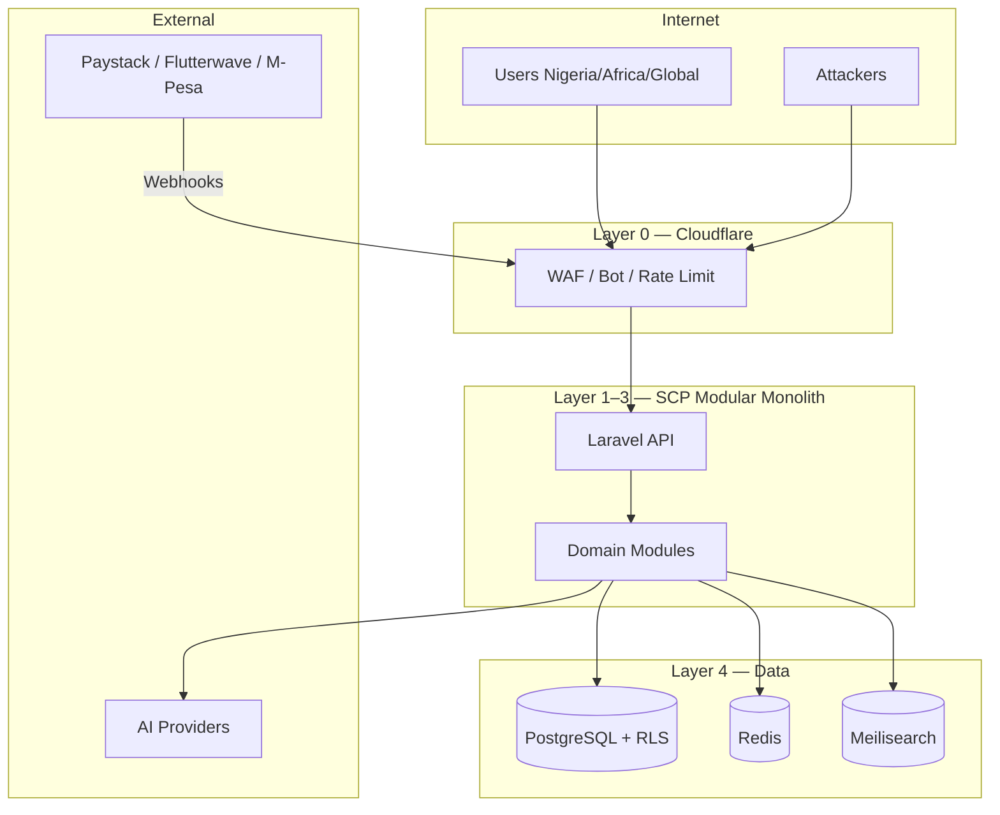

# Chapter 03: Threat Model (STRIDE)

**Document ID:** SCP-SEC-001-03  
**Version:** 1.0.0  
**Status:** 📝 Draft  

---

## 1. Assets

| Asset | Sensitivity | Nigeria Context |
|-------|-------------|-----------------|
| Customer PII (name, phone, address) | High | BVN-linked phone numbers common; SIM swap risk |
| Merchant business data (catalog, orders, payouts) | High | Naira revenue; bank account details for payouts |
| Payment references (PSP tokens, refs — never PAN) | High | Paystack/Flutterwave transaction IDs |
| Platform credentials & API tokens | Critical | Developer ecosystem target |
| Tenant configuration & themes | Medium | Defacement, SEO spam |
| AI prompts/outputs | Medium–High | Cross-tenant leakage, prompt injection |
| Audit logs | High | NDPC/ODPC investigation evidence |

## 2. Actors

| Actor | Intent |
|-------|--------|
| Anonymous shopper | Purchase, scrape catalogs |
| Authenticated customer | Account access, order history |
| Merchant staff/owner | Business operations |
| Platform admin | Support, operations |
| Third-party app developer | API integration |
| PSP (Paystack, Flutterwave, M-Pesa) | Webhook delivery |
| **Malicious tenant** | Cross-tenant access, fraud, platform abuse |
| External attacker | Credential stuffing, DDoS, fraud |
| Insider (platform) | Support abuse, data exfiltration |

## 3. STRIDE Analysis

| STRIDE | Threat (SCP-specific) | Mitigation |
|--------|----------------------|------------|
| **Spoofing** | Credential stuffing on Nigerian merchant logins; forged Paystack webhooks | Argon2id, MFA, rate limits; HMAC webhook verify + timestamp ≤5min + event dedupe |
| **Tampering** | Cart price manipulation; malicious theme JSON; CI compromise | Server-side price recompute; schema-only themes (ADR-003); signed deploys, SBOM |
| **Repudiation** | Merchant denies payout change; disputed refund | Immutable audit log (ADR-009); dual-control on high-value refunds |
| **Information disclosure** | **Cross-tenant leak**; PII in logs; IDOR on UUID orders | RLS + middleware + isolation test suite (NFR-040); log scrubbing |
| **Denial of service** | Flash sale on Lagos merchant; bot scraping; webhook storms | Cloudflare WAF (ADR-008); per-tenant quotas; queue-based webhooks |
| **Elevation** | Staff → owner; tenant → admin; excessive OAuth scopes | Deny-by-default policies; separate admin guard; scope enforcement |

## 4. Trust Boundaries

## 5. Nigeria-Specific Threat Notes

| Threat | Detail | Control |
|--------|--------|---------|
| SIM swap / account takeover | Phone-based recovery popular | TOTP MFA for merchants; delay on phone number change |
| Payment fraud (false confirmations) | Fake webhook replay | HMAC + idempotency keys; never mark paid without verified PSP callback |
| Marketplace seller fraud | Fake listings, payout theft | KYC for vendors; payout change MFA + cooling period |
| Regulatory investigation | NDPC audit request | RoPA, audit logs, DPO contact ready |

## 6. Refresh Triggers

Update this model when:

- New country launch (Nigeria → Kenya → Ghana, etc.)
- New payment provider integrated
- AI agent capabilities expand
- Marketplace mode enabled
- Major architecture change (service extraction)

---

## References

- Microsoft STRIDE: https://learn.microsoft.com/en-us/azure/security/develop/threat-modeling-tool-threats
- AWS SaaS Tenant Isolation: https://docs.aws.amazon.com/whitepapers/latest/saas-tenant-isolation-strategies/
