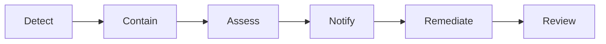

# Chapter 06: Incident Response

**Document ID:** SCP-SEC-001-06  
**Version:** 1.0.0  
**Status:** 📝 Draft  

---

## 1. Severity Levels

| Level | Examples | Response |
|-------|----------|----------|
| SEV1 | Cross-tenant leak; payment fraud at scale; confirmed breach with PII | Immediate; all-hands; regulatory clock starts |
| SEV2 | Single-tenant data exposure; auth bypass; WAF bypass | < 1 hour to mitigation decision |
| SEV3 | Elevated failed logins; dependency critical CVE | < 4 hours |
| SEV4 | Low-risk misconfiguration | Next business day |

## 2. Regulatory Notification Clocks

| Regulator | Law | Timeline | Trigger |
|-----------|-----|----------|---------|
| **NDPC** | NDPA §40 | **≤ 72 hours** from awareness | Breach likely to risk rights/freedoms |
| **NDPC → data subjects** | NDPA §40(3) | **Immediately** | High risk to individuals |
| **ODPC** | Kenya DPA | **≤ 72 hours** | Same (Kenya data subjects) |
| GDPR SA | GDPR Art. 33 | ≤ 72 hours | Phase 3 EU subjects |

**Clock starts:** When any engineer or DPO has **reasonable certainty** a personal data breach occurred — not when full forensics complete.

## 3. Incident Response Phases

### 3.1 Detect

- SIEM alerts: authz denial spikes, impossible travel, mass export
- Audit log anomalies
- External report (merchant, researcher, NDPC inquiry)

### 3.2 Contain

- Revoke compromised tokens/sessions
- Isolate affected tenant(s)
- Block attacker IPs at Cloudflare
- Preserve forensic snapshots (logs, DB point-in-time)

### 3.3 Assess (DPO-led)

- Categories of data affected
- Approximate number of data subjects (Nigeria + Kenya separately if applicable)
- Risk to rights/freedoms → NDPC notification required?
- High risk → immediate data subject notification?

### 3.4 Notify

Pre-drafted templates for:

- NDPC initial notification (72h)
- NDPC phased update
- ODPC notification (Kenya)
- Data subject notification (email/SMS/in-app)
- Merchant notification (processor → controller)
- Public communication (if direct contact infeasible per NDPA §40(3))

### 3.5 Remediate

- Patch vulnerability
- Rotate secrets
- Expand monitoring
- Update threat model

### 3.6 Review

- Blameless post-incident within 5 business days
- Actions tracked to closure
- CAR/audit documentation updated for NDPC annual filing

## 4. Runbooks (Required)

| Runbook | SEV |
|---------|-----|
| Cross-tenant data leak | SEV1 |
| Credential stuffing / account takeover | SEV2 |
| Fraudulent payment webhooks | SEV1 |
| Ransomware / backup restore | SEV1 |
| Subprocessor breach (Paystack, Cloudflare) | SEV1–2 |
| NDPC regulatory inquiry | SEV3 |

## 5. On-Call

- PagerDuty (or equivalent) for SEV1/SEV2 (NFR-068)
- DPO contact in escalation chain for any suspected personal data breach
- Legal counsel contact for regulatory notifications

## 6. Tabletop Exercises

| Exercise | Frequency | Success Criteria |
|----------|-----------|------------------|
| NDPC 72h breach drill | Quarterly | Notification draft ready ≤ 4h from scenario start |
| Backup restore | Quarterly | RTO ≤ 4h, RPO ≤ 6h (NFR-023) |
| Cross-tenant leak | Semi-annual | Tenant isolated ≤ 30 min |

---

## References

- NDPA §40 breach provisions
- GAID 2025 Article 33 (breach notification guidance)
- Kenya ODPC breach guidance: https://www.odpc.go.ke/
