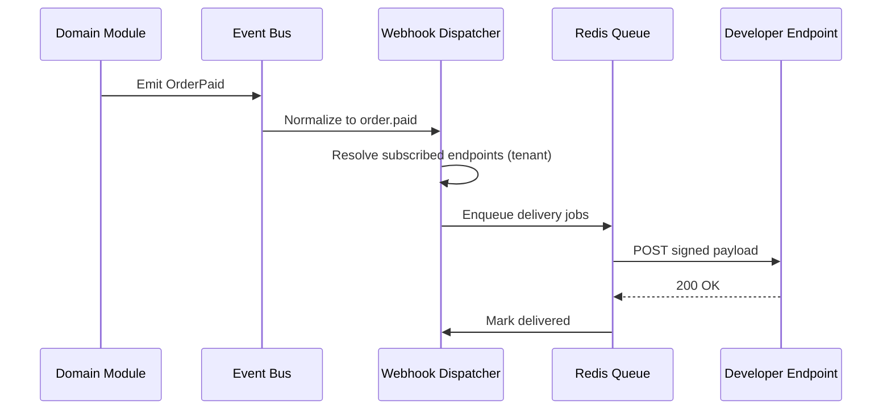

# Chapter 04: Webhooks and Events

**Document ID:** SCP-DEV-001-04  
**Version:** 1.0.0  
**Status:** 📝 Draft  
**Traceability:** NFR-020, NFR-021, NFR-041, PRD-009  

---

## 1. Purpose

Define SCP's **outbound webhook system** — the event catalog, subscription model, delivery guarantees, signature verification, and developer tooling. Webhooks are the primary integration path for Nigerian agencies syncing to ERP, inventory, and accounting systems.

## 2. Scope

- Event topic catalog and payload schemas
- Endpoint registration and secret rotation
- Delivery pipeline, retries, and dead-letter handling
- Signature verification (HMAC-SHA256)
- Developer portal webhook debugger
- Test mode vs live mode behavior

## 3. Out of Scope

- Inbound PSP webhooks (Paystack → SCP) — Volume 5
- Internal Laravel domain events (Volume 3)
- Real-time WebSocket subscriptions (Phase 4)

## 4. Architecture



## 5. Event Topic Catalog

### 5.1 Commerce Events

| Topic | Trigger | Payload Resource |
|-------|---------|------------------|
| `order.created` | Order placed (any payment state) | `order` |
| `order.paid` | Payment confirmed | `order` |
| `order.updated` | Order fields changed | `order` |
| `order.cancelled` | Order cancelled | `order` |
| `order.fulfilled` | All items fulfilled | `order` |
| `fulfillment.created` | Shipment created | `fulfillment` |
| `fulfillment.updated` | Tracking updated | `fulfillment` |
| `refund.created` | Refund issued | `refund` |
| `product.created` | Product created | `product` |
| `product.updated` | Product changed | `product` |
| `product.deleted` | Product archived/deleted | `product` |
| `inventory.updated` | Stock level changed | `inventory_level` |
| `discount.created` | Discount created | `discount` |
| `discount.updated` | Discount changed | `discount` |

### 5.2 Customer Events

| Topic | Trigger | Payload Resource |
|-------|---------|------------------|
| `customer.created` | Customer registered | `customer` |
| `customer.updated` | Profile updated | `customer` |
| `customer.deleted` | Customer removed | `customer` |
| `checkout.abandoned` | Cart abandoned > 1 hour | `abandoned_checkout` |

### 5.3 Marketplace Events

| Topic | Trigger | Payload Resource |
|-------|---------|------------------|
| `vendor.created` | Vendor onboarded | `vendor` |
| `vendor.approved` | KYC approved | `vendor` |
| `payout.created` | Payout initiated | `vendor_payout` |
| `payout.completed` | Payout settled | `vendor_payout` |
| `commission.calculated` | Order commission computed | `commission` |

### 5.4 App & Platform Events

| Topic | Trigger | Payload Resource |
|-------|---------|------------------|
| `app.installed` | App installed on store | `app` |
| `app.uninstalled` | App removed | `app` |
| `theme.published` | Theme published | `theme` |

### 5.5 Payment Rail Events (Nigeria)

| Topic | Trigger | Payload Resource |
|-------|---------|------------------|
| `payment.initiated` | Checkout redirect started | `payment` |
| `payment.failed` | PSP declined/failed | `payment` |
| `payment.pending` | Bank transfer awaiting confirmation | `payment` |

## 6. Webhook Payload Envelope

```json
{
  "id": "evt_4Qx8mK2nP9rL",
  "object": "event",
  "api_version": "2026-07-12",
  "created_at": "2026-07-12T14:22:33Z",
  "topic": "order.paid",
  "livemode": true,
  "data": {
    "object": {
      "id": "ord_7kL2mN9p",
      "object": "order",
      "status": "PAID",
      "total": { "amount": 3250000, "currency": "NGN" },
      "payment": {
        "provider": "PAYSTACK",
        "reference": "T_abc123xyz"
      }
    }
  }
}
```

**Rules:**

- Payload contains the resource snapshot at event time (not a delta)
- `livemode: false` in sandbox
- `api_version` matches the merchant's pinned version (if set)
- PII fields respect app scopes (masked if `read_customers` not granted)

## 7. Endpoint Registration

```http
POST /v1/webhook-endpoints
Authorization: Bearer scp_live_...
Content-Type: application/json

{
  "url": "https://erp.lagos-agency.ng/hooks/scp",
  "topics": ["order.paid", "order.fulfilled"],
  "description": "SAP sync — production"
}
```

Response:

```json
{
  "id": "whk_9mN2kL8p",
  "object": "webhook_endpoint",
  "url": "https://erp.lagos-agency.ng/hooks/scp",
  "topics": ["order.paid", "order.fulfilled"],
  "status": "ACTIVE",
  "secret": "whsec_8xK9mN2pQ7rL4vB3",
  "created_at": "2026-07-12T14:22:33Z"
}
```

`secret` is returned **once**. Store securely. Rotate via `POST /webhook-endpoints/{id}/rotate-secret`.

## 8. Signature Verification

SCP uses Stripe-compatible HMAC-SHA256:

| Header | Value |
|--------|-------|
| `SCP-Signature` | `t={timestamp},v1={signature}` |
| `SCP-Event-Id` | `evt_4Qx8mK2nP9rL` |
| `User-Agent` | `SCP-Webhook/1.0` |

### 8.1 Verification Algorithm

```php
function verifyWebhook(string $payload, string $header, string $secret, int $tolerance = 300): bool
{
    $parts = [];
    foreach (explode(',', $header) as $element) {
        [$key, $value] = explode('=', $element, 2);
        $parts[$key] = $value;
    }

    $timestamp = (int) ($parts['t'] ?? 0);
    $signature = $parts['v1'] ?? '';

    if (abs(time() - $timestamp) > $tolerance) {
        return false; // Replay protection
    }

    $signed = $timestamp . '.' . $payload;
    $expected = hash_hmac('sha256', $signed, $secret);

    return hash_equals($expected, $signature);
}
```

### 8.2 JavaScript Verification

```javascript
import crypto from 'crypto';

function verifyScpWebhook(payload, header, secret, tolerance = 300) {
  const parts = Object.fromEntries(
    header.split(',').map((e) => e.split('='))
  );
  const timestamp = parseInt(parts.t, 10);
  if (Math.abs(Math.floor(Date.now() / 1000) - timestamp) > tolerance) {
    return false;
  }
  const signed = `${timestamp}.${payload}`;
  const expected = crypto.createHmac('sha256', secret).update(signed).digest('hex');
  return crypto.timingSafeEqual(Buffer.from(expected), Buffer.from(parts.v1));
}
```

## 9. Delivery Guarantees

| Property | Guarantee |
|----------|-----------|
| **At-least-once** | Events may be delivered more than once; handlers must be idempotent |
| **Ordering** | Best-effort per resource ID; not global ordering |
| **Latency** | First attempt within 5s p95 of event emission |
| **Timeout** | 30s per delivery attempt |
| **Payload size** | Max 256 KB |

### 9.1 Retry Schedule

| Attempt | Delay After Failure |
|---------|---------------------|
| 1 | Immediate |
| 2 | 1 minute |
| 3 | 5 minutes |
| 4 | 30 minutes |
| 5 | 2 hours |
| 6 | 8 hours |
| 7 | 24 hours |

After 7 failures → endpoint status `DISABLED`; merchant notified via email and admin banner.

### 9.2 Success Criteria

HTTP `2xx` within 30 seconds. Redirects (`3xx`) followed up to 3 hops. All other responses are failures.

## 10. Endpoint Health

| Status | Meaning |
|--------|---------|
| `ACTIVE` | Delivering normally |
| `DEGRADED` | > 10% failure rate in last hour |
| `DISABLED` | Auto-disabled after retry exhaustion |
| `PAUSED` | Manually paused by merchant |

Merchants can replay individual deliveries: `POST /webhook-deliveries/{id}/replay`.

## 11. SSRF Prevention (Summary)

Full rules in Chapter 11. At registration:

- HTTPS only (TLS 1.2+)
- No private IP ranges, localhost, or link-local
- No redirects to disallowed targets
- DNS resolution validated at registration and each delivery

## 12. Test Mode Webhooks

Sandbox endpoints receive `livemode: false` events only. Use `scp webhooks listen` CLI (Chapter 09) for local development:

```bash
scp webhooks listen --forward-to localhost:4242/webhooks
```

## 13. Nigeria Integration Patterns

| Use Case | Recommended Topics | Notes |
|----------|-------------------|-------|
| ERP sync (SAP, QuickBooks) | `order.paid`, `refund.created` | Map `payment.reference` to PSP |
| SMS notification service | `order.created`, `fulfillment.created` | Use customer phone E.164 |
| Lagos warehouse WMS | `order.paid`, `inventory.updated` | Filter by `shipping_address.state` |
| Accounting (local) | `order.paid`, `payout.completed` | NGN amounts in kobo |
| Agency multi-store | Per-tenant endpoints | One endpoint per merchant |

## 14. Data Ownership

| Entity | Retention | Owner |
|--------|-----------|-------|
| `WebhookEndpoint` | Until deleted | Merchant |
| `WebhookDelivery` | 30 days | Platform (merchant read access) |
| `Event` (replay log) | 30 days | Platform |

## 15. Observability

- Delivery metrics per endpoint: success rate, p95 latency, failure reasons
- Alert merchant when endpoint enters `DEGRADED` or `DISABLED`
- Platform ops dashboard: queue depth, delivery throughput (NFR-020)

## 16. Acceptance Criteria

| ID | Criterion | Verification |
|----|-----------|--------------|
| AC-DEV-04-01 | `order.paid` delivered within 5s p95 | Load test |
| AC-DEV-04-02 | HMAC verification passes with official SDK helpers | Unit test |
| AC-DEV-04-03 | 7-retry exhaustion disables endpoint and notifies merchant | Integration test |
| AC-DEV-04-04 | Replay delivery succeeds for failed events | E2E test |
| AC-DEV-04-05 | SSRF-blocked URL rejected at registration | Security test |
| AC-DEV-04-06 | Idempotent handler test documented in quickstart | Docs review |

## 17. References

- Stripe webhooks: https://docs.stripe.com/webhooks
- Paystack webhooks: https://paystack.com/docs/payments/webhooks/
- Shopify webhooks: https://shopify.dev/docs/api/webhooks
- Volume 11 §6 (webhook HMAC in commerce checklist)
