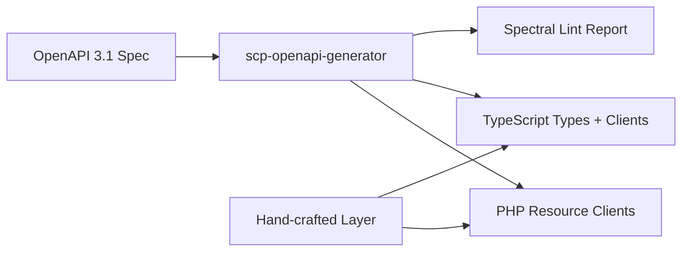

# Chapter 06: SDKs — PHP & JavaScript

**Document ID:** SCP-DEV-001-06  
**Version:** 1.0.0  
**Status:** 📝 Draft  
**Traceability:** PRD-009, NFR-003, NFR-058  

---

## 1. Purpose

Specify the official **PHP** and **JavaScript/TypeScript** SDKs that wrap SCP REST APIs with typed clients, automatic retries, error handling, and webhook verification — delivering Stripe-quality developer ergonomics for Nigeria's PHP-heavy agency ecosystem and global JavaScript developers.

## 2. Scope

- Package structure and distribution
- Client initialization and configuration
- Resource client patterns
- Error handling and retries
- Webhook signature helpers
- Type generation from OpenAPI 3.1
- Nigeria-specific defaults

## 3. Out of Scope

- Mobile SDKs (Swift/Kotlin) — Phase 4 roadmap
- Unofficial community SDKs (supported but not specified)
- SDK internal test suite CI config (Volume 13)

## 4. SDK Overview

| SDK | Package | Min Runtime | Phase |
|-----|---------|-------------|-------|
| **PHP** | `sapphital/scp-php` | PHP 8.4+ | Phase 1 |
| **JavaScript** | `@sapphital/scp-js` | Node 20+, browsers (ES2022) | Phase 2 |

Both SDKs are generated from OpenAPI 3.1 specs with hand-crafted ergonomics layer (pagination iterators, webhook helpers).

## 5. PHP SDK

### 5.1 Installation

```bash
composer require sapphital/scp-php
```

### 5.2 Initialization

```php
<?php

use Sapphital\Scp\ScpClient;

$scp = new ScpClient(
    apiKey: getenv('SCP_API_KEY'),  // scp_live_... or scp_test_...
    options: [
        'api_version' => '2026-07-12',
        'timeout' => 30,           // Nigeria 3G tolerance
        'max_retries' => 3,
        'currency_default' => 'NGN',
    ]
);
```

### 5.3 Resource Operations

```php
// Create product (NGN, kobo)
$product = $scp->products->create([
    'name' => 'Ankara Print Dress',
    'price' => ['amount' => 2500000, 'currency' => 'NGN'],
    'status' => 'ACTIVE',
]);

// List orders with cursor pagination
foreach ($scp->orders->list(['status' => 'PAID', 'limit' => 50]) as $order) {
    echo $order->id . ': ' . $order->total->amount . " kobo\n";
}

// Idempotent create
$order = $scp->orders->create(
    params: ['line_items' => [...]],
    options: ['idempotency_key' => '7c9e6679-7425-40de-944b-e07fc1f90ae7']
);
```

### 5.4 Error Handling

```php
use Sapphital\Scp\Exception\ApiException;
use Sapphital\Scp\Exception\RateLimitException;

try {
    $scp->products->retrieve('prod_invalid');
} catch (ApiException $e) {
    echo $e->getError()->type;    // not_found_error
    echo $e->getError()->code;    // resource_missing
    echo $e->getRequestId();      // req_3Nx8kQm2vL9p
} catch (RateLimitException $e) {
    sleep($e->getRetryAfter());
    // retry
}
```

### 5.5 Webhook Verification

```php
use Sapphital\Scp\Webhook;

$event = Webhook::constructEvent(
    payload: file_get_contents('php://input'),
    signature: $_SERVER['HTTP_SCP_SIGNATURE'],
    secret: getenv('SCP_WEBHOOK_SECRET'),
    tolerance: 300
);

if ($event->topic === 'order.paid') {
    $order = $event->data->object;
    // Process payment confirmation
}
```

### 5.6 Laravel Integration

Optional service provider for Laravel apps (common in Nigerian agencies):

```php
// config/scp.php
return [
    'api_key' => env('SCP_API_KEY'),
    'webhook_secret' => env('SCP_WEBHOOK_SECRET'),
];

// Route handler
Route::post('/webhooks/scp', function (Request $request) {
    $event = app(ScpClient::class)->webhooks->constructEvent(
        $request->getContent(),
        $request->header('SCP-Signature'),
    );
    // dispatch job
});
```

## 6. JavaScript / TypeScript SDK

### 6.1 Installation

```bash
npm install @sapphital/scp-js
# or
yarn add @sapphital/scp-js
```

### 6.2 Initialization

```typescript
import { ScpClient } from '@sapphital/scp-js';

const scp = new ScpClient({
  apiKey: process.env.SCP_API_KEY!,
  apiVersion: '2026-07-12',
  timeout: 30_000,
  maxRetries: 3,
  currencyDefault: 'NGN',
});
```

### 6.3 Resource Operations

```typescript
// Create product
const product = await scp.products.create({
  name: 'Ankara Print Dress',
  price: { amount: 2_500_000, currency: 'NGN' },
  status: 'ACTIVE',
});

// Auto-paginating async iterator
for await (const order of scp.orders.list({ status: 'PAID' })) {
  console.log(order.id, order.total.amount);
}

// Expand related resources
const order = await scp.orders.retrieve('ord_7kL2mN9p', {
  expand: ['customer', 'line_items.product'],
});
```

### 6.4 TypeScript Types

Types generated from OpenAPI 3.1:

```typescript
import type { Product, Order, ScpError } from '@sapphital/scp-js/types';

function handleOrder(order: Order): void {
  const ngn = order.total.currency === 'NGN'
    ? order.total.amount / 100  // display naira
    : null;
}
```

### 6.5 Webhook Verification (Node.js)

```typescript
import { ScpClient } from '@sapphital/scp-js';

const event = ScpClient.webhooks.constructEvent(
  request.body,          // raw Buffer
  request.headers['scp-signature'] as string,
  process.env.SCP_WEBHOOK_SECRET!,
);

switch (event.topic) {
  case 'order.paid':
    await handlePaidOrder(event.data.object);
    break;
}
```

### 6.6 Browser / Storefront Usage

Storefront API client for headless Next.js storefronts:

```typescript
import { ScpStorefront } from '@sapphital/scp-js/storefront';

const store = new ScpStorefront({
  storeDomain: 'ankara-boutique.sapphital.com',
});

const products = await store.products.list({ collection: 'new-arrivals' });
const cart = await store.cart.addItem({ variantId: 'var_8kL2m', quantity: 1 });
```

**Note:** Storefront client uses session cookies; no secret key in browser bundles.

## 7. Shared SDK Behaviors

### 7.1 Automatic Retries

| Condition | Retry |
|-----------|-------|
| `429` rate limit | Yes, after `Retry-After` |
| `500`, `502`, `503`, `504` | Yes, exponential backoff + jitter |
| `400`, `401`, `403`, `404`, `409` | No |
| Connection timeout | Yes, up to `max_retries` |

### 7.2 Request Headers (Auto-Set)

```text
Authorization: Bearer scp_live_...
User-Agent: SCP-PHP/1.0.0 (PHP 8.4; Laravel 12) | SCP-JS/1.0.0 (Node 20)
X-Client-Info: scp-php/1.0.0
SCP-Version: 2026-07-12
```

### 7.3 Logging

- Never log full API keys or webhook secrets
- Log `request_id` on errors for support correlation
- Opt-in debug logging via `SCP_DEBUG=true`

## 8. Code Generation Pipeline



| Output | Generator | Manual Layer |
|--------|-----------|----------------|
| PHP resource classes | `openapi-generator` (php) | Pagination iterators, webhook helper |
| TS types | `openapi-typescript` | — |
| TS client | Custom template | Retry logic, storefront client |

## 9. Versioning and Release

| Artifact | Versioning | Release Cadence |
|----------|------------|-----------------|
| PHP SDK | SemVer | With API dated versions |
| JS SDK | SemVer | With API dated versions |
| Breaking SDK change | Major bump | When API `/v2/` launches |

Changelog at `developers.sapphital.com/changelog/sdk`.

## 10. Nigeria Developer Ecosystem

| Consideration | SDK Feature |
|---------------|-------------|
| PHP-first agencies | PHP SDK Phase 1; Laravel service provider |
| Composer mirror latency | Packagist + GitHub releases; offline tarball |
| Naira defaults | `currencyDefault: 'NGN'`; `Money::ngn(25000)` helper |
| Low bandwidth | `timeout: 30`; gzip auto-negotiated |
| Paystack familiarity | Similar client pattern: `$scp->orders->retrieve()` |
| University projects | MIT license for SDK; sandbox keys free |

### 10.1 PHP Money Helper

```php
use Sapphital\Scp\Money;

$price = Money::ngn(25_000);       // ₦25,000 → 2_500_000 kobo
echo $price->format();              // "₦25,000.00"
```

## 11. Security

- API keys loaded from environment variables, never hardcoded
- SDKs refuse `scp_live_` keys in client-side browser code (runtime check)
- Webhook helpers use timing-safe comparison
- Dependencies scanned in CI (NFR-042)

## 12. Acceptance Criteria

| ID | Criterion | Verification |
|----|-----------|--------------|
| AC-DEV-06-01 | PHP SDK on Packagist; `composer require` succeeds | Publish test |
| AC-DEV-06-02 | JS SDK on npm; `npm install` succeeds | Publish test |
| AC-DEV-06-03 | SDK CRUD products and list orders in sandbox | Integration test |
| AC-DEV-06-04 | Webhook helper verifies valid/invalid signatures | Unit test |
| AC-DEV-06-05 | Auto-retry on 429 and 503 | Unit test |
| AC-DEV-06-06 | TypeScript types match OpenAPI schemas | Type diff CI |

## 13. References

- Stripe PHP SDK: https://github.com/stripe/stripe-php
- Stripe Node SDK: https://github.com/stripe/stripe-node
- Paystack PHP: https://github.com/yabacon/paystack-php
- OpenAPI Generator: https://openapi-generator.tech/
