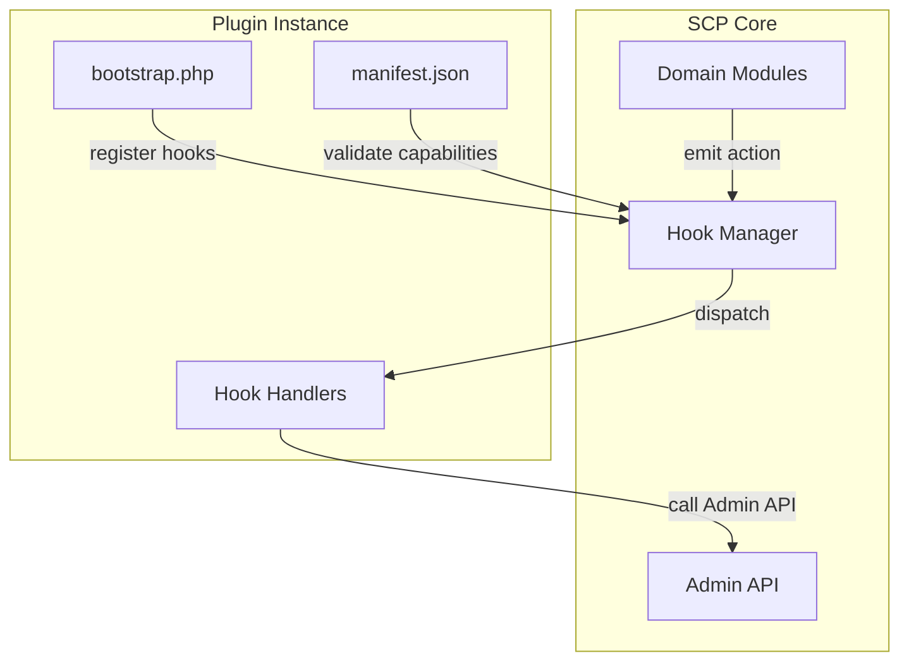
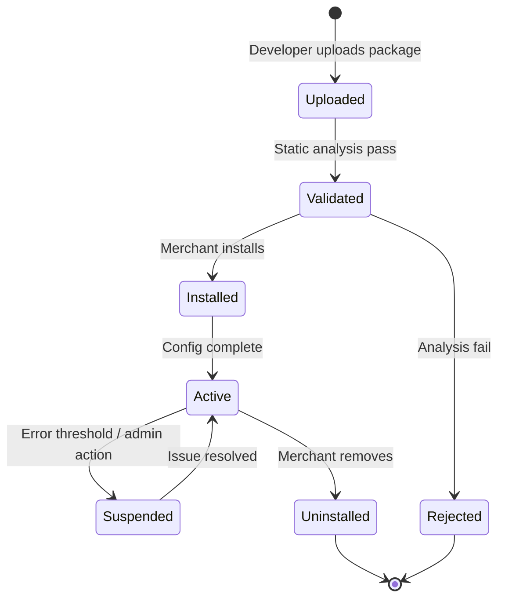

# Chapter 07: Plugin Runtime

**Document ID:** SCP-DEV-001-07  
**Version:** 1.0.0  
**Status:** 📝 Draft  
**Traceability:** PRD-009, NFR-029, NFR-040, ADR-001, ADR-023  

---

## 1. Purpose

Define SCP's **plugin runtime** — the server-side extension system that allows third-party developers to hook into commerce workflows, admin UI, and background processing without modifying SCP core code.

## 2. Scope

- Plugin manifest and lifecycle
- Hook system (actions and filters)
- Sandboxing and capability model
- Plugin installation and configuration
- Admin UI extension points
- Marketplace packaging requirements

## 3. Out of Scope

- Theme client-side extensions (Chapter 08)
- WordPress-compatible plugin porting
- Arbitrary code execution in merchant browsers

## 4. Design Principles

| Principle | Rationale |
|-----------|-----------|
| **No core forks** | Plugins extend; they never patch SCP source |
| **Explicit capabilities** | Manifest declares every API scope and hook |
| **Sandboxed PHP** | No raw SQL, no filesystem outside plugin dir |
| **Tenant-scoped** | Plugin instances are per-tenant |
| **Auditable** | Install, config change, and hook execution logged |

Comparable: Shopify Functions (server) + WordPress hooks — adapted for Laravel modular monolith.

Third-party **plugins** ship as Extension packages under `Modules/Extensions/` with `module.json` (platform packages) plus plugin-specific `manifest.json` (capabilities and hooks). See [ADR-023](../00-meta/adr/023-sapphital-platform-os.md) and [Volume 3 Ch. 13](../03-architecture/13-platform-os-architecture.md).

## 5. Architecture



## 6. Plugin Manifest

`manifest.json` at plugin root:

```json
{
  "name": "inventory-sync-pro",
  "display_name": "Inventory Sync Pro",
  "version": "1.2.0",
  "description": "Sync inventory with external WMS systems",
  "author": "Lagos Digital Agency",
  "scp_api_version": "2026-07-12",
  "min_scp_version": "1.0.0",
  "capabilities": {
    "scopes": ["read_products", "write_inventory", "read_orders"],
    "hooks": {
      "actions": ["order.paid", "product.updated"],
      "filters": ["shipping.rates", "product.display_price"]
    },
    "admin_pages": ["settings"],
    "webhooks": ["inventory.updated"]
  },
  "config_schema": {
    "type": "object",
    "properties": {
      "wms_endpoint": { "type": "string", "format": "uri" },
      "sync_interval_minutes": { "type": "integer", "minimum": 5, "default": 15 }
    },
    "required": ["wms_endpoint"]
  }
}
```

## 7. Hook System

### 7.1 Actions (Event Listeners)

Fire-and-forget; no return value. Async by default (queued).

| Hook | Emitted When | Typical Plugin Use |
|------|--------------|-------------------|
| `order.placed` | Order created | Fraud check, ERP push |
| `order.paid` | Payment confirmed | Inventory decrement, WMS |
| `order.fulfilled` | Shipment complete | SMS notification |
| `product.created` | Product created | External catalog sync |
| `product.updated` | Product changed | Search index, WMS |
| `customer.created` | Customer registered | CRM sync |
| `checkout.completed` | Checkout success | Loyalty points |
| `vendor.approved` | Vendor KYC passed | Onboarding email |
| `payout.completed` | Vendor paid | Accounting entry |

### 7.2 Filters (Transformers)

Synchronous; return modified value. Must complete within 200ms p95.

| Filter | Input | Output | Example |
|--------|-------|--------|---------|
| `shipping.rates` | Rate array | Modified rates | Custom courier pricing |
| `product.display_price` | Money object | Modified price | Dynamic pricing rules |
| `discount.eligibility` | Boolean | Modified boolean | Custom discount logic |
| `checkout.validation` | Error array | Modified errors | BVN validation |
| `email.template` | Template string | Modified template | Branded emails |

### 7.3 Hook Registration (PHP)

```php
<?php
// plugins/inventory-sync-pro/bootstrap.php

use Sapphital\Scp\Plugin\Plugin;
use Sapphital\Scp\Plugin\Hook;

return new class extends Plugin {
    public function register(): void
    {
        $this->on('order.paid', function (Order $order) {
            $this->api()->inventory->syncFromOrder($order);
        });

        $this->filter('shipping.rates', function (array $rates, ShipmentContext $ctx) {
            if ($ctx->destination->state === 'Lagos') {
                $rates[] = $this->lagosCourierRate($ctx);
            }
            return $rates;
        });
    }
};
```

## 8. Sandbox Model

### 8.1 Allowed

- Call SCP Admin API via plugin-scoped internal client
- Read/write plugin config (encrypted at rest)
- Write to plugin's storage directory (`storage/plugins/{tenant}/{plugin}/`)
- Queue jobs on plugin's dedicated queue
- HTTP outbound to URLs declared in manifest `allowed_hosts`

### 8.2 Forbidden

- Direct database queries
- `eval()`, `exec()`, `shell_exec()`, `system()`
- Filesystem access outside plugin directory
- Loading unsigned external PHP packages (all deps bundled in plugin package)
- Accessing other tenants' data
- Outbound HTTP to undeclared hosts (SSRF prevention)

### 8.3 Static Analysis Gate

Plugins submitted to marketplace pass:

- PHPStan level 6
- Custom SCP plugin linter (capability vs code audit)
- Dependency vulnerability scan
- No forbidden function calls

## 9. Plugin Lifecycle



| State | Behavior |
|-------|----------|
| `Installed` | Hooks registered; config UI available; not executing |
| `Active` | Hooks executing; API calls enabled |
| `Suspended` | Hooks disabled; admin notified; config preserved |
| `Uninstalled` | Hooks removed; config deleted after 30 days |

## 10. Admin UI Extension

Plugins with `admin_pages` capability render in merchant admin:

| Surface | Description |
|---------|-------------|
| **Settings page** | JSON Schema-driven config form from `config_schema` |
| **Dashboard widget** | Small card on admin home (Phase 3) |
| **Order detail panel** | Sidebar panel on order view |
| **Product detail panel** | Sidebar panel on product view |

Admin UI rendered via isolated iframe with postMessage bridge (CSP-safe).

## 11. Plugin API Client

Internal client pre-scoped to plugin's declared capabilities:

```php
// Inside hook handler — no manual token management
$this->api()->products->list(['limit' => 50]);
$this->api()->inventory->adjust('prod_8x9k', ['delta' => -1]);
```

Rate limits shared with tenant API quota.

## 12. Packaging Format

```text
inventory-sync-pro-1.2.0.scp-plugin (zip)
├── manifest.json
├── bootstrap.php
├── src/
│   └── ...
├── vendor/          (locked dependencies)
├── assets/
│   └── icon.png
└── checksums.sha256
```

Built via `scp plugins package` (Chapter 09).

## 13. Nigeria Use Cases

| Plugin Type | Example | Hooks Used |
|-------------|---------|------------|
| WMS integration | Lagos warehouse sync | `order.paid`, `product.updated` |
| SMS provider | Termii, Africa's Talking | `order.fulfilled`, `customer.created` |
| Accounting | Local tax filing helper | `order.paid`, `refund.created` |
| Delivery | GIGL, Kobo360 rate filter | `shipping.rates` |
| KYC | Vendor verification | `vendor.approved` |

## 14. Performance

| Metric | Target |
|--------|--------|
| Action hook dispatch overhead | ≤ 5ms (enqueue only) |
| Filter hook execution p95 | ≤ 200ms |
| Plugin job processing | ≤ 5s p95 (NFR-008) |
| Max active plugins per tenant | 25 (Business), 50 (Marketplace) |

## 15. Security

- Plugin code runs in same PHP process but with restricted API surface
- Outbound HTTP restricted to manifest `allowed_hosts`
- Config secrets encrypted with tenant-specific key (ADR-007)
- Plugin updates require re-validation before auto-update
- Suspended automatically after 50 hook errors in 1 hour

## 16. Acceptance Criteria

| ID | Criterion | Verification |
|----|-----------|--------------|
| AC-DEV-07-01 | Plugin with valid manifest installs and activates | E2E test |
| AC-DEV-07-02 | Action hook `order.paid` triggers plugin handler | Integration test |
| AC-DEV-07-03 | Filter hook modifies shipping rates | Unit test |
| AC-DEV-07-04 | Forbidden `exec()` call rejected at validation | Static analysis test |
| AC-DEV-07-05 | Cross-tenant data access blocked in plugin API client | Isolation test |
| AC-DEV-07-06 | Plugin settings UI renders from config_schema | Browser test |

## 17. References

- WordPress Plugin API (hook pattern): https://developer.wordpress.org/plugins/hooks/
- Shopify Functions: https://shopify.dev/docs/api/functions
- Volume 6 (theme extensions — client-side counterpart)
