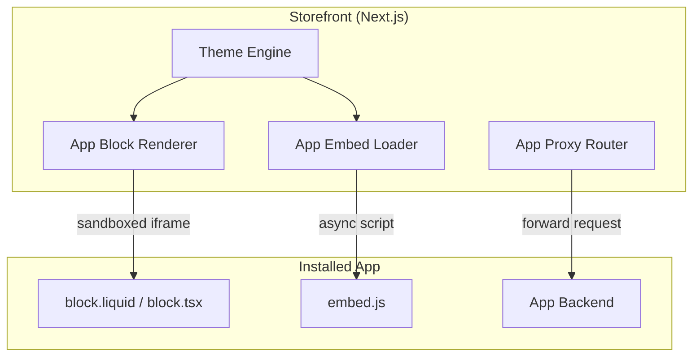

# Chapter 08: Theme App Extensions

**Document ID:** SCP-DEV-001-08  
**Version:** 1.0.0  
**Status:** 📝 Draft  
**Traceability:** PRD-006, PRD-009, Volume 6  

---

## 1. Purpose

Define **theme app extensions** — the client-side and server-side surfaces where installed apps inject UI and behavior into merchant storefronts without editing theme source code. This chapter complements [Volume 6 — Theme Engine](../06-theme-engine/README.md).

## 2. Scope

- App blocks (theme editor sections)
- App embeds (global scripts/widgets)
- App proxies (server-side route proxying)
- Theme extension manifest
- CSP and performance constraints
- Nigeria storefront considerations

## 3. Out of Scope

- Theme JSON schema and section definitions (Volume 6)
- Full theme development SDK (Volume 6)
- Plugin server-side hooks (Chapter 07)

## 4. Extension Types

| Type | Renders Where | Auth | Phase |
|------|---------------|------|-------|
| **App Block** | Theme section slot (product page, home, cart) | Public + app config | Phase 3 |
| **App Embed** | Global (`<head>`, before `</body>`) | Public | Phase 3 |
| **App Proxy** | `{store}.sapphital.com/apps/{app}/{path}` | App session | Phase 3 |
| **Checkout UI Extension** | Checkout steps (hosted checkout boundary) | PCI-scoped | Phase 4 |

## 5. Architecture



## 6. App Block

### 6.1 Manifest Entry

```json
{
  "type": "app_block",
  "name": "reviews-widget",
  "target": "section",
  "templates": ["product", "collection", "index"],
  "javascript": "assets/reviews.js",
  "stylesheet": "assets/reviews.css",
  "settings": [
    {
      "type": "select",
      "id": "layout",
      "label": "Layout",
      "options": [
        { "value": "grid", "label": "Grid" },
        { "value": "list", "label": "List" }
      ],
      "default": "grid"
    },
    {
      "type": "color",
      "id": "accent_color",
      "label": "Accent colour",
      "default": "#1a6b4a"
    }
  ]
}
```

### 6.2 Merchant Theme Editor

Merchants add app blocks via drag-and-drop in theme editor (Volume 6):

1. Open theme editor → Product page template
2. Click "Add block" → "Apps" category
3. Select "Review Stars Pro"
4. Configure settings (layout, accent colour)
5. Save and publish

### 6.3 Rendering Rules

- App blocks render in **sandboxed iframe** (`sandbox="allow-scripts"`)
- No direct DOM access to parent storefront
- Communication via `postMessage` with origin validation
- Block settings passed as JSON via `data-scp-block-settings` attribute
- Lazy-loaded below fold (Intersection Observer)

## 7. App Embed

Global injections for analytics, chat widgets, and marketing pixels:

```json
{
  "type": "app_embed",
  "name": "live-chat",
  "target": "body",
  "javascript": "assets/chat.js",
  "settings": [
    {
      "type": "text",
      "id": "welcome_message",
      "label": "Welcome message",
      "default": "Welcome! How can we help you today?"
    }
  ]
}
```

### 7.1 CSP Constraints

| Directive | App Embed Policy |
|-----------|------------------|
| `script-src` | Nonce + app CDN origin allowlist |
| `frame-src` | App block iframe origins only |
| `connect-src` | App backend + SCP API (no arbitrary) |

Apps declare required CSP origins in manifest; merchant approves at install.

## 8. App Proxy

Server-side proxy for apps needing storefront-origin URLs:

```text
https://ankara-boutique.sapphital.com/apps/reviews-pro/api/ratings
  → proxied to → https://reviews-app.example.com/storefront/ratings
```

### 8.1 Proxy Configuration

```json
{
  "type": "app_proxy",
  "prefix": "reviews-pro",
  "subpath": "api",
  "proxy_url": "https://reviews-app.example.com/storefront"
}
```

### 8.2 Proxy Headers (Appended by SCP)

| Header | Value |
|--------|-------|
| `X-SCP-Shop-Domain` | `ankara-boutique.sapphital.com` |
| `X-SCP-Shop-Id` | `ten_8kL2mN9p` |
| `X-SCP-App-Id` | `app_4Qx8mK2n` |
| `X-SCP-Proxy-Signature` | HMAC of request |

Apps verify `X-SCP-Proxy-Signature` to authenticate proxied requests.

## 9. Theme Extension Manifest

Full `theme-extension.json` in app package:

```json
{
  "name": "review-stars-pro",
  "scp_api_version": "2026-07-12",
  "extensions": [
    { "...app_block..." },
    { "...app_embed..." }
  ],
  "app_proxy": {
    "prefix": "reviews-pro",
    "subpath": "api",
    "proxy_url": "https://reviews-app.example.com/storefront"
  },
  "csp_origins": [
    "https://cdn.reviews-app.example.com",
    "https://reviews-app.example.com"
  ],
  "assets_cdn": "https://cdn.reviews-app.example.com"
}
```

## 10. Performance Requirements

| Metric | Target | NFR |
|--------|--------|-----|
| App block iframe load | ≤ 500ms p75 | NFR-001 |
| App embed JS size | ≤ 30 KB gzipped | NFR-009 |
| App proxy response p95 | ≤ 300ms (excluding app backend) | NFR-003 |
| Max app blocks per page | 10 | — |
| Max app embeds per store | 5 active | — |

**Nigeria constraint:** App assets served from Cloudflare African PoPs; self-hosted app CDNs must pass latency check from Lagos (< 200ms TTFB).

## 11. Nigeria Storefront Considerations

| Factor | Design Response |
|--------|-----------------|
| Mobile-first (90%+ traffic) | App blocks responsive by default; touch targets ≥ 44px |
| Low bandwidth | Lazy load; ≤ 30 KB JS per extension |
| Naira price display | App blocks receive `money_format` in context JSON |
| Local payment badges | Checkout extensions show Paystack/Flutterwave icons |
| Pidgin/Hausa UI | App block settings support i18n strings |
| WhatsApp chat embeds | Popular app category; CSP allows `wa.me` links |

## 12. Security

- Sandboxed iframe for app blocks; no `allow-same-origin`
- App embed scripts subresource-integrity (SRI) when served from SCP CDN mirror
- App proxy: SSRF rules from Chapter 11 apply to `proxy_url`
- Apps cannot access customer PII in block context without `read_customers` scope
- Checkout UI extensions cannot touch card fields (PCI SAQ A — ADR-004)

## 13. Developer Workflow

```bash
# Scaffold theme extension
scp apps generate extension --name reviews-widget --type app_block

# Local preview with theme dev server
scp themes dev --app-extension ./extensions/reviews-widget

# Package for marketplace submission
scp apps package --include-extensions
```

## 14. Data Ownership

| Data | Owner |
|------|-------|
| Block settings (merchant config) | Tenant-scoped in `app_extension_settings` |
| App extension assets | App developer (CDN) |
| Proxy request logs | Platform (7-day retention) |
| Customer interaction data in app | App developer (DPA required) |

## 15. Acceptance Criteria

| ID | Criterion | Verification |
|----|-----------|--------------|
| AC-DEV-08-01 | App block renders in theme editor and published storefront | E2E test |
| AC-DEV-08-02 | App block sandbox prevents parent DOM access | Security test |
| AC-DEV-08-03 | App proxy forwards with valid signature | Integration test |
| AC-DEV-08-04 | App embed respects CSP and loads asynchronously | Lighthouse audit |
| AC-DEV-08-05 | Block settings persist per tenant per theme | Data test |
| AC-DEV-08-06 | Lagos TTFB ≤ 200ms for CDN-mirrored assets | Synthetic monitoring |

## 16. References

- Shopify theme app extensions: https://shopify.dev/docs/apps/build/online-store
- Volume 6 — Theme Engine
- ADR-004 — Checkout PCI boundary
- WCAG 2.2 AA (Volume 4)
