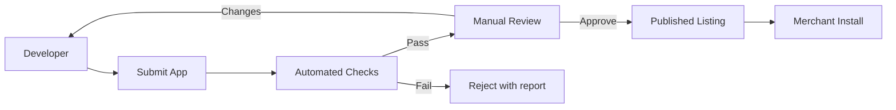
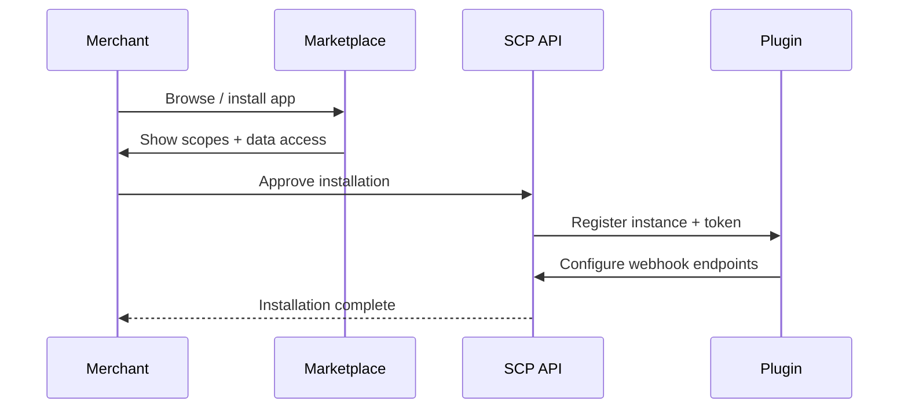

# Chapter 10: App Review & Marketplace

**Document ID:** SCP-DEV-001-10  
**Version:** 1.0.0  
**Status:** ✅ Active  
**Traceability:** PRD-006, PRD-009, NFR-029, NFR-040

---

## Purpose

Define **app and plugin review requirements**, marketplace listing standards, and publication workflow for SCP's developer ecosystem — ensuring merchant trust in third-party extensions across Nigeria and Africa.

## Scope

- App review pipeline (automated + manual)
- Security and quality gates
- Marketplace listing schema
- Pricing models (free, one-time, subscription)
- Revenue share and payouts
- Suspension and revocation procedures
- Nigeria developer onboarding

## Out of Scope

- Theme Store visual review (Volume 6 Ch. 07 — cross-referenced)
- Internal Sapphital apps
- Legal developer agreements (Volume 19)

---

## 1. Marketplace Overview



| Marketplace | Content | Phase |
|-------------|---------|-------|
| **App Store** | Plugins, integrations | Phase 3 |
| **Theme Store** | Themes (Volume 6) | Phase 2 |
| **Connector Hub** | Pre-built ERP/CRM links | Phase 4 |

---

## 2. App Categories

| Category | Examples |
|----------|----------|
| Payments | BNPL, wallet extensions |
| Shipping | GIG, Kwik integrations |
| Marketing | SMS, WhatsApp campaigns |
| Analytics | GA4, Meta Pixel connectors |
| Inventory | ERP sync, multi-warehouse |
| Customer | CRM, loyalty |
| AI | Custom agents (scoped) |

---

## 3. Automated Review Gates

| Check | Tool / Rule | Blocking |
|-------|-------------|----------|
| Manifest schema valid | JSON Schema | Yes |
| Declared scopes ⊆ used scopes | Static analysis | Yes |
| No undeclared hooks | AST scan | Yes |
| CVE scan dependencies | npm/composer audit | High/critical |
| SSRF patterns in HTTP calls | Semgrep | Yes |
| Secrets in package | gitleaks | Yes |
| PHPUnit/Pest tests present | CI artifact | Yes |
| Privacy policy URL valid | HTTP 200 | Yes |
| NDPA data processing declared | Manifest field | Yes |

---

## 4. Manual Review Checklist

| Area | Reviewer Verifies |
|------|-------------------|
| **Functionality** | Installs, configures, uninstalls cleanly on sandbox |
| **Security** | No privilege escalation; tenant isolation |
| **UX** | Admin UI uses SDS components |
| **Performance** | Hook handlers < 500ms p95 |
| **Data** | Subprocessor list accurate; minimal PII collection |
| **Docs** | Setup guide with Nigeria-specific steps if applicable |
| **Support** | Developer contact email; 48h response SLA |

Review SLA: **5 business days** initial; resubmission **2 business days**.

---

## 5. Listing Schema

```json
{
  "name": "WhatsApp Order Alerts",
  "slug": "whatsapp-order-alerts",
  "category": "marketing",
  "developer": {
    "name": "Lagos Dev Studio",
    "website": "https://example.ng",
    "support_email": "support@example.ng"
  },
  "pricing": {
    "model": "subscription",
    "amount_ngn": 5000,
    "trial_days": 14
  },
  "privacy_policy_url": "https://example.ng/privacy",
  "data_processed": ["customer.phone", "order.id"],
  "scopes_required": ["orders:read", "notifications:write"],
  "screenshots": ["..."],
  "description_html": "..."
}
```

---

## 6. Pricing & Revenue Share

| Model | Platform Fee | Developer Net |
|-------|--------------|---------------|
| Free | — | — |
| One-time NGN | 20% | 80% |
| Subscription NGN | 15% recurring | 85% |
| Usage-based | 10% of metered | 90% |

Payouts via Paystack Transfer (Nigeria developers) or Flutterwave; KYC required. Minimum payout ₦10,000.

---

## 7. Installation Flow (Merchant)



Merchants must confirm scope list — NDPA lawful basis for third-party processing.

---

## 8. Suspension & Revocation

| Trigger | Action | Timeline |
|---------|--------|----------|
| Critical security vulnerability | Immediate suspend all instances | < 1 h |
| NDPA breach report | Suspend pending investigation | < 4 h |
| Merchant complaint spike | Review queue; possible suspend | 24 h |
| Developer unresponsive 30 days | Delist |
| Voluntary deprecation | 90-day sunset notice |

Suspended apps: merchants notified; data export window 30 days.

---

## 9. Nigeria Developer Program

| Benefit | Detail |
|---------|--------|
| Reduced revenue share | 10% for first ₦1M GMV |
| Free sandbox tenants | 3 per registered developer |
| Lagos meetup support | Quarterly office hours |
| Fast-track review | Verified agency partners |
| NGN pricing tools | Listing in Naira only Phase 1 |

---

## 10. Acceptance Criteria

- [ ] Automated + manual review pipeline documented
- [ ] Blocking checks: scopes, CVE, SSRF, secrets, NDPA manifest
- [ ] Manual review SLA 5 business days
- [ ] Listing JSON schema with privacy_policy and data_processed
- [ ] Revenue share: 15–20% platform fee
- [ ] Suspension triggers with timelines
- [ ] Merchant scope approval flow documented
- [ ] Nigeria developer program benefits listed

---

## References

- [Chapter 07 — Plugin Runtime](./07-plugin-runtime.md)
- [Chapter 11 — SSRF & Rate Limits](./11-security-ssrf-rate-limits.md)
- [Volume 6 Ch. 07 — Theme Marketplace](../06-theme-engine/07-theme-marketplace.md)
- [Volume 11 — NDPA Compliance](../11-security/02-africa-regulatory-compliance.md)
