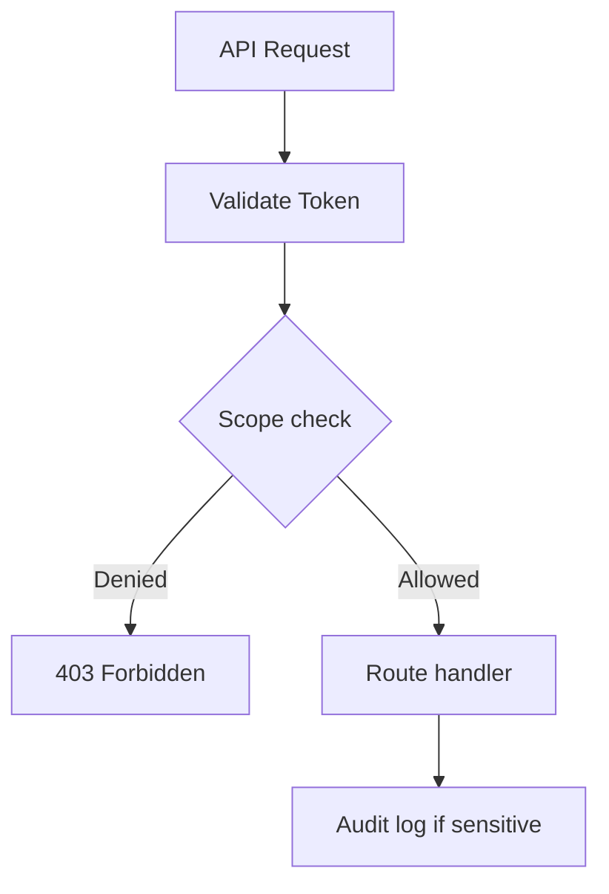

# Chapter 11: Security — SSRF & Rate Limits

**Document ID:** SCP-DEV-001-11  
**Version:** 1.0.0  
**Status:** ✅ Active  
**Traceability:** NFR-036, NFR-040, OWASP ASVS V5, OWASP API Top 10

---

## Purpose

Define **developer-platform security controls** — SSRF prevention for plugins and webhooks, rate limiting, scope enforcement, and abuse detection — protecting Nigeria-primary production from third-party extension risks.

## Scope

- SSRF threat model for apps/plugins
- Outbound HTTP client restrictions
- Webhook ingress validation
- API rate limit tiers
- Scope enforcement at runtime
- Abuse detection and ban procedures

## Out of Scope

- Platform edge WAF (Volume 11, ADR-008)
- Merchant storefront CSP (Volume 6 Ch. 09)
- Internal service mesh mTLS (Phase 4)

---

## 1. Threat Model

| Threat | Actor | Vector |
|--------|-------|--------|
| **SSRF** | Malicious plugin | Fetch `http://169.254.169.254/` metadata |
| **Webhook abuse** | Compromised app | Flood merchant endpoint |
| **Token scope creep** | Malicious app | Read orders beyond declared scope |
| **Resource exhaustion** | Noisy neighbor | Unbounded API polling |
| **Credential theft** | App stores token insecurely | Developer malpractice (guidance) |

**Impact:** Cross-tenant data exposure = NDPA breach; platform reputation damage in Nigeria market.

---

## 2. Outbound HTTP Policy (Plugins)

All plugin HTTP calls **must** use `ScpHttpClient` — raw `file_get_contents`, `curl`, and Guzzle direct use blocked in sandbox.

### 2.1 ScpHttpClient Rules

| Rule | Implementation |
|------|----------------|
| Scheme allowlist | `https:` only (http blocked except localhost dev) |
| IP blocklist | RFC1918, loopback, link-local, metadata IPs |
| DNS rebinding guard | Resolve DNS; verify IP before connect; re-check after redirect |
| Redirect limit | Max 3 redirects; re-validate each hop |
| Timeout | Connect 5s; total 30s |
| Response size | Max 5 MB |
| Header blocklist | Strip `X-Forwarded-For` injection to internal |

```php
// Allowed
$response = ScpHttpClient::get('https://api.partner.com/v1/inventory');

// Blocked at runtime
ScpHttpClient::get('http://10.0.0.5/internal'); // Private IP
```

### 2.2 Domain Allowlist (Optional Per App)

Apps declare `allowed_domains` in manifest. Requests to undeclared domains rejected unless app has `network:unrestricted` scope (enterprise only, manual approval).

---

## 3. Webhook Egress Security

| Control | Detail |
|---------|--------|
| Merchant URL validation | HTTPS required; no IP literals in production |
| SSRF check on register | Same IP blocklist as outbound |
| Signing | HMAC-SHA256 `X-SCP-Signature` |
| Retry | Exponential backoff; max 48h |
| Disable on failure | > 100 consecutive failures → pause delivery |
| Payload PII | Minimize; document in app listing |

Developers cannot set webhook targets to `*.sapphital.internal` or cloud metadata endpoints.

---

## 4. Webhook Ingress (PSP vs App)

| Source | Validation |
|--------|------------|
| Paystack/Flutterwave | IP allowlist + HMAC signature |
| Developer app callbacks | Sanctum token + tenant scope |
| Plugin test endpoint | Sandbox only; blocked in prod |

---

## 5. API Rate Limits

### 5.1 Tier Matrix

| Tier | Requests/min | Burst | Applies To |
|------|--------------|-------|------------|
| **Storefront public** | 300/IP | 50 | Unauthenticated reads |
| **Customer auth** | 120/user | 30 | Account, learn API |
| **Admin standard** | 120/user | 40 | CRUD operations |
| **Admin bulk** | 30/user | 10 | Export, batch |
| **App token — basic** | 60/app/tenant | 20 | Installed apps |
| **App token — plus** | 300/app/tenant | 60 | Paid app tier |
| **Platform partner** | 1000/app/tenant | 200 | Contracted |
| **Webhook test** | 10/min | 5 | CLI only |

### 5.2 Response Headers

```http
X-RateLimit-Limit: 120
X-RateLimit-Remaining: 87
X-RateLimit-Reset: 1720345678
Retry-After: 42
```

HTTP **429** when exceeded. No rate limit bypass for any app except break-glass platform admin with audit.

### 5.3 Nigeria Fair Use

Merchants on Starter plan: Admin API 60 req/min. Prevents single tenant starving shared Octane workers during Lagos peak hours.

---

## 6. Scope Enforcement



| Scope | Grants |
|-------|--------|
| `products:read` | GET products, variants |
| `orders:read` | GET orders (no PII export bulk) |
| `orders:write` | Update fulfillment status |
| `customers:read` | GET customers (masked in logs) |
| `webhooks:manage` | Register endpoints |
| `content:write` | CMS mutations |

Runtime: token scopes must be ⊆ installation-approved scopes. Escalation requires merchant re-approval.

---

## 7. Plugin Sandbox

| Restriction | Detail |
|-------------|--------|
| Filesystem | Plugin directory only |
| Database | No raw SQL; ORM via scoped models only |
| Network | ScpHttpClient only |
| CPU/time | 30s max per hook invocation |
| Memory | 128 MB per invocation |
| Secrets | Per-tenant encrypted vault |

Violations → plugin execution halted; incident logged.

---

## 8. Abuse Detection

| Signal | Threshold | Action |
|--------|-----------|--------|
| 429 rate > 50% requests | 5 min window | Throttle app token |
| SSRF attempt | 1 blocked request | Alert security; warn developer |
| SSRF repeat | 3 in 24h | Suspend app |
| Cross-tenant ID in request | Any | SEV2; suspend app; investigate |
| Webhook flood | > 1000/min | Pause egress queue |

---

## 9. Developer Guidance

| Practice | Requirement |
|----------|-------------|
| Store tokens in env | Never commit PATs |
| Use official SDKs | Auto rate limit handling |
| Register minimum scopes | Principle of least privilege |
| Handle 429 | Exponential backoff |
| Log `X-Request-Id` | Support correlation |

Published in developer docs portal; Nigeria WhatsApp dev channel for questions.

---

## 10. Acceptance Criteria

- [ ] ScpHttpClient rules: HTTPS, IP blocklist, DNS rebinding, redirect limit
- [ ] Plugin raw HTTP blocked in sandbox
- [ ] Webhook egress HTTPS + SSRF check on registration
- [ ] Rate limit tiers for storefront, admin, app tokens documented
- [ ] 429 response with Retry-After header
- [ ] Scope enforcement flow with merchant re-approval for escalation
- [ ] SSRF repeat → app suspension after 3 attempts
- [ ] Starter plan admin limit 60 req/min stated

---

## References

- [Volume 11 Ch. 04 — Security Architecture](../11-security/04-security-architecture.md)
- [Chapter 07 — Plugin Runtime](./07-plugin-runtime.md)
- [Chapter 10 — App Review](./10-app-review-marketplace.md)
- [Volume 7 Ch. 10 — CMS SSRF](../07-cms/10-api-events-security.md)
