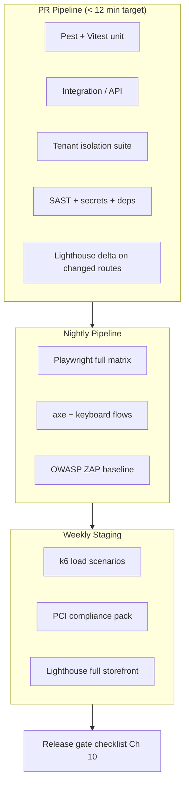

# Chapter 01: Testing Strategy Overview

**Document ID:** SCP-TEST-001-01  
**Version:** 1.0.0  
**Status:** ✅ Active  
**Traceability:** NFR-001 – NFR-012, NFR-040, NFR-042, NFR-044, NFR-047 – NFR-053  

---

## 1. Purpose

Define the master testing strategy for SCP: what we test, why, with which tools, at which cadence, and how results gate merges and releases.

## 2. Scope

- All SCP surfaces: Laravel API, Next.js admin/storefront/vendor portals, queues, search, cache, file storage, webhooks
- Multi-tenant isolation across every persistence and cache layer (ADR-002)
- Nigeria-first payment flows (Paystack, Flutterwave, USSD) and Kenya expansion (M-Pesa)
- PCI SAQ A compliance verification (ADR-004, NFR-044)
- WCAG 2.2 Level AA accessibility (NFR-047)

## 3. Out of Scope

- Third-party PSP internal QA (covered by AoC on file)
- Merchant-created theme JavaScript (sandboxed; separate review process in Volume 6)
- Hardware POS certification (Volume 15 / future)

## 4. User & Business Value

| Stakeholder | Value |
|-------------|-------|
| Merchants | Reliable checkout, no cross-store data leaks |
| Platform ops | Predictable releases, measurable SLOs |
| Compliance | NDPA, PCI, ASVS evidence from automated suites |
| Engineers | Fast feedback, clear ownership, less production firefighting |

## 5. Architecture Impact

Testing mirrors SCP's modular monolith (ADR-001):

Each bounded context (Commerce, CMS, Marketplace, Identity) owns its test fixtures and coverage targets. Shared infrastructure (tenant context, auth, events) lives in `tests/Support/`.

## 6. Data Ownership

| Artifact | Owner | Retention |
|----------|-------|-----------|
| CI test reports (JUnit, HTML) | Platform Eng | 90 days |
| Coverage reports (backend/frontend) | Module owner | Per release, 1 year |
| k6 / Lighthouse artifacts | SRE | 1 year |
| PCI / ASVS evidence bundles | Security + Compliance | 7 years |
| Tenant isolation suite results | Platform Eng | Every PR, 1 year |

## 7. Test Layers & Ownership

| Layer | Tooling | Owner | Target runtime (PR) |
|-------|---------|-------|---------------------|
| Domain unit | Pest, Vitest | Feature team | ≤ 4 min combined |
| HTTP/API integration | Pest + `RefreshDatabase` | Feature team | ≤ 3 min |
| Tenant isolation | Pest (generated) | Platform tenancy | ≤ 2 min |
| Component | Vitest + Testing Library | Frontend | ≤ 2 min |
| E2E | Playwright | QA + feature teams | Nightly |
| Performance | k6, Lighthouse CI | SRE + frontend | Weekly / PR delta |
| Security | Semgrep, gitleaks, ZAP | Security | PR + weekly |
| Accessibility | axe, Playwright | Design system + QA | PR + release |

## 8. Quality Targets

| Metric | Phase 1 Target | Measurement |
|--------|----------------|-------------|
| Backend line coverage (domain + HTTP) | ≥ 80% | Pest coverage |
| Frontend statement coverage (shared UI) | ≥ 75% | Vitest coverage |
| Tenant-scoped models in isolation suite | 100% | Generator manifest |
| PR suite pass rate | ≥ 99% (rolling 30d) | CI metrics |
| Flaky test rate | &lt; 0.5% | Quarantine tracker |
| E2E critical path pass | 100% pre-release | Playwright |
| Lighthouse performance (storefront p75) | Score ≥ 90 | LHCI |
| WCAG automated violations (critical/serious) | 0 on gated routes | axe |

## 9. Environments

| Environment | Purpose | Data |
|-------------|---------|------|
| Local | Developer TDD; Docker Compose stack | Factories + seeders |
| CI | Ephemeral PostgreSQL 16, Redis, Meilisearch | Migrations + minimal fixtures |
| Staging | E2E, k6, ZAP, manual a11y | Anonymized production-like |
| Production | Synthetic monitoring only | Real (read-only probes) |

**Nigeria note:** Staging must include Paystack/Flutterwave **sandbox** webhooks and NGN price formatting fixtures before Nigeria GA.

## 10. Test Data Strategy

- **Factories** (Laravel) and **fixtures** (Vitest/Playwright) for all tenant-scoped entities
- Two canonical tenants in isolation tests: `tenant_alpha` (NGN, Lagos TZ) and `tenant_beta` (KES, Nairobi TZ)
- No production PII in any non-production environment (NFR-083)
- Webhook replay fixtures stored as signed JSON in `tests/Fixtures/Webhooks/`

## 11. Security Considerations

- Test credentials in CI via encrypted secrets (ADR-007); never committed
- Isolation suite attempts real cross-tenant attacks (IDOR, cache key bleed, search leakage)
- PCI pack asserts zero PAN/CVV patterns in logs, responses, and DB columns

## 12. Observability Requirements

- All CI jobs emit structured logs with `trace_id`, `job`, `shard`
- Failed E2E uploads Playwright trace + video on first retry
- k6 outputs Prometheus-compatible metrics to staging Grafana

## 13. Risks & Tradeoffs

| Risk | Mitigation |
|------|------------|
| Slow PR feedback | Parallel shards; isolation suite generated, not hand-written per model |
| Flaky E2E | `data-testid` contract; network idle avoided; retry once in CI only |
| Coverage gaming | Mutation testing on Commerce pricing (Phase 2) |
| Africa network variance | k6 scenarios include 3G throttle; Lighthouse mobile emulation |

## 14. Acceptance Criteria

- [ ] Every new tenant-scoped model registers in isolation manifest within same PR
- [ ] PR pipeline documented in Chapter 09 runs on all protected branches
- [ ] Module README links to its test entry points (`tests/Feature/Commerce/`, etc.)
- [ ] Nigeria checkout sandbox E2E passes before GA sign-off

## 15. Related ADRs

- ADR-001 — Modular monolith test boundaries
- ADR-002 — RLS + tenant context; isolation suite validates
- ADR-004 — PCI redirect; compliance test pack
- ADR-005 — PgBouncer SET LOCAL; integration tests set tenant per connection

## 16. Sources

- ISO/IEC 25010 — Software quality model (NFR mapping)
- Diátaxis — Documentation structure for test guides
- Google Testing Blog — Test pyramid guidance (E2/E3)
