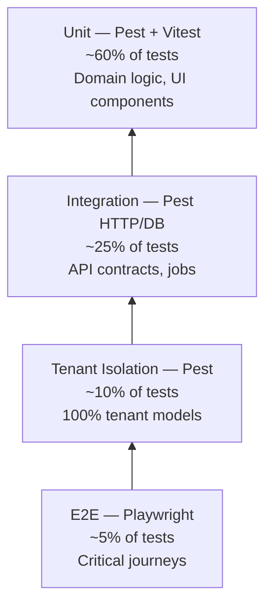

# Chapter 02: Testing Pyramid

**Document ID:** SCP-TEST-001-02  
**Version:** 1.0.0  
**Status:** ✅ Active  
**Traceability:** NFR-001 – NFR-012, NFR-040  

---

## 1. Purpose

Define SCP's testing pyramid: layer proportions, responsibilities, anti-patterns, and how layers complement the **tenant isolation suite** (Volume 13, Chapter 04).

## 2. SCP Testing Pyramid

SCP adopts a **modified pyramid** with a mandatory **isolation band** between integration and E2E:



**Rationale:** Standard pyramids under-test multi-tenant leakage. SCP elevates isolation to a **peer gate**, not an afterthought buried in integration tests.

## 3. Layer Definitions

### 3.1 Unit Tests (~60%)

| Attribute | Backend (Pest) | Frontend (Vitest) |
|-----------|----------------|-------------------|
| Scope | Pure domain services, validators, policies, state machines | Components, hooks, utilities, Redux/Zustand slices |
| DB | Forbidden (mock repositories) | N/A |
| HTTP | Forbidden | Mock fetch/MSW |
| Speed | &lt; 50ms per test | &lt; 100ms per test |
| Example | `OrderTotalCalculator`, `CouponStackingRule` | `PriceDisplay`, `useCart` |

### 3.2 Integration Tests (~25%)

| Attribute | Specification |
|-----------|---------------|
| Scope | HTTP endpoints, FormRequests, policies with DB, queue dispatch, event listeners |
| DB | PostgreSQL test DB with migrations; transactions per test |
| External APIs | HTTP fake (Paystack sandbox responses) |
| Tenant | Explicit `actingAsTenant()` helper |
| Example | `POST /api/v1/orders` creates order + inventory reservation |

### 3.3 Tenant Isolation Suite (~10%, blocking)

Not a percentage of effort — **100% model coverage**. See Chapter 04. Runs on every PR; failure blocks merge.

### 3.4 End-to-End Tests (~5%)

| Attribute | Specification |
|-----------|---------------|
| Tool | Playwright |
| Scope | Merchant signup → product → checkout → webhook → order paid (NGN sandbox) |
| Browsers | Chromium (CI), WebKit (nightly), mobile viewport |
| Data | Staging/sandbox only |

### 3.5 Non-Pyramid Layers

| Layer | Tool | Cadence |
|-------|------|---------|
| Contract | OpenAPI diff + Schemathesis (Phase 2) | PR |
| Performance | k6 | Weekly |
| Visual regression | Playwright screenshots (admin, Phase 2) | Nightly |
| Chaos | Tenant context drop injection (staging) | Monthly |

## 4. What Belongs Where — Decision Tree

```text
Does it require a browser rendering JS + CSS?
  YES → E2E (Playwright) or component test (Vitest) if no full journey
  NO → Does it touch tenant-scoped persistence?
    YES → Is it verifying Tenant A cannot see Tenant B?
      YES → Tenant isolation suite
      NO → Integration (Pest)
    NO → Is it pure logic?
      YES → Unit (Pest/Vitest)
```

## 5. Anti-Patterns (Forbidden)

| Anti-Pattern | Why | Correct Approach |
|--------------|-----|------------------|
| E2E for validation rules | Slow, brittle | Pest unit + FormRequest test |
| Unit test with real Redis/Meilisearch | Not a unit test | Integration with fakes or dedicated integration file |
| Skipping isolation for "read-only" models | Leaks via search/cache | Full isolation matrix |
| Shared mutable state between tests | Flakiness | `RefreshDatabase`, isolated Redis DB index |
| `@group slow` in PR gate | Defeats shift-left | Move to nightly or optimize |

## 6. Coverage by Module (Phase 1 Targets)

| Module | Unit | Integration | Isolation | E2E |
|--------|------|-------------|-----------|-----|
| Identity / Auth | 85% | All routes | User, Session, Token | Login, MFA |
| Commerce / Checkout | 85% | Order state machine | Order, Cart, Payment | NGN checkout |
| Catalog | 80% | CRUD APIs | Product, Variant, Collection | Add to cart |
| CMS | 75% | Page publish | Page, Block, Media | Publish page |
| Marketplace | 80% | Commission calc | Vendor, Payout | Vendor onboarding |
| Search | 70% | Index sync job | Search document scope | Search results |

## 7. Performance Budget for Test Suites

| Suite | Max Duration (CI) | Parallelism |
|-------|-------------------|-------------|
| Pest unit | 3 min | 4 workers |
| Pest integration | 3 min | 4 workers |
| Tenant isolation | 2 min | 2 workers (DB heavy) |
| Vitest | 2 min | 4 workers |
| Playwright (PR smoke) | 5 min | 2 shards |
| Playwright (nightly full) | 45 min | 8 shards |

## 8. Test Naming Conventions

```text
# Pest
it('rejects coupon when cart subtotal below minimum', ...)
it('tenant alpha cannot list tenant beta orders via api', ...)  # isolation

# Vitest
describe('PriceDisplay', () => it('formats NGN with locale en-NG', ...))

# Playwright
test('merchant completes paystack redirect checkout @critical @ng', ...)
```

Tags: `@critical`, `@ng`, `@ke`, `@pci`, `@a11y` for selective runs.

## 9. Architecture Impact

Pyramid layers map to ADR-001 module boundaries:

- Unit tests live inside module directories (`app/Domain/Commerce/tests/` or `tests/Unit/Commerce/`)
- Cross-module integration tests in `tests/Feature/CrossModule/` require architect approval
- No circular test dependencies between modules

## 10. Acceptance Criteria

- [ ] New features include tests at the lowest applicable layer (documented in PR template)
- [ ] E2E count stays ≤ 150 scenarios Phase 1 (smoke + critical paths)
- [ ] Isolation suite count grows automatically with tenant-scoped models
- [ ] No PR merges with `@group slow` tests in default PR filter

## 11. Sources

- Martin Fowler — Test Pyramid (E3)
- Spotify — Testing at scale patterns (E3)
- OWASP ASVS 5.0 — Verification depth guidance (E1)
