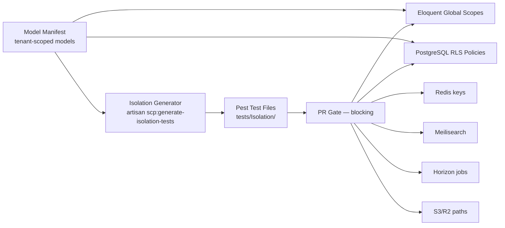

# Chapter 04: Tenant Isolation Test Suite

**Document ID:** SCP-TEST-001-04  
**Version:** 1.0.0  
**Status:** ✅ Active  
**Traceability:** NFR-040, ADR-002, ADR-005  

---

## 1. Purpose

Define SCP's **flagship tenant isolation test suite** — the automated verification that Tenant A cannot access, modify, enumerate, or infer Tenant B data across every persistence, cache, search, queue, and file layer.

**This suite is a blocking PR gate.** Zero tolerance for cross-tenant access.

## 2. Business Context

SCP is multi-tenant SaaS handling Nigerian consumer records under **NDPA** (NFR-083). A single isolation failure is:

- A reportable data breach
- Loss of merchant trust
- Platform-wide regulatory exposure

Manual QA cannot scale to 100+ tenant-scoped models. The suite is **auto-generated** from a manifest and runs on every pull request.

## 3. Architecture



Defense-in-depth (ADR-002): application scopes **and** RLS must both hold. Tests attack **both layers independently**.

## 4. Manifest — Tenant-Scoped Models

Every model with `tenant_id` (or equivalent) registers in:

```text
config/tenant-isolation.php   # or database/tenant_isolation_manifest.json
```

| Field | Description |
|-------|-------------|
| `model` | FQCN e.g. `App\Domain\Commerce\Models\Order` |
| `factory` | Factory class for test record creation |
| `routes` | API routes exposing CRUD/list/show |
| `search_index` | Meilisearch index name if indexed |
| `cache_tags` | Cache tags/keys used |
| `storage_disk` | If model has files |
| `queue_jobs` | Jobs that load this model |

**Rule:** PR adding a tenant-scoped model without manifest entry **fails CI** via manifest diff check.

## 5. Attack Matrix (Per Model)

For each model `M`, generate tests for Tenant Alpha (attacker) vs Tenant Beta (victim):

| # | Attack Vector | Method | Expected |
|---|---------------|--------|----------|
| 1 | API list | `GET /api/v1/{resource}` as Alpha | Beta records absent |
| 2 | API show | `GET /api/v1/{resource}/{beta_uuid}` as Alpha | **404** |
| 3 | API update | `PATCH` Beta UUID as Alpha | **404** |
| 4 | API delete | `DELETE` Beta UUID as Alpha | **404** |
| 5 | UUID enumeration | Sequential/guess UUIDs | No Beta leakage in timing/body |
| 6 | Direct DB (app conn) | Eloquent without scope (test helper) | Zero rows |
| 7 | Direct DB (RLS) | Raw SQL with Alpha session var | Zero rows |
| 8 | Cache | Read cache key built from Beta entity | Miss or tenant-scoped value only |
| 9 | Search | Query matching Beta-only term as Alpha | Zero Beta hits |
| 10 | Queue | Dispatch job with Beta entity ID in Alpha context | Job rejects or no-ops |
| 11 | File URL | Request Beta storage signed URL as Alpha | **403/404** |
| 12 | Export | Tenant data export job | Contains Alpha only |
| 13 | Webhook replay | Beta payment event to Alpha endpoint | Rejected |
| 14 | GraphQL (Phase 2) | Nested query across tenants | Empty/errors |

## 6. Generated Test Structure

```php
// tests/Isolation/OrderIsolationTest.php — GENERATED — do not hand-edit
describe('Order tenant isolation', function () {
    beforeEach(function () {
        [$this->alpha, $this->beta] = IsolationContext::twoTenants();
        $this->betaOrder = OrderFactory::new()->for($this->beta)->create();
    });

    it('tenant alpha cannot show tenant beta order via api', function () {
        $this->actingAsTenant($this->alpha, $this->alpha->owner);

        $this->getJson("/api/v1/orders/{$this->betaOrder->uuid}")
            ->assertNotFound();
    });

    it('tenant alpha cannot read beta order via direct db with rls', function () {
        IsolationContext::setRlsTenant($this->alpha);

        $count = DB::selectOne(
            'SELECT COUNT(*) AS c FROM orders WHERE id = ?',
            [$this->betaOrder->id]
        )->c;

        expect($count)->toBe(0);
    });

    // ... generated for each vector in matrix
});
```

## 7. Generator Command

```bash
php artisan scp:generate-isolation-tests
php artisan scp:generate-isolation-tests --check   # CI: fail if stale
```

Generator reads manifest, renders Pest files from stubs in `stubs/isolation/`. Custom edge cases (e.g., marketplace vendor sub-tenancy) extend via `tests/Isolation/Manual/` — reviewed by platform team.

## 8. Special Cases

### 8.1 Platform Admin

Platform admins bypass tenant scope **only** via audited impersonation (ADR-010). Tests verify:

- Impersonation creates audit log entry
- Non-impersonated admin cannot read arbitrary tenant data without explicit permission

### 8.2 Marketplace Vendors

Vendors are scoped to `vendor_id` **within** tenant. Additional tests:

- Vendor A cannot see Vendor B orders within same tenant
- Cross-tenant vendor IDOR blocked

### 8.3 Shared Resources

Global resources (payment provider configs, platform settings) listed in manifest `shared: true` with read-only cross-tenant rules documented.

### 8.4 Cache Key Contract

All cache keys MUST follow:

```text
t:{tenant_uuid}:{resource}:{id}
```

Isolation tests scan for violations via static analysis in CI (Semgrep rule `scp-cache-key-tenant`).

## 9. Performance

| Metric | Target |
|--------|--------|
| Full suite runtime | ≤ 120 seconds (4 parallel workers) |
| Models covered Phase 1 | 100% of manifest |
| Generator check | ≤ 5 seconds |

Use shared `beforeAll` tenant pair creation per file; avoid redundant migrations.

## 10. Failure Response

| Severity | Action |
|----------|--------|
| Any cross-tenant read | **P0** — block release, incident channel |
| Cross-tenant write | **P0** — assume breach protocol |
| Search/cache leak | **P0** — block merge |
| Generator stale | Block PR until `generate --check` passes |

## 11. Observability

- CI publishes isolation summary: `{ models: 87, vectors: 1044, passed: 1044, failed: 0 }`
- Failed tests output attacker/victim tenant IDs and resource UUID (synthetic data only)

## 12. Acceptance Criteria

- [ ] 100% tenant-scoped models in manifest (Phase 1 launch blocker)
- [ ] Zero failures across all 14 attack vectors per model
- [ ] Generator `--check` in PR pipeline
- [ ] Manual extensions reviewed in platform team PR
- [ ] Documented in Volume 11 Security Acceptance Criteria (Section 1)

## 13. Related ADRs

- ADR-002 — Shared DB + RLS
- ADR-005 — PgBouncer SET LOCAL tenant propagation
- ADR-010 — Admin impersonation audit requirements

## 14. Sources

- OWASP ASVS 5.0 V8 Authorization verification (E1)
- PostgreSQL RLS documentation (E1)
- NFR-040 (E1 — internal)
