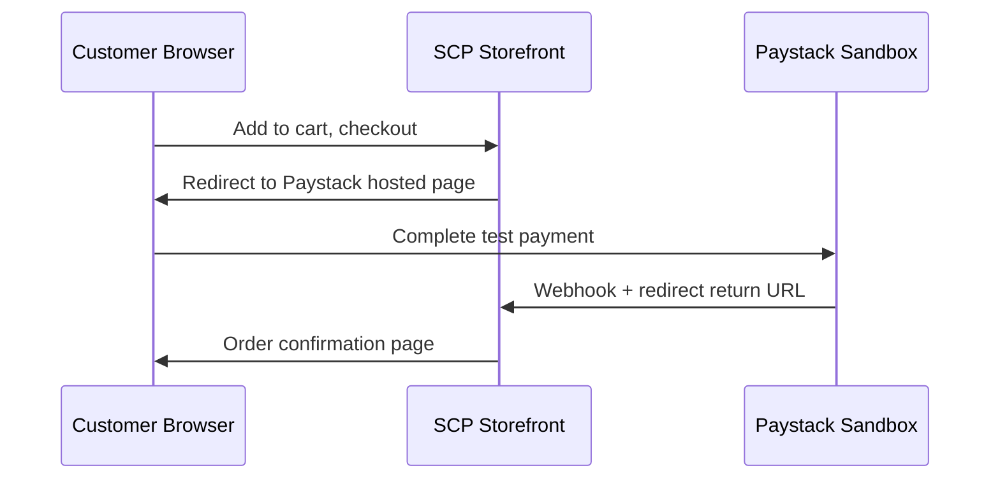

# Chapter 05: End-to-End Testing (Playwright)

**Document ID:** SCP-TEST-001-05  
**Version:** 1.0.0  
**Status:** ✅ Active  
**Traceability:** NFR-012, NFR-047 – NFR-053, NFR-044  

---

## 1. Purpose

Define end-to-end (E2E) testing standards using **Playwright** for critical user journeys across admin, storefront, vendor portal, and payment redirect flows — with Nigeria-first scenarios.

## 2. Scope

- Browser-based journeys requiring JS, routing, cookies, and third-party redirects
- Mobile viewport emulation (375×667 minimum — NFR-051)
- Payment sandbox redirects (Paystack, Flutterwave)
- Accessibility smoke within E2E (detailed a11y in Chapter 08)

## 3. Out of Scope

- API-only flows (Pest integration)
- Load/stress (k6 — Chapter 06)
- Native mobile apps (future Volume 17)

---

## 4. Project Structure

```text
e2e/
├── playwright.config.ts
├── fixtures/
│   ├── auth.ts              # Storage state per role
│   ├── tenant.ts            # Merchant context
│   └── api-helpers.ts       # Seed via API for speed
├── pages/                   # Page Object Model
│   ├── AdminDashboardPage.ts
│   ├── StorefrontProductPage.ts
│   └── CheckoutRedirectPage.ts
├── tests/
│   ├── smoke/               # PR gate (~5 min)
│   ├── critical/            # Nightly
│   ├── commerce/
│   │   ├── checkout-paystack-ng.spec.ts
│   │   └── checkout-flutterwave-ng.spec.ts
│   ├── marketplace/
│   └── a11y/                # Tagged @a11y
└── .auth/                   # gitignored storage states
```

## 5. Configuration Standards

```typescript
// playwright.config.ts (excerpt)
export default defineConfig({
  testDir: './tests',
  fullyParallel: true,
  forbidOnly: !!process.env.CI,
  retries: process.env.CI ? 1 : 0,
  workers: process.env.CI ? 4 : undefined,
  reporter: [['html'], ['junit', { outputFile: 'reports/junit.xml' }]],
  use: {
    baseURL: process.env.E2E_BASE_URL ?? 'https://staging.scp.test',
    trace: 'on-first-retry',
    video: 'retain-on-failure',
    screenshot: 'only-on-failure',
    locale: 'en-NG',
    timezoneId: 'Africa/Lagos',
  },
  projects: [
    { name: 'chromium', use: { ...devices['Desktop Chrome'] } },
    { name: 'mobile-chrome', use: { ...devices['Pixel 5'] } },
    { name: 'webkit', use: { ...devices['Desktop Safari'] } },
  ],
});
```

## 6. Test Categories

| Category | Tag | Cadence | Examples |
|----------|-----|---------|----------|
| Smoke | `@smoke` | Every PR | Login, homepage load, admin nav |
| Critical | `@critical` | Nightly + pre-release | Full checkout, order fulfillment |
| Nigeria | `@ng` | Nightly | NGN pricing, Paystack redirect |
| Kenya | `@ke` | Pre-KE launch | KES, M-Pesa STK mock |
| PCI | `@pci` | Weekly | No card fields on SCP pages |
| Accessibility | `@a11y` | Nightly | Keyboard checkout, focus trap |

## 7. Critical Journeys (Phase 1)

### 7.1 Merchant Onboarding

```text
Register → verify email → create store → connect Paystack sandbox → add product → publish storefront
```

### 7.2 Customer Checkout (Nigeria — Paystack Redirect)



Playwright handles redirect by:

1. Click "Pay with Paystack"
2. Wait for URL matching `checkout.paystack.com/**`
3. Fill sandbox card (test PAN from Paystack docs)
4. Assert return to `{store}.scp.test/orders/{id}/thank-you`
5. Assert order status via API helper (not UI alone)

### 7.3 Admin Order Management

Fulfill order → generate shipping label (Phase 2) → refund initiation.

### 7.4 Vendor Marketplace (Phase 2)

Vendor application → product listing → commission on sale.

## 8. Page Object Model

```typescript
// e2e/pages/CheckoutRedirectPage.ts
export class CheckoutRedirectPage {
  constructor(private page: Page) {}

  async payWithPaystack() {
    await this.page.getByRole('button', { name: /pay with paystack/i }).click();
    await this.page.waitForURL(/checkout\.paystack\.com/);
  }

  async completePaystackSandbox() {
    await this.page.getByLabel(/card number/i).fill('4084084084084081');
    await this.page.getByLabel(/expiry/i).fill('12/30');
    await this.page.getByLabel(/cvv/i).fill('408');
    await this.page.getByRole('button', { name: /pay/i }).click();
  }
}
```

**Selector priority:** `getByRole` → `getByLabel` → `getByTestId` → CSS (last resort).

## 9. Authentication & Tenant Fixtures

Pre-authenticate via API, save `storageState` per role:

```typescript
// e2e/fixtures/auth.ts
export const test = base.extend<{ merchantPage: Page }>({
  merchantPage: async ({ browser }, use) => {
    const context = await browser.newContext({
      storageState: 'e2e/.auth/merchant-ng.json',
    });
    await use(await context.newPage());
    await context.close();
  },
});
```

Regenerate auth states in CI setup job via Pest/Artisan seed + login API.

## 10. PCI E2E Assertions (`@pci`)

On SCP-controlled pages (never on PSP hosted page):

| Assertion | Method |
|-----------|--------|
| No card input fields | `page.locator('input[autocomplete="cc-number"]')` count = 0 |
| No PAN in DOM | Regex scan page content |
| CSP blocks inline scripts on checkout | Console listener for CSP violations |
| Redirect leaves SCP before card entry | URL change detected |

## 11. Flake Prevention

| Rule | Implementation |
|------|----------------|
| No `waitForTimeout` | Use `expect(locator).toBeVisible()` |
| Seed data via API | 10× faster than UI setup |
| Idempotent test stores | Unique subdomain per run: `{runId}.staging.scp.test` |
| Network idle avoided | Wait for specific API response or element |
| Quarantine | `@flaky` tag removes from PR; 7-day fix SLA |

## 12. CI Integration

| Job | Scope | Duration |
|-----|-------|----------|
| `playwright-smoke` | `@smoke` Chromium | ≤ 5 min |
| `playwright-nightly` | All projects | ≤ 45 min |
| `playwright-pre-release` | `@critical` + `@ng` + `@pci` | ≤ 20 min |

Artifacts: HTML report, trace, video on failure — retained 14 days.

## 13. Local Execution

```bash
# Install browsers once (developer machine)
pnpm exec playwright install chromium

# Smoke suite against staging
E2E_BASE_URL=https://staging.scp.test pnpm exec playwright test --grep @smoke

# Debug mode
pnpm exec playwright test checkout-paystack-ng --debug
```

## 14. Accessibility in E2E

Integrate `@axe-core/playwright` on critical pages:

```typescript
import AxeBuilder from '@axe-core/playwright';

test('checkout page has no critical a11y violations @a11y', async ({ page }) => {
  await page.goto('/checkout');
  const results = await new AxeBuilder({ page }).analyze();
  expect(results.violations.filter(v => v.impact === 'critical')).toEqual([]);
});
```

Full a11y standards in Chapter 08.

## 15. Acceptance Criteria

- [ ] Smoke suite ≤ 15 tests, passes in PR gate
- [ ] Nigeria Paystack redirect checkout E2E passes on staging
- [ ] Mobile viewport coverage on all `@critical` tests
- [ ] Zero `@flaky` tests in smoke suite
- [ ] PCI tag tests confirm no card data entry on SCP pages

## 16. Sources

- Playwright documentation: https://playwright.dev/
- Paystack test cards: https://paystack.com/docs/payments/test-payments/
- WCAG 2.2 — operable checkout (E1)
