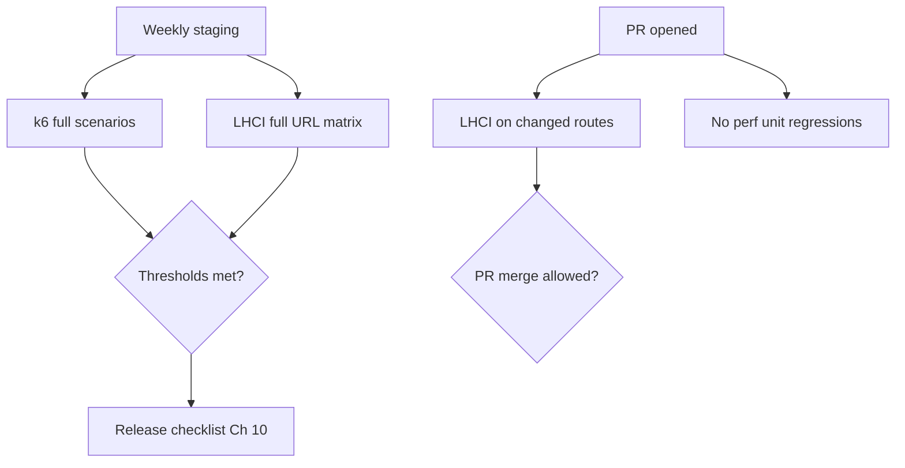

# Chapter 06: Performance Testing (k6, Lighthouse)

**Document ID:** SCP-TEST-001-06  
**Version:** 1.0.0  
**Status:** ✅ Active  
**Traceability:** NFR-001 – NFR-012, NFR-017  

---

## 1. Purpose

Define performance verification using **Grafana k6** for API/load scenarios and **Lighthouse CI** for web vitals, bundle budgets, and performance regression gates on storefront and admin surfaces.

## 2. Scope

- API throughput and latency under load (NFR-003, NFR-004, NFR-017)
- Storefront and admin Core Web Vitals (NFR-001, NFR-002, NFR-006)
- Nigeria/Africa network profiles (3G/4G emulation)
- Checkout and search hot paths

## 3. Out of Scope

- Infrastructure capacity planning (Volume 10)
- Database query tuning procedures (Volume 16)
- CDN configuration (Volume 10)

---

## 4. Performance Targets (Recap)

| ID | Metric | Target | Tool |
|----|--------|--------|------|
| NFR-001 | LCP mobile p75 | ≤ 2.0s | Lighthouse CI |
| NFR-002 | LCP desktop p75 | ≤ 1.5s | Lighthouse CI |
| NFR-003 | API read p95 | ≤ 200ms | k6 + OpenTelemetry |
| NFR-004 | API write p95 | ≤ 500ms | k6 |
| NFR-005 | Search autocomplete p95 | ≤ 100ms | k6 |
| NFR-009 | JS bundle initial | ≤ 150 KB gzip | Lighthouse + bundler |
| NFR-017 | Platform RPS | 100 (Phase 1) | k6 soak |

---

## 5. k6 Load Testing

### 5.1 Project Layout

```text
perf/k6/
├── config/
│   └── thresholds.json
├── lib/
│   ├── auth.js
│   └── tenants.js
├── scenarios/
│   ├── storefront-browse.js
│   ├── api-read-products.js
│   ├── api-write-cart.js
│   ├── search-autocomplete.js
│   ├── checkout-init.js          # stops before PSP redirect
│   └── webhook-ingest.js
└── README.md
```

### 5.2 Scenario Design

| Scenario | VUs | Duration | Ramp | Pass Criteria |
|----------|-----|----------|------|---------------|
| Storefront browse | 50 | 10 min | 2 min | p95 LCP proxy via TTFB ≤ 800ms |
| API product read | 100 | 10 min | 2 min | p95 ≤ 200ms, error &lt; 0.1% |
| Cart mutations | 30 | 10 min | 1 min | p95 ≤ 500ms |
| Search autocomplete | 50 | 5 min | 1 min | p95 ≤ 100ms |
| Checkout session create | 20 | 5 min | 30s | p95 ≤ 500ms, no 5xx |
| Webhook burst | 10 | 2 min | 10s | 100% 2xx, idempotent |

### 5.3 Example Script

```javascript
// perf/k6/scenarios/api-read-products.js
import http from 'k6/http';
import { check, sleep } from 'k6';
import { authHeaders } from '../lib/auth.js';

export const options = {
  stages: [
    { duration: '2m', target: 100 },
    { duration: '8m', target: 100 },
    { duration: '1m', target: 0 },
  ],
  thresholds: {
    http_req_duration: ['p(95)<200'],
    http_req_failed: ['rate<0.001'],
  },
};

export default function () {
  const res = http.get(
    `${__ENV.BASE_URL}/api/v1/products?limit=24`,
    { headers: authHeaders(__ENV.TENANT_TOKEN) }
  );

  check(res, {
    'status is 200': (r) => r.status === 200,
    'has products': (r) => JSON.parse(r.body).data.length > 0,
  });

  sleep(1);
}
```

### 5.4 Network Profiles — Africa

k6 browser module (Phase 2) or Toxiproxy for latency injection:

| Profile | Download | Upload | Latency | Use |
|---------|----------|--------|---------|-----|
| Lagos 4G | 9 Mbps | 3 Mbps | 80ms | Default mobile |
| Nigeria 3G | 768 Kbps | 256 Kbps | 200ms | NFR-058 minimum |
| Nairobi 4G | 10 Mbps | 4 Mbps | 100ms | Kenya launch |

### 5.5 Execution Cadence

| When | Environment | Scenarios |
|------|-------------|-----------|
| Weekly cron | Staging | Full suite |
| Pre-release | Staging | Full + 2× VUs |
| Post-incident | Staging | Affected scenario only |
| PR (optional) | Ephemeral preview | Smoke 10 VUs, 2 min |

### 5.6 Observability

- k6 outputs to Grafana Cloud k6 or self-hosted InfluxDB
- Correlate with OpenTelemetry trace IDs via `X-Request-Id` header
- Alert if p95 regresses &gt; 20% vs 7-day baseline

---

## 6. Lighthouse CI

### 6.1 Configuration

```text
lighthouserc.js          # Root config
.lighthouseci/
├── budgets.json
└── urls.json
```

```javascript
// lighthouserc.js (excerpt)
module.exports = {
  ci: {
    collect: {
      url: [
        'https://staging.scp.test/',
        'https://demo.staging.scp.test/products/sample',
        'https://demo.staging.scp.test/cart',
        'https://admin.staging.scp.test/dashboard',
      ],
      numberOfRuns: 3,
      settings: {
        preset: 'desktop',
        throttling: { rttMs: 40, throughputKbps: 10240 },
      },
    },
    assert: {
      assertions: {
        'categories:performance': ['error', { minScore: 0.9 }],
        'categories:accessibility': ['error', { minScore: 0.95 }],
        'largest-contentful-paint': ['error', { maxNumericValue: 2000 }],
        'cumulative-layout-shift': ['error', { maxNumericValue: 0.05 }],
        'total-blocking-time': ['error', { maxNumericValue: 200 }],
      },
    },
    upload: {
      target: 'temporary-public-storage',
    },
  },
};
```

### 6.2 Mobile Runs

Separate LHCI collection with `preset: 'mobile'` and Nigeria 4G throttling for NFR-001.

### 6.3 PR Delta Strategy

Full LHCI nightly. On PR:

- Detect changed routes via git diff on `apps/storefront/app/`
- Run LHCI only on affected URLs + homepage
- Compare scores vs `main` baseline; regressions &gt; 5 points block merge

### 6.4 Resource Budgets

`.lighthouseci/budgets.json` enforces NFR-009, NFR-010:

```json
[
  {
    "path": "/*",
    "resourceSizes": [
      { "resourceType": "script", "budget": 150 },
      { "resourceType": "stylesheet", "budget": 50 },
      { "resourceType": "image", "budget": 300 }
    ]
  }
]
```

Sizes in KB transferred (gzip).

---

## 7. Combined Performance Gate



---

## 8. Failure Triage

| Symptom | Likely Cause | Owner |
|---------|--------------|-------|
| API p95 spike | N+1 query, missing index | Backend |
| LCP regression | Hero image, font blocking | Frontend |
| TBT spike | JS bundle growth | Frontend |
| k6 5xx under load | Connection pool, Octane workers | SRE |
| Search p95 fail | Meilisearch capacity | Platform |

---

## 9. Security Considerations

- k6 runs only against staging with synthetic credentials
- Never load-test production without explicit war-game approval
- Webhook load tests use sandbox signatures only

---

## 10. Acceptance Criteria

- [ ] k6 weekly job green on staging for 4 consecutive weeks pre-GA
- [ ] LHCI performance ≥ 90 on storefront product page (mobile)
- [ ] LHCI accessibility ≥ 95 on gated URLs (pairs with Chapter 08)
- [ ] API read p95 ≤ 200ms at 100 RPS on staging
- [ ] 3G profile scenario documented and passing NFR-058 functional threshold

---

## 11. Sources

- Grafana k6 documentation: https://grafana.com/docs/k6/
- Lighthouse CI: https://github.com/GoogleChrome/lighthouse-ci
- Web Vitals: https://web.dev/vitals/
- NFR-001 – NFR-012 (internal)
