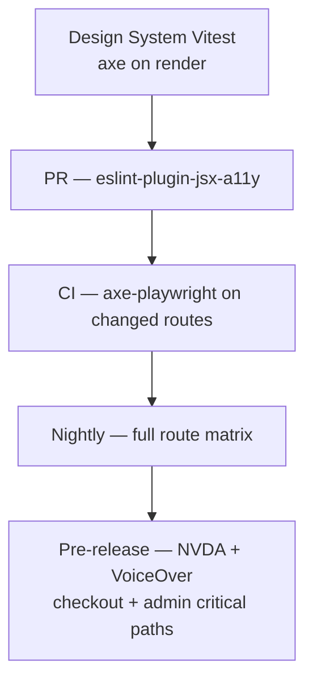

# Chapter 08: Accessibility Testing

**Document ID:** SCP-TEST-001-08  
**Version:** 1.0.0  
**Status:** ✅ Active  
**Traceability:** NFR-047 – NFR-053  

---

## 1. Purpose

Define how SCP verifies **WCAG 2.2 Level AA** accessibility across admin, storefront, vendor portal, and checkout flows — combining automated tooling, E2E keyboard tests, and manual screen reader verification.

Accessibility is a **product requirement** (Engineering Principle 1), not a post-launch audit.

## 2. Scope

- Web surfaces built with SAPPHITAL Design System (Volume 4)
- Storefront themes using platform components (locked checkout template)
- Forms, modals, navigation, data tables, checkout redirect handoff pages
- Mobile touch targets (NFR-051)

## 3. Out of Scope

- Merchant fully custom themes (Phase 1 — guidance only; certification Phase 2)
- PDF/email templates (separate checklist)
- Native mobile apps (Volume 17)

---

## 4. WCAG 2.2 AA Requirements Mapping

| NFR | WCAG Criterion | Test Approach |
|-----|----------------|---------------|
| NFR-047 | Level AA conformance | axe + manual audit |
| NFR-048 | 2.1.1 Keyboard | Playwright keyboard-only flows |
| NFR-049 | 4.1.2 Name, Role, Value | NVDA/VoiceOver manual |
| NFR-050 | 1.4.3 Contrast | axe + design token lint |
| NFR-051 | 2.5.8 Target Size (minimum) | CSS audit + manual |
| NFR-052 | 2.3.3 Animation from Interactions | `prefers-reduced-motion` tests |
| NFR-053 | 3.3.1 Error Identification, 3.3.3 Error Suggestion | Form E2E tests |

---

## 5. Testing Layers



---

## 6. Automated Testing

### 6.1 ESLint (Development)

```json
{
  "extends": ["plugin:jsx-a11y/recommended"],
  "rules": {
    "jsx-a11y/anchor-is-valid": "error",
    "jsx-a11y/click-events-have-key-events": "error",
    "jsx-a11y/no-autofocus": "warn"
  }
}
```

### 6.2 Vitest + axe-core (Components)

```typescript
import { axe, toHaveNoViolations } from 'jest-axe';
import { render } from '@testing-library/react';

expect.extend(toHaveNoViolations);

it('PrimaryButton meets a11y rules', async () => {
  const { container } = render(<PrimaryButton>Pay now</PrimaryButton>);
  expect(await axe(container)).toHaveNoViolations();
});
```

Design system components: **zero axe violations** at merge.

### 6.3 Playwright + @axe-core/playwright (Pages)

```typescript
import AxeBuilder from '@axe-core/playwright';

const CRITICAL_ROUTES = [
  '/',
  '/products/:slug',
  '/cart',
  '/checkout',
  '/admin/dashboard',
  '/admin/products/new',
];

for (const route of CRITICAL_ROUTES) {
  test(`a11y: ${route} @a11y`, async ({ page }) => {
    await page.goto(route);
    const results = await new AxeBuilder({ page })
      .withTags(['wcag2a', 'wcag2aa', 'wcag22aa'])
      .analyze();

    const blocking = results.violations.filter(
      (v) => v.impact === 'critical' || v.impact === 'serious'
    );
    expect(blocking).toEqual([]);
  });
}
```

### 6.4 Lighthouse CI

Accessibility category ≥ 95 score on gated URLs (Chapter 06). Lighthouse complements but does not replace axe rule coverage.

---

## 7. Keyboard Testing (NFR-048)

Playwright tests simulate **keyboard-only** operation:

| Flow | Steps | Pass Criteria |
|------|-------|---------------|
| Admin product create | Tab through form, Enter submit | Product created |
| Storefront add to cart | Tab to button, Space activate | Cart count updates |
| Checkout | Tab through shipping form | Redirect button reachable |
| Modal dialog | Escape closes, focus returns | Focus trap works |
| Data table | Arrow keys or Tab through actions | Row actions reachable |

```typescript
test('checkout is keyboard operable @a11y', async ({ page }) => {
  await page.goto('/checkout');
  await page.keyboard.press('Tab');
  // ... navigate to Pay button without mouse
  await page.keyboard.press('Enter');
  await expect(page).toHaveURL(/paystack|flutterwave/);
});
```

---

## 8. Screen Reader Testing (NFR-049)

Manual checklist pre-release — **not fully automatable**:

| Surface | Tool | Pass |
|---------|------|------|
| Storefront product page | NVDA (Windows) | Product name, price announced |
| Cart | NVDA | Item count, remove buttons labeled |
| Checkout | NVDA | Form errors linked via `aria-describedby` |
| Order confirmation | VoiceOver (iOS) | Success message announced |
| Admin dashboard | NVDA | Landmarks, skip link works |

Record session notes in `qa/a11y-reports/{release}/`.

---

## 9. Visual & Motion (NFR-050, NFR-052)

### 9.1 Contrast

- Design tokens enforced via Style Dictionary lint: text ≥ 4.5:1, large text ≥ 3:1
- axe `color-contrast` rule on all pages

### 9.2 Reduced Motion

```typescript
test('respects prefers-reduced-motion @a11y', async ({ page }) => {
  await page.emulateMedia({ reducedMotion: 'reduce' });
  await page.goto('/');
  const animationDuration = await page.evaluate(() =>
    getComputedStyle(document.querySelector('.hero-banner')!).animationDuration
  );
  expect(animationDuration).toBe('0s');
});
```

---

## 10. Form Accessibility (NFR-053)

| Requirement | Test |
|-------------|------|
| Visible labels | axe `label` rule |
| Error association | `aria-invalid`, `aria-describedby` |
| Focus on first error | Playwright: submit empty form → focus on first invalid |
| Required fields | `aria-required` or visible indicator + text |

Nigeria context: phone input uses `inputmode="tel"`, country code +234 labeled clearly for screen readers.

---

## 11. Checkout & PCI Interaction

On SCP checkout pages (pre-redirect):

- Single clear primary action ("Continue to Paystack")
- Warning if redirect will leave site (WCAG 3.2.2 predictable)
- No timeout without extension on session expiry

Post-redirect PSP pages are PSP responsibility; SCP documents handoff accessibility in merchant help center.

---

## 12. Gated Routes (Phase 1)

Must pass automated + manual checklist before Nigeria GA:

1. Storefront homepage
2. Product detail page
3. Cart
4. Checkout (pre-redirect)
5. Order confirmation
6. Merchant login / signup
7. Admin dashboard
8. Admin product CRUD
9. Admin order detail

---

## 13. CI Integration

| Job | Tool | Gate |
|-----|------|------|
| `eslint-a11y` | jsx-a11y | PR merge |
| `vitest-axe` | jest-axe on design system | PR merge |
| `playwright-a11y` | axe-core serious/critical = 0 | PR on changed routes |
| `lhci-a11y` | score ≥ 95 | PR + nightly |
| Manual NVDA/VoiceOver | checklist | Pre-release |

---

## 14. Exception Process

WCAG exceptions require:

1. Ticket with criterion ID, user impact, mitigation
2. Product + accessibility reviewer approval
3. Entry in `docs/04-design-system/accessibility-exceptions.md`
4. Re-review every 6 months

---

## 15. Acceptance Criteria

- [ ] Zero critical/serious axe violations on gated routes
- [ ] Keyboard tests pass for checkout and admin product create
- [ ] NVDA/VoiceOver manual checklist signed pre-GA
- [ ] Design system components have Vitest axe coverage
- [ ] Lighthouse accessibility ≥ 95 on storefront product page

---

## 16. Sources

- WCAG 2.2: https://www.w3.org/TR/WCAG22/
- axe-core rules: https://github.com/dequelabs/axe-core
- WAI-ARIA Authoring Practices: https://www.w3.org/WAI/ARIA/apg/
- Volume 4 Design System (accessibility tokens)
