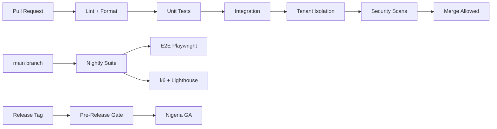

# Chapter 09: CI Quality Gates

**Document ID:** SCP-TEST-001-09  
**Version:** 1.0.0  
**Status:** ✅ Active  
**Traceability:** NFR-040 – NFR-044, NFR-047 – NFR-053, Engineering Principles

---

## Purpose

Define **continuous integration quality gates** that block defective code from reaching staging or production — enforcing SCP's fail-closed security and multi-tenant correctness standards for Nigeria GA.

## Scope

- PR merge gates (blocking)
- Nightly pipeline gates
- Pre-release gates
- Tool configuration and thresholds
- Flaky test quarantine policy
- Evidence retention for compliance

## Out of Scope

- Release sign-off ceremony (Chapter 10)
- Production monitoring alerts (Volume 10 Ch. 08)
- Manual QA test cases (team process)

---

## 1. Pipeline Overview



---

## 2. PR Merge Gates (Blocking)

| Gate | Tool | Threshold | Timeout |
|------|------|-----------|---------|
| PHP lint | Laravel Pint | Zero violations | 2 min |
| TS lint | ESLint | Zero errors | 3 min |
| PHP types | PHPStan level 6 | Zero errors | 5 min |
| Backend unit | Pest | 100% pass | 8 min |
| Frontend unit | Vitest | 100% pass | 5 min |
| Integration | Pest + PostgreSQL | 100% pass | 15 min |
| **Tenant isolation** | Auto-generated Pest | **0 failures** | 10 min |
| Secret scan | gitleaks | 0 leaks | 1 min |
| Dependency CVE | composer audit + npm audit | 0 critical/high | 3 min |
| SAST | Semgrep SCP rules | 0 blocking findings | 5 min |

**Total PR pipeline target:** < 25 minutes on standard runner.

---

## 3. Changed-Path Optimization

| Path Changed | Required Gates |
|--------------|----------------|
| `app/Domain/*` | Full backend + isolation |
| `resources/js/admin/*` | Vitest + ESLint |
| `themes/*` | Theme check CLI + Lighthouse changed routes |
| `docs/*` only | Markdown lint (no test gates) |
| `migrations/*` | Integration + isolation + migration rollback test |

---

## 4. Nightly Gates (Non-Blocking PR, Blocking Release)

| Gate | Tool | Threshold |
|------|------|-----------|
| E2E storefront | Playwright | 100% critical paths |
| E2E admin | Playwright | 100% critical paths |
| E2E checkout Paystack test | Playwright + test mode | Payment flow complete |
| Load smoke | k6 | p95 < 500ms @ 100 VU |
| Lighthouse mobile | Lighthouse CI | Performance ≥ 85 reference theme |
| Accessibility | axe-core | 0 serious/critical on checkout + admin |
| ZAP baseline | OWASP ZAP | 0 high |

Nightly failures create P2 ticket; same failure 2 nights → P1.

---

## 5. Pre-Release Gates (Nigeria GA)

| Gate | Requirement |
|------|-------------|
| All nightly green | 3 consecutive nights |
| Tenant isolation | Extended suite 0 failures |
| PCI pack | SAQ A assertions pass (ADR-004) |
| NDPA pack | Export/delete e2e pass |
| Manual a11y | NVDA spot check checkout (Volume 13 Ch. 08) |
| Staging soak | 48h with synthetic traffic |
| Rollback drill | RB-002 executed once per release candidate |

---

## 6. Coverage Targets

| Layer | Minimum Coverage | Enforced |
|-------|------------------|----------|
| Domain logic (PHP) | 80% line | PR warning < 75%; release block < 70% |
| Application actions | 70% line | PR warning |
| HTTP controllers | 60% line | Informational |
| React components | 50% line | PR warning |
| Critical paths | 100% e2e | Release block |

Coverage excludes generated code, migrations, config.

---

## 7. Flaky Test Policy

| Stage | Action |
|-------|--------|
| First flake | Quarantine with `@group quarantine`; issue filed |
| Quarantine SLA | Fix within 5 business days |
| Release | Zero quarantined tests in critical paths |
| Third flake | Test deleted and rewritten |

Quarantined tests still run nightly but don't block PR.

---

## 8. Evidence Retention

| Artifact | Retention | Storage |
|----------|-----------|---------|
| CI logs | 90 days | CI provider |
| Coverage reports | 1 year | R2 compliance bucket |
| Security scan SARIF | 1 year | R2 |
| Lighthouse reports | 1 year | R2 |
| Isolation suite results | 1 year | R2 |

Required for NDPA accountability and enterprise customer audits.

---

## 9. Local Developer Parity

```bash
# Run full PR suite locally
composer test:pr
npm run test:pr

# Includes: pint, phpstan, pest, vitest, isolation subset
# Target: < 10 minutes on M1 Mac / equivalent
```

Pre-push hook recommended; not mandatory.

---

## 10. Gate Bypass Policy

| Situation | Allowed | Approval |
|-----------|---------|----------|
| Emergency hotfix SEV1 | Single gate skip | Lead Architect + on-call |
| Docs-only change | Test skip | Auto |
| CVE false positive | CVE gate skip | Security reviewer |
| Routine bypass | **Never** | — |

All bypasses logged in audit with reason and ticket ID.

---

## 11. Acceptance Criteria

- [ ] PR blocking gates: lint, unit, integration, isolation, gitleaks, CVE, Semgrep
- [ ] Tenant isolation 0 failures — blocking on every PR
- [ ] Nightly: E2E, k6, Lighthouse, axe, ZAP documented
- [ ] Pre-release: 3 green nights, PCI pack, NDPA e2e, rollback drill
- [ ] Coverage targets for domain 80% with release block at 70%
- [ ] Flaky quarantine SLA 5 business days
- [ ] Evidence retention 90 days–1 year specified
- [ ] Gate bypass requires Lead Architect approval

---

## References

- [Chapter 04 — Tenant Isolation Suite](./04-tenant-isolation-test-suite.md)
- [Chapter 07 — Security Testing](./07-security-testing.md)
- [Volume 11 Ch. 07 — Security Acceptance](../11-security/07-acceptance-criteria.md)
- [Chapter 10 — Release Criteria](./10-release-criteria.md)
