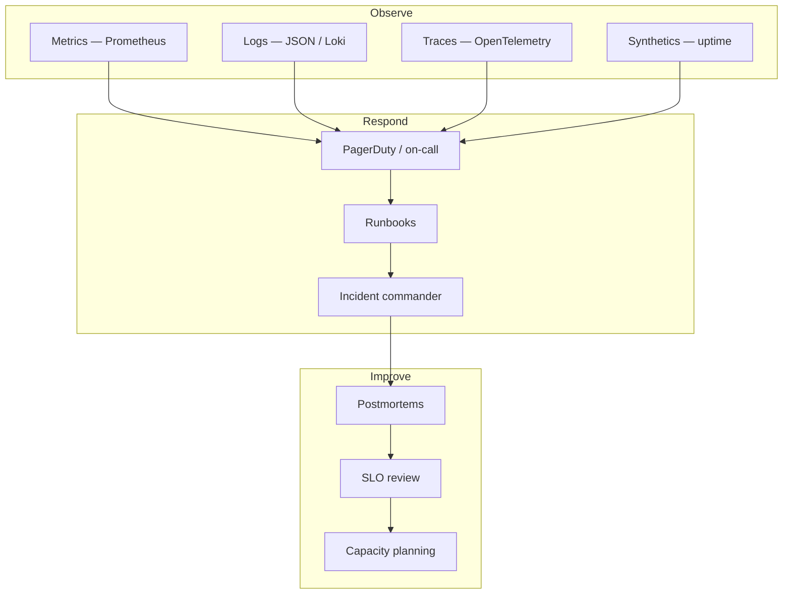

# Chapter 01: Operations Overview

**Document ID:** SCP-OPS-001-01  
**Version:** 1.0.0  
**Status:** 📝 Draft  
**Traceability:** NFR-021 – NFR-028, NFR-062 – NFR-070, ADR-011, Volume 10, Volume 11 Ch 06  

---

## Purpose

Define how SCP is **operated reliably** from Nigeria Phase 1 launch through multi-region scale. Operations covers observability, incident response, capacity, database maintenance, merchant support, and external communications — the day-to-day work that keeps merchants selling when infrastructure, payments, or third parties fail.

## Scope

- Operational model and team roles (bootstrap → scale)
- Observability stack and golden signals
- Runbook and on-call program
- Relationship to Volume 10 (Infrastructure) and Volume 11 (Security)
- Nigeria/West Africa operational constraints (power, connectivity, PSP latency)

## Out of Scope

- Application feature development (Volumes 5–9)
- Detailed cloud provisioning (Volume 10)
- Security control implementation (Volume 11)

---

## Operational Philosophy

SCP operations follow four principles aligned with [Engineering Principles](../00-meta/engineering-principles.md):

1. **Measure before optimizing** — SLOs and error budgets drive prioritization, not gut feel.
2. **Automate the toil** — Backups, deploys, scaling alerts, and tenant exports are scripted; humans handle judgment calls.
3. **Fail closed on isolation** — Any missing tenant context or RLS failure is treated as SEV1 (ADR-002, ADR-005).
4. **Nigeria-first runbooks** — Primary on-call timezone WAT (UTC+1); NDPA breach clocks and Paystack/Flutterwave webhook health are first-class monitors.

---

## Operational Model by Phase

| Phase | Team | On-call | Primary region | Key ops focus |
|-------|------|---------|----------------|---------------|
| Phase 1 (Nigeria MVP) | 1–3 engineers | Shared rotation; DPO on breach escalation | Lagos / West Africa | Uptime, backups, PSP webhooks, tenant isolation |
| Phase 2 (Growth) | 5–10 engineers | Dedicated primary + secondary | Lagos + Kenya read path | Read replicas, queue scaling, merchant support tier |
| Phase 3 (Platform) | 15–30 engineers | 24×7 rotation; SRE function | Multi-region Africa | Marketplace payouts, search/AI service health |
| Phase 4 (Enterprise) | 30+ engineers | Follow-the-sun + enterprise liaison | Africa + EU/US enclaves | Dedicated tenant ops, custom SLAs |

**Assumption:** Phase 1 on-call is engineer-led with legal/DPO escalation paths documented in Chapter 04.  
**Validation needed:** Hire dedicated SRE when active merchants exceed 2,000 or monthly incidents exceed 10 SEV2+.

---

## Observability Stack

| Layer | Tool (Phase 1) | NFR | Notes |
|-------|----------------|-----|-------|
| Metrics | Prometheus + Grafana | NFR-063 | RED metrics per service; business counters (orders/min, GMV) |
| Logs | Structured JSON → Loki or managed log store | NFR-062, NFR-070 | `tenant_id`, `trace_id`, `request_id` on every line |
| Traces | OpenTelemetry → Tempo/Jaeger | NFR-064 | Checkout and payment spans mandatory |
| Errors | Sentry | NFR-066 | PII scrubbing verified quarterly |
| Uptime | External synthetics (1-min) | NFR-067 | Lagos, Nairobi, London probe points |
| Alerting | PagerDuty or equivalent | NFR-068 | SEV1 pages immediately |

### Golden Signals (Per Service)

| Signal | Target surface | Alert threshold (Phase 1) |
|--------|----------------|---------------------------|
| **Latency** | API p95 | > 500ms write, > 200ms read for 5 min |
| **Traffic** | Requests/sec | Anomaly ± 50% vs 7-day baseline |
| **Errors** | 5xx rate | > 1% for 3 min → SEV2; > 5% → SEV1 |
| **Saturation** | CPU, DB connections, queue depth | > 80% for 10 min |

### Nigeria-Specific Monitors

| Monitor | Rationale |
|---------|-----------|
| Paystack / Flutterwave webhook success rate | Primary payment rails for Nigeria merchants |
| PSP redirect latency (p95) | Mobile 3G/4G checkout completion (NFR-012) |
| NDPA-relevant audit export job failures | Regulatory evidence for DPO |
| Cross-border subprocessor API errors | Cloudflare, Sentry, AI gateway — RoPA impact |

---

## Health Endpoints

| Endpoint | Purpose | Consumer |
|----------|---------|----------|
| `GET /health` | Liveness — process up | Load balancer, k8s |
| `GET /ready` | Readiness — DB, Redis, queue reachable | Deploy pipeline |
| `GET /health/deep` | Auth-only; full dependency check | On-call diagnostics |

Readiness failure during deploy **blocks traffic shift** (NFR-028 zero-downtime from Phase 2).

---

## Runbook Catalog

Every runbook lives in `runbooks/` (repository) and links from Grafana/PagerDuty.

| ID | Runbook | SEV | Owner |
|----|---------|-----|-------|
| RB-001 | Platform down — all regions | SEV1 | Platform |
| RB-002 | PostgreSQL primary unavailable | SEV1 | Platform |
| RB-003 | Redis unavailable | SEV2 | Platform |
| RB-004 | Queue backlog critical | SEV2 | Platform |
| RB-005 | Cross-tenant data leak suspected | SEV1 | Security + Platform |
| RB-006 | Payment webhook storm / duplicate charges | SEV1 | Commerce |
| RB-007 | Paystack/Flutterwave outage | SEV2 | Commerce |
| RB-008 | Cloudflare WAF false positives | SEV3 | Platform |
| RB-009 | Backup restore drill | — | Platform |
| RB-010 | NDPC breach notification | SEV1 | DPO + Legal |
| RB-011 | Tenant data export failure | SEV3 | Support + Platform |
| RB-012 | RLS / SET LOCAL isolation failure | SEV1 | Platform |

---

## Data Ownership

| Data | Owner | Operations access |
|------|-------|-------------------|
| Application metrics & logs | Platform team | Full; PII scrubbed |
| Audit logs | Security / DPO | Read-only; immutable (ADR-009) |
| Merchant support tickets | Support ops | Tenant-scoped |
| Incident records | Incident commander | Internal |
| Status page history | Comms lead | Public subset |

---

## Security Considerations

- Production access via SSO + MFA; break-glass credentials in Vault (ADR-007)
- Admin impersonation logged and time-boxed (ADR-010)
- No production DB queries without ticket reference; read replicas for diagnostics
- Log access restricted; Nigeria NDPA data minimization in log fields

---

## Operational Implications

| Area | Phase 1 | Phase 3+ |
|------|---------|----------|
| Deployments | Docker Compose; manual approval | Blue/green or canary |
| Backups | Every 6h; tested quarterly | Continuous PITR + cross-region copy |
| Maintenance | ≤ 2h/month off-peak WAT | Zero-downtime migrations |
| Support hours | Business hours WAT + email | 24×7 for Business+ tiers |

---

## Risks and Tradeoffs

| Risk | Mitigation |
|------|------------|
| Small team burnout from on-call | Strict SEV definitions; error budget policy pauses feature work |
| Africa cloud region availability | Multi-AZ within region; DR runbook to secondary AZ |
| PSP dependency | Status page integration; COD fallback messaging |
| Observability cost | Sample traces at high volume; retain hot logs 90 days (NFR-070) |

---

## Acceptance Criteria

- [ ] Golden signal dashboards live for API, workers, PostgreSQL, Redis
- [ ] All RB-001 – RB-012 runbooks authored and linked from PagerDuty
- [ ] External synthetics from Lagos probe passing
- [ ] On-call rotation documented with escalation to DPO for breach scenarios
- [ ] `/health` and `/ready` integrated with deploy pipeline

---

## Related ADRs

- [ADR-002](../00-meta/adr/002-multi-tenancy-shared-db-rls.md) — Tenant isolation operations
- [ADR-005](../00-meta/adr/005-rls-pgbouncer-set-local.md) — RLS operational discipline
- [ADR-009](../00-meta/adr/009-audit-log-immutability.md) — Audit retention
- [ADR-011](../00-meta/adr/011-data-residency-africa.md) — Nigeria-primary operations region

---

## Sources

- Google SRE Book — golden signals, error budgets (E2)
- OpenTelemetry documentation (E1)
- Volume 1 NFR-021 – NFR-028, NFR-062 – NFR-070
- Volume 11 Chapter 06 — Incident Response
