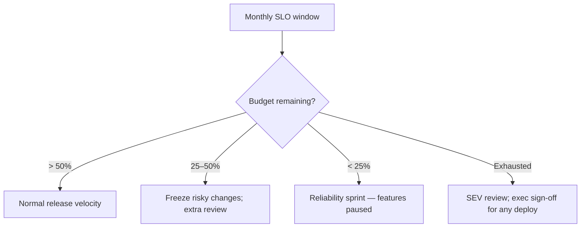

# Chapter 02: SLOs, SLAs, and Error Budgets

**Document ID:** SCP-OPS-001-02  
**Version:** 1.0.0  
**Status:** 📝 Draft  
**Traceability:** NFR-001 – NFR-004, NFR-021 – NFR-023, NFR-067  

---

## Purpose

Translate NFR targets into **measurable Service Level Objectives (SLOs)** for internal reliability engineering, **Service Level Agreements (SLAs)** for merchant-facing commitments, and **error budgets** that govern release velocity when reliability degrades.

## Scope

- Platform-wide and tier-specific SLO definitions
- SLA commitments by subscription tier (Nigeria launch)
- Error budget policy and burn-rate alerting
- Measurement methodology and reporting cadence

## Out of Scope

- Individual microservice SLOs before service extraction (Phase 3+)
- Enterprise custom SLA legal contracts (see Volume 15 Ch 06)

---

## Definitions

| Term | Definition |
|------|------------|
| **SLI** | Service Level Indicator — quantified metric (e.g., successful checkout ratio) |
| **SLO** | Internal target for an SLI over a rolling window |
| **SLA** | External commitment with remedies (credits) if breached |
| **Error budget** | Allowed unreliability: `1 − SLO` over the measurement window |

---

## Platform SLOs (Phase 1 — Nigeria)

All SLOs measured **calendar month**, excluding announced maintenance (≤ 2h/month, NFR-022).

### Availability SLO

| SLI | SLO | Measurement |
|-----|-----|-------------|
| **Platform availability** | **99.9%** | Synthetic + LB success for storefront, admin, API `/ready` |
| **Checkout availability** | **99.95%** | Successful completion of synthetic checkout (Paystack sandbox) |
| **Webhook delivery** | **99.5%** | Merchant-configured webhooks delivered within 5 min |

**Maps to:** NFR-021 (99.9% monthly uptime).

### Latency SLOs

| Surface | SLI | SLO (p95) | Window |
|---------|-----|-----------|--------|
| Storefront LCP (mobile) | Lighthouse / CrUX | ≤ 2.0s | Weekly rolling |
| API reads | Server-side trace | ≤ 200ms | 28-day |
| API writes | Server-side trace | ≤ 500ms | 28-day |
| Admin dashboard TTI | Lighthouse | ≤ 3.0s | Weekly rolling |
| Search autocomplete | App metric | ≤ 100ms | 28-day |

**Maps to:** NFR-001 – NFR-006.

### Correctness SLOs

| SLI | SLO | Notes |
|-----|-----|-------|
| Payment state consistency | 99.99% | Order paid iff PSP confirms; zero duplicate capture |
| Tenant isolation | 100% | Automated suite — any failure is SEV1, not budget consumption |
| Audit log completeness | 99.99% | Mandatory events from Volume 11 |

---

## Tier SLAs (Merchant-Facing)

SLAs apply from **Phase 2** for paid tiers; Enterprise SLAs are custom (Volume 15).

| Tier | Monthly uptime SLA | Support response | Credit remedy |
|------|-------------------|------------------|---------------|
| Free / Starter | Best effort (no credit) | 48h email | — |
| Business | 99.9% | 8h business (WAT) | 10% monthly fee per 0.1% below SLA |
| Marketplace | 99.9% | 4h business | 15% monthly fee per 0.1% below SLA |
| Enterprise | 99.95%+ (contract) | 1h 24×7 | Per MSA |

**Nigeria note:** SLA credits issued in **NGN** against next invoice; documented in Terms of Service and DPA annex.

### SLA Exclusions

- Merchant misconfiguration (DNS, custom code, theme errors)
- Third-party PSP outages beyond SCP control (status communicated)
- Force majeure, DDoS beyond mitigated capacity
- Announced maintenance within NFR-022 limits

---

## Error Budget Policy

### Burn-Rate Alerts

Multi-window burn rates page on-call when budget consumption accelerates:

| Alert | Condition | Action |
|-------|-----------|--------|
| Fast burn | 2% budget in 1 hour | Page primary on-call |
| Slow burn | 10% budget in 6 hours | Slack warning; IC notified |
| Budget exhausted | 0% remaining | Feature freeze per policy |

### Budget Allocation by Change Type

| Change type | Budget cost |
|-------------|-------------|
| Standard deploy (rollback ≤ 5 min) | Normal |
| Database migration (expand-only) | 1.5× risk weight |
| Payment gateway change | 2× risk weight |
| RLS / tenancy change | Requires architect + DPO review; no budget override |

---

## Measurement Implementation

### Data Sources

| SLI | Source | Retention |
|-----|--------|-----------|
| Availability | Prometheus `up`, synthetics | 13 months |
| Latency | OpenTelemetry histograms | 90 days hot |
| Checkout success | Analytics event `checkout.completed` | 13 months |
| Webhook delivery | `webhook_deliveries` table | 90 days |

### SLO Dashboard (Grafana)

Required panels:

1. Availability — current month vs 99.9% target
2. Error budget remaining (%)
3. Burn rate (1h, 6h, 3d)
4. Checkout and API latency heatmaps
5. Top error budget consumers (deploys, incidents)

### Reporting Cadence

| Report | Audience | Frequency |
|--------|----------|-----------|
| SLO review | Engineering | Weekly |
| SLA compliance | Product + Finance | Monthly |
| Executive reliability summary | Leadership | Quarterly |

---

## Nigeria / Africa Considerations

| Factor | SLO impact |
|--------|------------|
| Mobile network variability | Storefront SLO uses p75 LCP on 4G profile, not datacenter-only |
| PSP latency spikes | Checkout SLO excludes PSP redirect time > 30s (user abandon) |
| Public holidays (Eid, Christmas) | Support SLA adjusted in published holiday calendar |
| Kenya merchants | Same platform SLOs; region tag on dashboards for KE-specific incidents |

---

## Business Rules

1. **Tenant isolation failures never consume error budget** — they trigger immediate rollback and SEV1.
2. **Planned maintenance** must be posted 72h on status page; counts against availability only if exceeds 2h/month.
3. **SLA credits** require merchant ticket within 30 days of month end; automated calculation from uptime data.

---

## Acceptance Criteria

- [ ] All Phase 1 SLOs instrumented and visible on Grafana home dashboard
- [ ] Burn-rate alerts configured in PagerDuty
- [ ] Error budget policy documented and acknowledged by engineering lead
- [ ] SLA credit calculation script tested against synthetic downtime
- [ ] Monthly SLO report template in use

---

## Related ADRs

- [ADR-004](../00-meta/adr/004-checkout-psp-redirect-saq-a.md) — Checkout availability scope
- [ADR-011](../00-meta/adr/011-data-residency-africa.md) — Regional measurement tags

---

## Sources

- Google SRE Workbook — multi-window burn rates (E2)
- Volume 1 NFR-021 – NFR-023
- Volume 1 Chapter 07 — Success metrics
