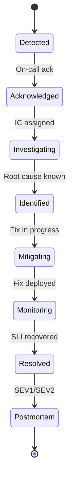
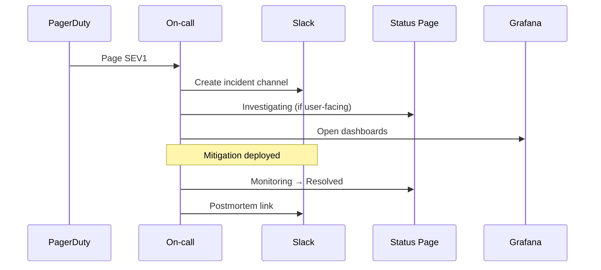

# Chapter 03: Incident Management

**Document ID:** SCP-OPS-001-03  
**Version:** 1.0.0  
**Status:** 📝 Draft  
**Traceability:** NFR-023, NFR-068, Volume 11 Ch 06  

---

## Purpose

Define the **end-to-end incident lifecycle** for SCP — from detection through resolution and handoff to postmortem — with Nigeria NDPA regulatory clocks integrated for personal data breaches.

## Scope

- Severity classification and incident types
- Incident commander (IC) role and responsibilities
- Communication templates and stakeholder matrix
- Tooling workflow (PagerDuty, Slack, status page)
- Integration with security incident response (Volume 11)

## Out of Scope

- Detailed security forensics procedures (Volume 11 Ch 06)
- Merchant support ticket handling (Chapter 07)

---

## Incident Severity Matrix

| SEV | User impact | Examples | MTTD target | Mitigation decision |
|-----|-------------|----------|-------------|---------------------|
| **SEV1** | Platform-wide or payment integrity | Full outage; cross-tenant leak; mass duplicate charges; confirmed NDPA breach | ≤ 5 min | ≤ 15 min |
| **SEV2** | Major feature degraded | Checkout failing for one PSP; admin down; single-tenant data exposure | ≤ 15 min | ≤ 1 hour |
| **SEV3** | Partial degradation | Elevated 5xx; slow search; webhook delays | ≤ 30 min | ≤ 4 hours |
| **SEV4** | Minor / internal | Non-prod failure; cosmetic bug; low-traffic endpoint | Next business day | As scheduled |

**Maps to:** NFR-023 (MTTR ≤ 30 min for P1/SEV1).

---

## Incident Types

| Type | Default SEV | Primary runbook |
|------|-------------|-----------------|
| Availability | 1–3 | RB-001 |
| Database | 1–2 | RB-002 |
| Payment / PSP | 1–2 | RB-006, RB-007 |
| Security / isolation | 1 | RB-005, RB-012 |
| Privacy / breach | 1 | RB-010 + Vol 11 |
| Performance | 2–3 | Capacity runbooks |
| Third-party (Cloudflare, Paystack) | 2 | Vendor status + comms |

---

## Incident Lifecycle

### Phase Responsibilities

| Phase | IC actions | Engineering | Comms | DPO (if PII) |
|-------|------------|-------------|-------|--------------|
| Detect | — | Triage alert | — | — |
| Ack | Assign roles; open incident channel | Join bridge | Draft internal note | Notify if breach suspected |
| Investigate | Coordinate; time-box hypotheses | Logs, traces, deploy history | — | Scope data categories |
| Mitigate | Approve rollback/feature flag | Execute fix | Status page update | Start 72h NDPC clock |
| Resolve | Confirm SLI recovery | Monitor 30 min | All-clear | Breach assessment |
| Review | Schedule postmortem | Draft timeline | Customer summary | Regulatory filing |

---

## Incident Commander Playbook

The IC is **not required to be the most senior engineer** — they coordinate, they do not solo-debug.

**IC checklist:**

1. Open `#incident-YYYYMMDD-sevN` channel; pin timeline doc
2. Page additional expertise (DB, payments, security)
3. Assign roles: **Operations Lead**, **Comms Lead**, **Scribe**
4. Every 15 min (SEV1) or 30 min (SEV2): status broadcast in channel
5. Log decisions with timestamp (who, what, why)
6. Declare resolved only when SLI green for 30 consecutive minutes
7. Create postmortem ticket within 24 hours for SEV1/SEV2

---

## Regulatory Integration (Nigeria Primary)

When an incident may involve **personal data** (customer PII, merchant KYC, payment metadata):

| Clock | Trigger | Owner | Deadline |
|-------|---------|-------|----------|
| NDPC notification | Reasonable certainty of breach (NDPA §40) | DPO | **≤ 72 hours** from awareness |
| Data subject notification | High risk to individuals | DPO + Comms | Immediately after NDPC where required |
| Merchant notification | SCP as processor | Comms | Without undue delay |
| ODPC (Kenya) | KE data subjects affected | DPO | ≤ 72 hours |

**Clock starts** when any engineer or DPO has reasonable certainty — not when forensics complete. See Volume 11 Ch 06.

---

## Tooling Workflow

### Incident Record Fields

| Field | Required |
|-------|----------|
| `incident_id` | UUID |
| `severity` | SEV1–4 |
| `started_at`, `resolved_at` | ISO 8601 WAT |
| `customer_impact_summary` | Plain language |
| `affected_regions` | NG, KE, global |
| `affected_tenants` | Count or list |
| `root_cause` | Post-resolution |
| `regulatory_triggered` | boolean + NDPC ref |
| `error_budget_consumed` | % |

---

## Communication Matrix

| Stakeholder | SEV1 | SEV2 | Channel |
|-------------|------|------|---------|
| Engineering | Immediate | Immediate | Slack + bridge |
| Leadership | ≤ 30 min | ≤ 2 hours | Email summary |
| Merchants (all) | Status page ≤ 15 min | Status page if user-visible | status.sapphital.com |
| Affected merchants | Direct email/SMS | Email if tenant-specific | Support system |
| NDPC / ODPC | DPO-led | If applicable | Secure channel |
| PSP partners | If payment related | If extended | Partner portal |

---

## Feature Flags and Kill Switches

| Switch | Effect | Authority |
|--------|--------|-----------|
| `checkout.disabled` | Storefront checkout → maintenance message | IC + Commerce lead |
| `webhooks.paused` | Stop outbound webhook flood | IC |
| `ai.agents.disabled` | Disable autonomous agents | IC |
| `tenant.{id}.readonly` | Isolate tenant | IC + Security |
| `psp.paystack.disabled` | Route to Flutterwave fallback | IC |

All kill switches emit audit events (ADR-009).

---

## Failure Modes

| Failure | Detection | Response |
|---------|-----------|----------|
| Alert storm | PagerDuty dedup | Single IC; mute noisy alerts |
| No IC available | Escalation timeout | Secondary → engineering lead |
| Premature resolve | SLI re-burn | Reopen incident; extend postmortem |
| Under-communicated SEV1 | Support ticket spike | Comms lead publishes update |

---

## Acceptance Criteria

- [ ] SEV1 tabletop completed quarterly; mitigation decision ≤ 30 min (Volume 11)
- [ ] Incident record template in use for all SEV1/SEV2
- [ ] Status page integrated with incident workflow (Chapter 08)
- [ ] NDPC breach drill: notification draft ≤ 4h from scenario start
- [ ] Kill switches tested in staging monthly

---

## Related ADRs

- [ADR-009](../00-meta/adr/009-audit-log-immutability.md)
- [ADR-010](../00-meta/adr/010-admin-impersonation.md) — Impersonation during incidents

---

## Sources

- Volume 11 Chapter 06 — Incident Response
- NDPA §40 breach notification (E1)
- PagerDuty incident response guide (E2)
