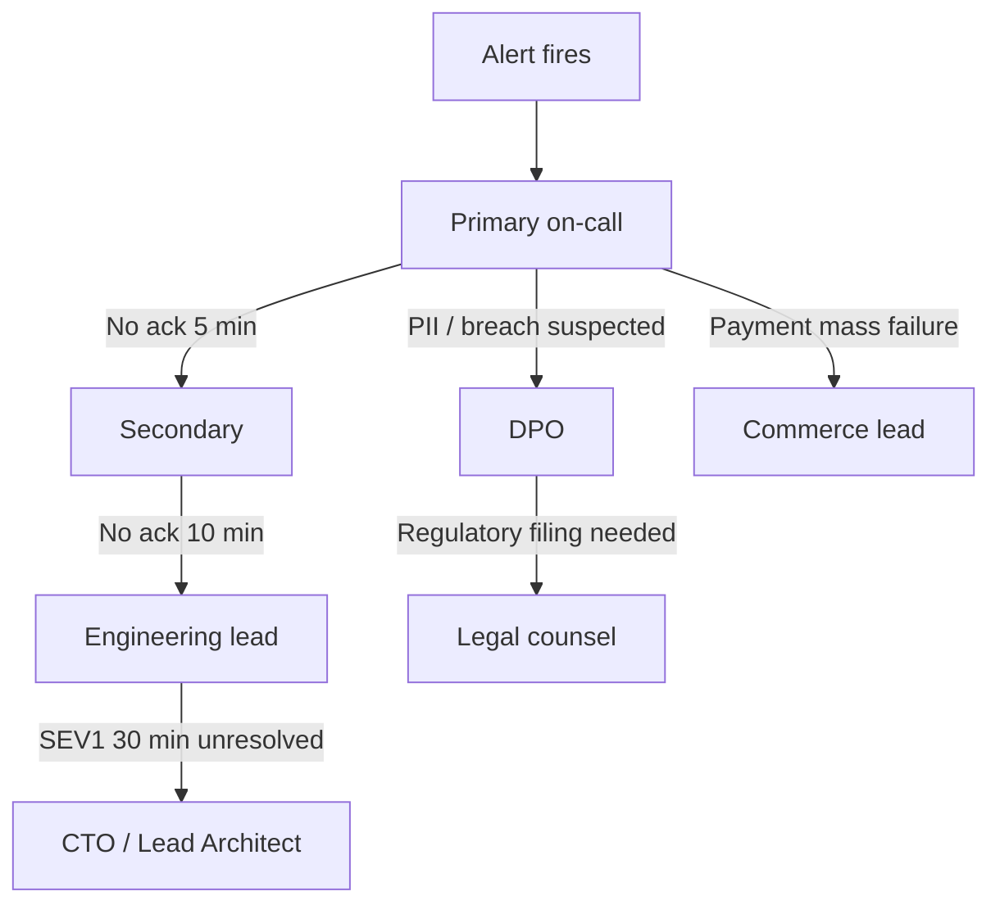

# Chapter 04: On-Call and Escalation

**Document ID:** SCP-OPS-001-04  
**Version:** 1.0.0  
**Status:** 📝 Draft  
**Traceability:** NFR-068, NFR-023, Volume 11 Ch 06  

---

## Purpose

Establish **on-call rotations, escalation paths, and handoff procedures** so SCP incidents are acknowledged and mitigated within SLO targets — with mandatory DPO and legal escalation for Nigeria NDPA breach scenarios.

## Scope

- Rotation structure by platform phase
- Primary, secondary, and executive escalation
- Handoff rituals and fatigue limits
- On-call compensation and sustainability (policy)
- Integration with PagerDuty (or equivalent)

## Out of Scope

- Vendor support SLAs (Paystack, cloud provider)
- Enterprise dedicated support lines (Volume 15 Ch 06)

---

## Rotation Model

### Phase 1 (Nigeria Launch — 1–5 engineers)

| Role | Coverage | Hours |
|------|----------|-------|
| **Primary on-call** | Platform + API + DB | 24×7 |
| **Secondary** | Backup if primary unresponsive 10 min | 24×7 |
| **DPO escalation** | Suspected personal data breach | Business hours + mobile |
| **Legal** | NDPC/ODPC filings | By appointment |

**Rotation length:** 1 week primary, 1 week secondary (alternating).

### Phase 2+ (5+ engineers)

| Role | Scope |
|------|-------|
| Platform on-call | Infra, API, workers |
| Commerce on-call | Payments, orders, checkout (shared week) |
| Security liaison | SEV1 security; joins within 15 min |

---

## Escalation Chain



### Escalation Triggers (Automatic)

| Condition | Escalate to |
|-----------|-------------|
| SEV1 unacknowledged 5 min | Secondary |
| SEV1 open 30 min | Engineering lead |
| Cross-tenant isolation alert | Security liaison + DPO |
| Payment duplicate capture detected | Commerce lead + IC |
| `app.tenant_id` missing in production logs | Platform lead (SEV1) |

---

## On-Call Responsibilities

### Primary

1. Acknowledge pages within **5 minutes** (SEV1) / **15 minutes** (SEV2)
2. Triage severity; become IC or assign IC
3. Execute or delegate runbook steps
4. Update status page for user-visible incidents
5. Document timeline in incident channel
6. Hand off cleanly at rotation end

### Secondary

1. Monitor `#incidents` channel during primary's on-call week
2. Respond if primary unreachable
3. Assist on complex SEV1 (DB, payments)

### DPO (Escalation Only)

1. Assess personal data scope within **2 hours** of breach suspicion
2. Start NDPC 72-hour clock documentation
3. Coordinate with Legal on notification content
4. Approve merchant/data-subject communications involving PII

---

## Contact Directory (Template)

Maintained in secure ops vault; synced to PagerDuty.

| Role | Name | Phone | Backup |
|------|------|-------|--------|
| Primary on-call | Rotation | PagerDuty | — |
| Secondary | Rotation | PagerDuty | — |
| DPO | Appointed NDPC-certified | Secure | Legal |
| Legal (Nigeria) | External counsel | Secure | — |
| Paystack support | Partner | Partner portal | — |
| Flutterwave support | Partner | Partner portal | — |
| Cloud provider | Account team | Ticket + phone | — |

---

## Handoff Procedure

**Weekly handoff meeting (30 min, mandatory):**

1. Review open incidents and postmortem actions
2. Walk through deploys scheduled during incoming week
3. Review known risks (migrations, PSP changes, marketing traffic spikes — e.g., Black Friday Nigeria)
4. Confirm runbook updates from previous week
5. Incoming primary confirms PagerDuty schedule and laptop connectivity

**Handoff document template:**

```markdown
## On-call handoff — YYYY-MM-DD

### Open incidents
- [none / list]

### Last week highlights
- Incidents: N SEV1, M SEV2
- Error budget: X% remaining

### This week risks
- [deploys, migrations, events]

### Runbook changes
- [links]

### Notes for incoming
- [debt, flaky alerts]
```

---

## Alert Routing

| Alert source | Default route | Business hours override |
|--------------|---------------|------------------------|
| Synthetics down | Primary — immediate page | Same |
| 5xx rate SEV1 | Primary | Same |
| Disk > 90% | Primary | Same |
| Certificate expiry 7d | Primary (SEV3) | Email if SEV4 |
| Dependency CVE critical | Security liaison + Primary | Same |
| Merchant SLA ticket | Support queue — **not** on-call | Business hours |

**Policy:** Merchant support tickets do **not** page on-call unless tied to SEV1/SEV2 platform condition.

---

## Fatigue and Sustainability

| Rule | Limit |
|------|-------|
| Max consecutive weeks primary | 2 (Phase 1 exception: 1) |
| Min rest after SEV1 night | No deploy authority next business day |
| Pages per week target | < 5 actionable (tune noisy alerts) |
| Post-SEV1 mandatory | 24h no primary rotation for responding engineer (swap) |

---

## Nigeria Operational Notes

- **Primary timezone:** WAT (UTC+1) — handoffs at 09:00 WAT Monday
- **Ramadan / holiday coverage:** Pre-schedule secondary overlap for reduced staffing
- **Connectivity:** On-call engineers maintain mobile hotspot backup (common Lagos power/load-shedding scenarios)
- **Local PSP escalation:** Paystack/Flutterwave incidents may require WAT business hours partner calls — document account manager contacts

---

## Observability Requirements

- PagerDuty integration with Grafana alert labels: `severity`, `service`, `region`
- All pages must link to runbook URL
- Monthly report: MTTA, MTTR, pages per engineer, false-positive rate

---

## Acceptance Criteria

- [ ] PagerDuty schedule live with primary + secondary
- [ ] Escalation policies tested (quarterly fire drill)
- [ ] DPO and Legal contacts in escalation chain
- [ ] Handoff template used weekly
- [ ] Alert routing separates platform pages from merchant support

---

## Sources

- Volume 11 Chapter 06 — On-Call
- PagerDuty escalation policies (E2)
- NFR-068, NFR-023
