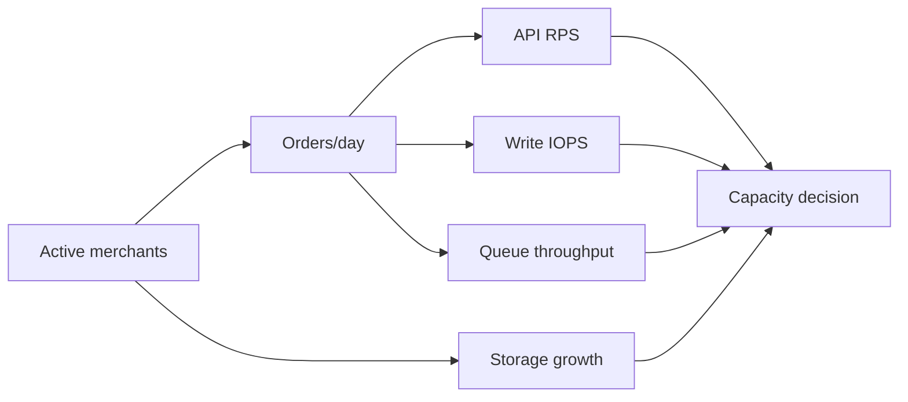

# Chapter 05: Capacity Planning

**Document ID:** SCP-OPS-001-05  
**Version:** 1.0.0  
**Status:** 📝 Draft  
**Traceability:** NFR-013 – NFR-020, NFR-007, NFR-008  

---

## Purpose

Define how SCP **forecasts, monitors, and scales** infrastructure capacity from Nigeria Phase 1 (500 merchants) through Phase 4 (10,000+ merchants) without reactive firefighting or premature over-provisioning.

## Scope

- Capacity dimensions (compute, database, cache, queue, search, storage)
- Growth forecasting tied to business metrics
- Scaling triggers and procedures per phase
- Cost guardrails for bootstrap budget
- Nigeria traffic patterns (mobile-heavy, seasonal)

## Out of Scope

- Detailed Terraform/module definitions (Volume 10)
- Application-level caching design (Volume 3, Volume 5)

---

## Capacity Dimensions

| Resource | Phase 1 target | Phase 3 target | Primary metric |
|----------|----------------|----------------|----------------|
| API workers (Octane) | 2–4 workers | Auto-scaled pool | CPU p95, request queue |
| Queue workers | 2 | 10–50 | Horizon queue depth, job age |
| PostgreSQL | 4 vCPU, 16 GB RAM | Primary + 2 replicas | Connections, IOPS, storage |
| Redis | 2 GB | 16 GB cluster | Memory, evictions |
| Meilisearch | 1 node | 3-node cluster | Index size, query p95 |
| Object storage | 500 GB | 50 TB | Egress, request rate |
| CDN | Cloudflare Pro | Enterprise | Cache hit ratio |

**Maps to:** NFR-013 – NFR-020.

---

## Forecasting Model

Capacity planning uses **leading indicators** from product metrics:

### Conversion Factors (Calibrated Quarterly)

| Metric | Phase 1 assumption | Notes |
|--------|-------------------|-------|
| Orders per active merchant/day | 5 | Nigeria SME average |
| API requests per order | 40 | Browse + checkout + webhooks |
| DB writes per order | 15 | Order, payment, inventory, events |
| Storage per merchant | 2 GB | Media-heavy fashion merchants ↑ |
| Search docs per product | 1.2 | Variants indexed separately |

**Assumption:** Nigeria launch skews mobile — API read:write ratio 5:1.  
**Validation needed:** Reconcile with production analytics after 90 days post-GA.

---

## Scaling Triggers

### Compute (API / Workers)

| Trigger | Action | Lead time |
|---------|--------|-----------|
| CPU p95 > 70% for 30 min | +1 worker instance | Minutes (Phase 2+) |
| Request queue depth > 100 | Scale Octane workers | Minutes |
| Queue job age p95 > 60s | +2 queue workers | Minutes |

### PostgreSQL

| Trigger | Action | Lead time |
|---------|--------|-----------|
| Storage > 70% | Expand disk | Hours |
| Connections > 80% max | Tune PgBouncer; add replica for reads | Days |
| Read latency p95 > 50ms sustained | Add read replica | Days |
| Write IOPS saturated | Vertical scale primary | Hours–days |

### Redis

| Trigger | Action |
|---------|--------|
| Memory > 75% | Increase instance; review TTLs |
| Eviction rate > 0 | Alert; cache strategy review |

---

## Phase Scaling Playbook

### Phase 1 — Single Region (Lagos)

- Single PostgreSQL primary; no replica (accept read load on primary with query discipline)
- PgBouncer transaction pooling (ADR-005)
- Vertical scale first; horizontal API workers second
- **Cost cap:** Infrastructure ≤ 15% of MRR until 200 paying merchants

### Phase 2 — Read Path Separation

- PostgreSQL read replica for analytics queries and heavy admin reports
- Horizon queue workers on separate VM
- Meilisearch dedicated node
- CDN cache rules for storefront ISR

### Phase 3 — Service Extraction

- Search and AI workloads on isolated compute
- Connection pool budgets per service
- Per-tenant rate limits enforced at edge (NFR-036)

### Phase 4 — Multi-Region

- Kenya/East Africa read/write region for KE merchants (ADR-011)
- Enterprise dedicated databases (schema-per-tenant)
- Global load balancing with geo-routing

---

## Seasonal and Event Planning

| Event | Region | Expected spike | Pre-scale action |
|-------|--------|----------------|------------------|
| Black Friday / Cyber Monday | Nigeria, Ghana | 3–5× orders | +50% workers 48h prior |
| Detty December | Nigeria | Traffic + nightlife merch | CDN preload |
| Salaries week (end of month) | Nigeria | Payment volume | PSP rate limit review |
| Back to school | West Africa | Category-specific | Merchant comms only |
| Ramadan (post-Eid) | Nigeria | Grocery/fashion | Monitor checkout |

---

## Noisy Neighbor Controls

Shared database tenancy (ADR-002) requires operational guardrails:

| Control | Implementation |
|---------|----------------|
| Per-tenant API rate limits | Plan-based (Volume 1 tenant tiers) |
| Query timeout | 30s max per statement |
| Long-running report jobs | Read replica only; off-peak WAT 02:00–05:00 |
| Storage quotas | Enforced per plan; alert at 80% |
| Webhook fan-out limits | Max concurrent deliveries per tenant |

---

## Capacity Review Cadence

| Activity | Frequency | Output |
|----------|-----------|--------|
| Weekly metrics review | Weekly | Slack summary |
| Forecast vs actual | Monthly | Capacity doc update |
| Load test | Pre-major release | Report in Volume 13 |
| Game day (scale test) | Quarterly | Runbook updates |

---

## Load Testing Requirements

Before Phase 2 GA and each major traffic event:

| Scenario | Target |
|----------|--------|
| Sustained API load | NFR-017 Phase target (100 → 5,000 RPS path) |
| Checkout burst | 50 concurrent checkouts per 1000 merchants |
| Webhook storm | NFR-020 limits |
| DB failover | Replica promotion ≤ RTO (NFR-026) |

---

## Cost Modeling (Bootstrap)

| Component | Phase 1 monthly (est.) | Driver |
|-----------|------------------------|--------|
| Compute | $150–400 | Single VM + workers |
| PostgreSQL managed | $100–250 | Lagos region premium |
| Redis | $30–80 | |
| Cloudflare | $20–200 | Plan tier |
| Observability | $50–150 | Log volume |
| **Total** | **$350–1,080** | Scales with GMV |

**Nigeria note:** NGN billing from cloud providers where available; USD reserve for subprocessors.

---

## Acceptance Criteria

- [ ] Capacity dashboard: CPU, DB connections, queue depth, storage trend
- [ ] Forecast spreadsheet linked from ops wiki; updated monthly
- [ ] Scaling runbooks tested in staging
- [ ] Noisy neighbor alerts configured per tenant storage and API quota
- [ ] Pre-Black-Friday scale checklist authored

---

## Related ADRs

- [ADR-001](../00-meta/adr/001-modular-monolith-over-microservices.md)
- [ADR-002](../00-meta/adr/002-multi-tenancy-shared-db-rls.md)
- [ADR-011](../00-meta/adr/011-data-residency-africa.md)

---

## Sources

- Volume 1 NFR-013 – NFR-020
- Volume 1 Chapter 08 — Product Roadmap scaling strategy
- AWS/Azure Africa region sizing guides (E2)
