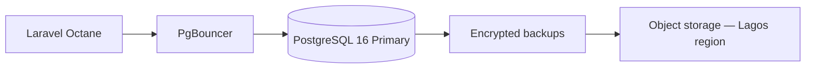

# Chapter 06: Database Operations

**Document ID:** SCP-OPS-001-06  
**Version:** 1.0.0  
**Status:** 📝 Draft  
**Traceability:** NFR-007, NFR-025 – NFR-027, NFR-076, ADR-002, ADR-005  

---

## Purpose

Define **operational procedures** for PostgreSQL in production — backups, restore, migrations, maintenance, monitoring, and tenant-scoped operations — with RLS and PgBouncer discipline as non-negotiable safety constraints.

## Scope

- Backup and disaster recovery (RPO/RTO)
- Migration execution in zero-downtime pattern
- Routine maintenance (VACUUM, ANALYZE, index health)
- Connection pooling operations (PgBouncer)
- Tenant export and deletion jobs
- Read replica management (Phase 2+)

## Out of Scope

- Schema design and RLS policy definitions (Chapter 11)
- Application query optimization in domain modules (Volume 5)

---

## Production Topology

### Phase 1 (Nigeria)

### Phase 2+

- Primary (writes) + read replica(s) for analytics and reports
- PITR (point-in-time recovery) enabled
- Cross-AZ within Lagos region; DR copy documented in RoPA (ADR-011)

---

## Backup Strategy

| Parameter | Value | NFR |
|-----------|-------|-----|
| Full backup frequency | Every 6 hours | NFR-025 |
| WAL / continuous archiving | Enabled (Phase 2) | NFR-027 |
| Retention — hot | 30 days | Ops policy |
| Retention — cold | 1 year (audit/finance) | NFR-073 |
| Encryption | AES-256 at rest | NFR-031 |
| Region | Same as primary (Lagos) | ADR-011 |
| Cross-region DR copy | Encrypted; RoPA documented | ADR-011 |

### Backup Verification

| Test | Frequency | Success criteria |
|------|-----------|------------------|
| Restore to isolated instance | Quarterly | Complete schema + sample tenant data |
| RTO drill | Quarterly | ≤ 4 hours (NFR-026) |
| RPO validation | Quarterly | Data loss ≤ 6 hours (NFR-027) |
| Tenant export spot-check | Monthly | Random tenant JSON export matches source |

---

## Restore Procedures

### Full Platform Restore (SEV1 — RB-002)

1. **Declare** SEV1; IC assigned; comms to status page
2. **Isolate** corrupted primary (prevent split-brain)
3. **Provision** new PostgreSQL instance from latest clean backup
4. **Replay** WAL to target timestamp if PITR available
5. **Validate** RLS policies enabled; run tenant isolation suite
6. **Repoint** PgBouncer to new primary
7. **Verify** `/ready` and synthetic checkout (Paystack sandbox)
8. **Monitor** 30 min before resolved

### Single-Tenant Restore (SEV2)

- Restore tenant rows from backup snapshot to staging DB
- Export `WHERE tenant_id = ?` for affected tables only
- Import via approved admin tool with audit trail (ADR-010)
- Merchant notification if customer data involved

---

## Migration Operations

All migrations follow **expand-contract** pattern (NFR-076):

| Phase | Action | Downtime |
|-------|--------|----------|
| Expand | Add nullable column / new table | None |
| Deploy | App writes to both old and new | None |
| Backfill | Background job fills data | None |
| Contract | Remove old column after deploy stable | None |

### Migration Checklist

- [ ] Reviewed for RLS policy updates on new tables
- [ ] `tenant_id` present on all tenant-scoped tables (ADR-002)
- [ ] Index plan includes `(tenant_id, ...)` composites
- [ ] Rollback migration tested on staging copy
- [ ] Long migration uses `CONCURRENTLY` for indexes
- [ ] Scheduled off-peak WAT 02:00–05:00 if lock risk

### Forbidden Operations

- `DROP COLUMN` without prior deploy removing reads
- Session-level `SET app.tenant_id` on pooled connections (ADR-005)
- Direct production DDL without ticket + peer review
- Disabling RLS on any tenant table

---

## PgBouncer Operations

| Setting | Value | Rationale |
|---------|-------|-----------|
| Pool mode | Transaction | Efficiency (ADR-005) |
| Max client connections | Per app tier | Prevent exhaustion |
| Server connection limit | ≤ PostgreSQL max_connections × 0.8 | Headroom for admin |
| `SET LOCAL` | Every transaction | RLS isolation |

### Health Checks

- Monitor PgBouncer `SHOW POOLS` and waiting client count
- Alert if wait time > 1s sustained
- CI test simulates connection reuse across tenants (ADR-005)

---

## Routine Maintenance

| Task | Schedule | Tool |
|------|----------|------|
| `VACUUM ANALYZE` | Autovacuum tuned; manual for bulk loads | pg_stat_user_tables |
| Index bloat review | Monthly | pg_repack or REINDEX CONCURRENTLY |
| Statistics update | After large imports | ANALYZE |
| Connection leak audit | Weekly | pg_stat_activity |
| Slow query review | Weekly | pg_stat_statements top 20 |
| SSL cert expiry | Automated alert | Provider |

### Autovacuum Tuning (High-Churn Tables)

Commerce tables (`orders`, `order_items`, `audit_logs`, `domain_events`) receive aggressive autovacuum settings due to Nigeria peak traffic patterns.

---

## Monitoring and Alerts

| Metric | Warning | Critical |
|--------|---------|----------|
| Replication lag | > 30s | > 5 min |
| Disk usage | > 70% | > 85% |
| Connection utilization | > 70% | > 90% |
| Deadlocks/min | > 1 | > 5 |
| Long queries | > 10s | > 30s (kill) |
| Backup job failure | Any | Any — page immediately |
| RLS policy disabled | — | Any — SEV1 page |

---

## Tenant Lifecycle Operations

| Operation | Procedure | Audit |
|-----------|-----------|-------|
| **Export** | Async job; JSON/CSV to secure download | `tenant.export.requested` |
| **Soft delete** | 30-day recovery window (NFR-074) | `tenant.deleted` |
| **Hard delete** | Background job; NDPA erasure request | DPO approval + `tenant.purged` |
| **Enterprise migrate** | Schema-per-tenant cutover runbook | Change ticket |

Hard delete order: disable storefront → revoke API tokens → purge PII → purge commerce data → purge media → retain financial records 7 years anonymized (NFR-073).

---

## Security Considerations

- Production DB credentials in Vault only (ADR-007)
- Break-glass admin access logged; read-only default
- No `SELECT *` exports without tenant filter
- Kenya merchant data: verify region tag before cross-region restore

---

## Acceptance Criteria

- [ ] Automated backups every 6h with failure paging
- [ ] Quarterly restore drill meets RTO/RPO
- [ ] Migration checklist enforced in CI for `tenant_id` + RLS
- [ ] PgBouncer monitoring dashboards live
- [ ] Tenant export and hard-delete runbooks tested

---

## Related ADRs

- [ADR-002](../00-meta/adr/002-multi-tenancy-shared-db-rls.md)
- [ADR-005](../00-meta/adr/005-rls-pgbouncer-set-local.md)
- [ADR-009](../00-meta/adr/009-audit-log-immutability.md)
- [ADR-011](../00-meta/adr/011-data-residency-africa.md)

---

## Sources

- PostgreSQL 16 administration documentation (E1)
- PgBouncer features (E1)
- Volume 1 NFR-025 – NFR-027, NFR-076
