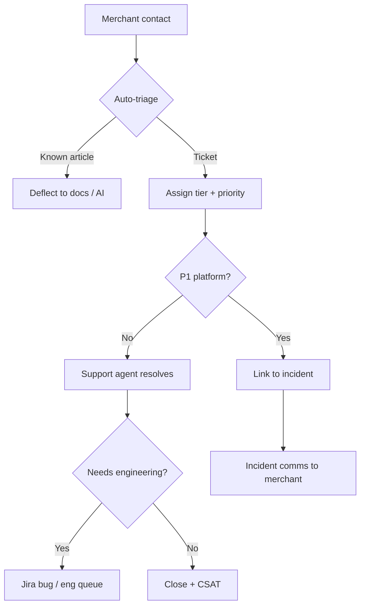

# Chapter 07: Merchant Support Operations

**Document ID:** SCP-OPS-001-07  
**Version:** 1.0.0  
**Status:** 📝 Draft  
**Traceability:** NFR-021, Volume 1 tenant tiers, PRD-001  

---

## Purpose

Define how SCP **supports Nigerian and African merchants** — ticket workflows, tiers, escalation to engineering, and operational metrics — so merchants achieve store activation and sustained GMV without platform engineering becoming ad-hoc support.

## Scope

- Support tiers aligned with subscription plans
- Channels (email, in-app, WhatsApp Phase 2)
- Ticket classification and SLA
- Escalation to incidents vs product bugs
- Knowledge base and merchant success playbooks
- Nigeria-specific support context (payment disputes, logistics, NDPA requests)

## Out of Scope

- End-customer (shopper) support — merchant responsibility
- Enterprise white-glove program details (Volume 15 Ch 06)

---

## Support Philosophy

1. **Merchant success = platform success** — Activation and first sale are support KPIs, not just ticket closure.
2. **Self-service first** — Documentation, AI assistant, and in-app guides resolve 60%+ of Phase 2 tickets.
3. **Never page on-call for tier-1 tickets** — Only escalate via defined engineering bridge (Chapter 04).
4. **Nigeria-first content** — Paystack, Flutterwave, NGN, local couriers, NDPA merchant obligations.

---

## Support Tiers by Plan

| Plan | Channels | First response SLA | Resolution target | Hours (WAT) |
|------|----------|-------------------|-------------------|-------------|
| Free / Starter | Email, community | 48h | Best effort | Business |
| Business | Email, in-app chat | 8h | 72h (P2) | Business |
| Marketplace | Email, chat, priority queue | 4h | 48h (P2) | Extended |
| Enterprise | Dedicated CSM, phone | 1h | Per contract | 24×7 |

**Business hours (Phase 1):** Mon–Fri 09:00–18:00 WAT; Sat 10:00–14:00 optional.

---

## Ticket Priority Matrix

| Priority | Definition | Examples | Engineering escalate? |
|----------|------------|----------|----------------------|
| **P1** | Store cannot sell | Checkout down for merchant; payments not recording | Yes — if platform SEV |
| **P2** | Major feature blocked | Theme broken; inventory sync failure | Yes — if repro platform-wide |
| **P3** | Degraded experience | Slow admin; single product edit bug | No — product backlog |
| **P4** | How-to / config | DNS setup; Paystack keys | No |

---

## Support Workflow

---

## Nigeria-Specific Playbooks

| Topic | Common issue | Resolution path |
|-------|--------------|-----------------|
| Paystack setup | Test keys in production | Guide: keys in admin → Payments |
| Flutterwave webhook | Orders stuck pending | Verify webhook URL + secret |
| Bank transfer proof | Manual order confirmation | Merchant workflow doc |
| NDPA customer request | Shopper wants data deleted | Merchant initiates; SCP processor assist |
| Custom domain | `.ng` DNS propagation | Cloudflare CNAME checklist |
| USSD / OPay | Payment method confusion | Explain hosted checkout flow |
| Logistics | GIG, Kwik, local riders | Shipping zones doc (Volume 5) |

---

## Escalation to Engineering

Support opens engineering ticket when:

- Reproducible on multiple tenants
- Data inconsistency (order paid but status pending)
- Suspected tenant isolation issue → **immediate security escalation**
- PSP webhook verified correct but platform state wrong

**Required fields:** `tenant_id`, timestamps (WAT), order/payment IDs, HAR/screenshots (no card data — PCI SAQ A).

Engineering responds within:

| Priority | Response |
|----------|----------|
| P1 linked to SEV | Incident bridge |
| P2 bug | 1 business day acknowledgment |
| P3 | Next sprint triage |

---

## Merchant Success Metrics

| Metric | Phase 1 target | Phase 2 target |
|--------|----------------|----------------|
| Time to first product | ≤ 24h from signup | ≤ 4h |
| Time to first order | ≤ 14 days | ≤ 7 days |
| Ticket CSAT | ≥ 4.0/5 | ≥ 4.3/5 |
| First response SLA met | ≥ 90% | ≥ 95% |
| Deflection rate (docs/AI) | ≥ 30% | ≥ 60% |
| Churn correlated to support | Track; target ↓ | |

Aligned with Volume 1 Chapter 07 success metrics.

---

## Tools

| Function | Tool (Phase 1) | Phase 2+ |
|----------|----------------|----------|
| Ticketing | Help Scout / Freshdesk | + WhatsApp Business API |
| Knowledge base | Docusaurus merchant section | AI search |
| Merchant context | Admin internal panel | 360° view |
| CSAT | Post-close survey | NPS quarterly |

Internal admin panel must show: plan, MRR, GMV, open tickets, recent incidents, payment health.

---

## Data Ownership and Privacy

| Data | Controller | Processor |
|------|------------|-----------|
| Merchant account | Sapphital | — |
| Shopper PII in tickets | Merchant | SCP when assisting |

Support agents access tenant data under **least privilege** with audit logging (ADR-009). Admin impersonation for support requires MFA, ticket reference, time limit (ADR-010).

---

## NDPA / Merchant Obligations

When shoppers exercise NDPA rights through a merchant store:

1. Merchant is **controller** for shopper data
2. SCP provides export/delete APIs (NFR-077)
3. Support routes erasure requests to merchant first; assists on platform-held logs only
4. DPO consulted if request spans multiple tenants or breach suspected

---

## Training and Quality

| Activity | Frequency |
|----------|-----------|
| New agent onboarding (Nigeria payments) | Before queue access |
| QA sample review | 10% tickets weekly |
| Macro/article updates | After each release |
| PSP outage comms drill | Quarterly with Comms |

---

## Acceptance Criteria

- [ ] Ticketing system live with plan-based SLAs
- [ ] Nigeria playbooks published (minimum 10 articles)
- [ ] Engineering escalation template enforced
- [ ] CSAT collection enabled
- [ ] Support metrics dashboard (first response, backlog, deflection)

---

## Sources

- Volume 1 Chapter 05 — User personas (Amina, James)
- Volume 1 Chapter 03 — Nigeria payment methods
- Shopify Help Center model (E3)
