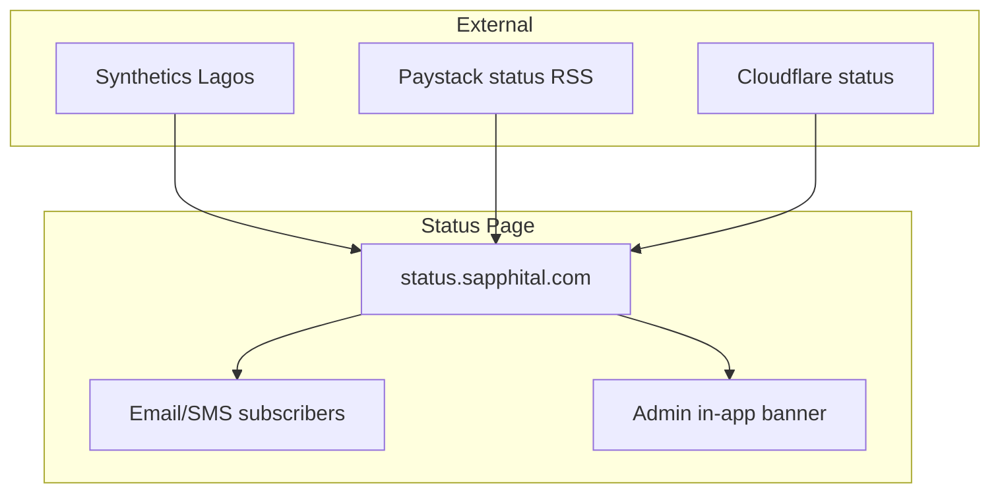

# Chapter 08: Status Page and Communications

**Document ID:** SCP-OPS-001-08  
**Version:** 1.0.0  
**Status:** 📝 Draft  
**Traceability:** NFR-021, NFR-022, Chapter 03, Chapter 07  

---

## Purpose

Define **public and merchant-facing communications** during normal operations, degraded performance, and incidents — ensuring Nigerian merchants receive timely, accurate updates in plain language across status page, email, and in-app channels.

## Scope

- Status page structure and component taxonomy
- Incident communication timelines
- Maintenance announcements
- Subscriber notification channels
- Localization (English primary; Pidgin/Hausa for broad alerts Phase 2)
- Integration with PSP and third-party status feeds

## Out of Scope

- Marketing communications
- Regulatory breach notifications to NDPC (Volume 11 — DPO-led)

---

## Status Page Architecture

**URL:** `status.sapphital.com` (Phase 1)

### Components

| Component | Monitors | Nigeria relevance |
|-----------|----------|-------------------|
| **Storefront** | Synthetic homepage + product page | Merchant customer-facing |
| **Admin Dashboard** | Admin login + API health | Merchant operations |
| **Checkout** | End-to-end sandbox checkout | Paystack test rail |
| **API** | `/ready` + authenticated sample call | Headless / integrations |
| **Webhooks** | Outbound delivery pipeline | Developer merchants |
| **Paystack Integration** | Webhook receipt + API | Primary Nigeria PSP |
| **Flutterwave Integration** | Webhook receipt + API | Secondary Nigeria PSP |
| **Search** | Autocomplete latency | Phase 2+ |



---

## Incident Communication Timeline

| Elapsed time | SEV1 action | SEV2 action |
|--------------|-------------|-------------|
| **≤ 15 min** | Status → *Investigating* | Status update if user-visible |
| **≤ 30 min** | First public update with impact scope | Detailed component note |
| **Every 30 min** | Update until resolved | Every 60 min |
| **Resolution** | *Resolved* + summary | *Resolved* |
| **≤ 24h post** | Post-incident summary on status | If merchant-impacting |
| **≤ 5 business days** | Full postmortem (internal); customer summary | Internal postmortem |

### Update Content Template

```markdown
**[Investigating / Identified / Monitoring / Resolved] — [Component]**

**Impact:** [Who is affected — e.g., Nigeria merchants using Paystack checkout]
**Started:** YYYY-MM-DD HH:MM WAT
**Current status:** [Plain language — no jargon]
**Workaround:** [If any — e.g., use bank transfer temporarily]
**Next update:** [Time WAT]
```

---

## Maintenance Communications

| Requirement | Value | NFR |
|-------------|-------|-----|
| Advance notice | ≥ 72 hours | Best practice |
| Maintenance window | Off-peak WAT 02:00–05:00 | NFR-022 |
| Max duration | ≤ 2 hours/month | NFR-022 |
| Status page | Scheduled maintenance section | — |

Maintenance posts include: affected components, expected impact (read-only vs full outage), rollback plan summary.

---

## Subscriber Channels

| Channel | Audience | Opt-in |
|---------|----------|--------|
| Email | All merchants | Default on signup |
| SMS | Business+ tiers | Opt-in (Nigeria numbers) |
| In-app banner | Logged-in admin | Automatic |
| WhatsApp broadcast | Marketplace+ (Phase 2) | Opt-in |
| Webhook `platform.incident` | Developer integrations | API subscription |

**NDPA note:** Subscriber lists store minimal PII; purpose documented in RoPA.

---

## Third-Party Status Integration

When Paystack or Flutterwave reports outage:

1. Comms lead verifies impact on SCP metrics (not RSS alone)
2. Status page adds *Degraded* badge on integration component
3. Merchant email: explain external cause; SCP platform may be operational
4. Do **not** claim SLA credit exclusion without verification

| Vendor | Feed |
|--------|------|
| Paystack | status.paystack.com |
| Flutterwave | status.flutterwave.com |
| Cloudflare | cloudflarestatus.com |

---

## In-App Messaging

| Severity | UI treatment |
|----------|--------------|
| SEV1 user-facing | Full-width banner; checkout interstitial if needed |
| SEV2 | Admin banner only |
| Maintenance | Blue informational banner 72h prior |
| Resolved | Banner auto-clear 24h after resolve |

Banner copy must state **WAT times** for Nigeria merchants.

---

## Localization

| Phase | Languages |
|-------|-----------|
| Phase 1 | English |
| Phase 1.5 | Pidgin English for SMS alerts (high-impact SEV1) |
| Phase 2 | Hausa, Yoruba for status summaries |
| Kenya | English + Swahili for KE-specific incidents |

---

## Roles and Approvals

| Action | Author | Approver |
|--------|--------|----------|
| SEV1 status post | Comms lead | Incident commander |
| Maintenance schedule | Platform lead | Product |
| Merchant email blast | Comms lead | IC + Legal if PII mentioned |
| Post-incident public summary | Comms lead | Engineering lead |

---

## Metrics

| Metric | Target |
|--------|--------|
| Time to first status post (SEV1) | ≤ 15 min |
| Subscriber delivery success | ≥ 99% |
| Status page uptime | 99.99% (separate infra) |
| Merchant confusion tickets during incident | ↓ vs no comms baseline |

---

## Acceptance Criteria

- [ ] Status page live with all Phase 1 components
- [ ] Email subscriber list integrated with merchant database
- [ ] SEV1 comms drill completed quarterly
- [ ] Maintenance template and 72h process documented
- [ ] In-app banner wired to incident API

---

## Sources

- Atlassian Statuspage practices (E2)
- Volume 14 Chapter 03 — Incident Management
- NFR-021, NFR-022
