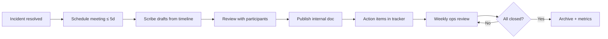

# Chapter 09: Postmortems

**Document ID:** SCP-OPS-001-09  
**Version:** 1.0.0  
**Status:** 📝 Draft  
**Traceability:** NFR-023, Volume 11 Ch 06, Chapter 03  

---

## Purpose

Establish a **blameless postmortem culture** that converts incidents into durable improvements — tracked action items, runbook updates, and architectural fixes — with regulatory documentation hooks for Nigeria NDPA when personal data is involved.

## Scope

- When postmortems are required
- Template and timeline
- Action item tracking and SLA
- Sharing boundaries (internal vs merchant vs public)
- Integration with error budgets and roadmap

## Out of Scope

- Live incident command (Chapter 03)
- Legal regulatory filings (DPO-owned)

---

## Postmortem Requirements

| Trigger | Postmortem required | Timeline |
|---------|---------------------|----------|
| SEV1 | Mandatory | Draft ≤ 5 business days |
| SEV2 | Mandatory | Draft ≤ 10 business days |
| SEV3 (recurring) | If same root cause 3× in 30 days | Within 10 business days |
| SEV4 | Optional | — |
| Near-miss (isolation almost failed) | Mandatory | Treat as SEV2 |
| Successful game day finding | Optional summary | After exercise |

---

## Blameless Principles

1. **Assume good intent** — Focus on systems, not individuals.
2. **What happened ≠ why it happened** — Five-whys to systemic causes.
3. **Actions over apologies** — Every postmortem produces tracked improvements.
4. **Psychological safety** — Participants speak freely; notes not used in performance reviews.
5. **Regulatory accuracy** — Factual timeline for NDPC/ODPC without speculation in external filings.

---

## Postmortem Process



### Meeting Attendees

| Role | Required SEV1 | Required SEV2 |
|------|---------------|---------------|
| Incident commander | ✓ | ✓ |
| Operations lead | ✓ | ✓ |
| Engineers involved | ✓ | ✓ |
| Comms lead | ✓ | If customer-facing |
| DPO | If PII | If PII |
| Product representative | Optional | ✓ |

---

## Postmortem Template

```markdown
# Postmortem: [INCIDENT-ID] — [Short title]

**Date:** YYYY-MM-DD  
**Authors:** [names]  
**Severity:** SEV1 | SEV2  
**Duration:** [start WAT] – [end WAT]  
**Regions affected:** NG, KE, global  
**Error budget consumed:** X%  
**Regulatory notification:** Yes/No — [NDPC ref if yes]

## Summary
[2–3 sentences — plain language]

## Impact
- Merchants affected: [count / segment]
- Orders failed / delayed: [estimate]
- Revenue impact: [if quantifiable]
- Data impact: [PII categories or none]

## Timeline (WAT)
| Time | Event |
|------|-------|
| HH:MM | Alert fired |
| HH:MM | IC assigned |
| ... | ... |

## Root cause
[Technical root cause — specific]

## Contributing factors
- [e.g., missing monitor, unclear runbook]

## What went well
- [e.g., fast rollback]

## What went poorly
- [e.g., delayed status page]

## Action items
| ID | Action | Owner | Priority | Due | Status |
|----|--------|-------|----------|-----|--------|
| PM-001 | Add Paystack webhook lag alert | @eng | P1 | YYYY-MM-DD | Open |

## Lessons learned
- [Systemic insight]

## Appendix
- Links to traces, deploys, incident channel export
```

---

## Action Item Tracking

| Priority | Due date | Escalation if overdue |
|----------|----------|------------------------|
| P0 (prevent recurrence) | 7 days | Engineering lead |
| P1 | 30 days | Weekly ops review |
| P2 | 90 days | Quarterly architecture review |

Action items link to:

- Runbook updates (Chapter 01)
- Grafana alerts (Chapter 02)
- ADR if architectural (Volume 00)
- Volume 13 test cases if regression gap

**Policy:** No SEV1 postmortem closed until all P0 items complete or explicitly risk-accepted by Lead Architect.

---

## Sharing Guidelines

| Audience | Content | Channel |
|----------|---------|---------|
| Engineering (full) | Complete postmortem | Internal wiki |
| Leadership | Summary + actions | Email |
| Merchants | Non-sensitive summary | Status page / email |
| Public | Rare; high-trust transparency | Blog |
| NDPC / ODPC | Factual incident appendix | DPO secure filing |

**Never include:** credentials, exploit details, individual PII, full attacker payloads.

---

## Metrics and Trends

Track monthly:

| Metric | Use |
|--------|-----|
| Postmortems completed on time | Process health |
| Repeat incidents (same component) | Architecture debt signal |
| Mean action item closure time | Improvement velocity |
| Incidents with PII involvement | DPO workload |
| Error budget correlation | SLO policy tuning |

Quarterly **incident review** presents trends to architecture review (Volume 00 document control).

---

## Nigeria / Regulatory Notes

When postmortem involves personal data:

- DPO reviews before any external sharing
- Timeline must align with NDPC notification timestamps
- Merchant notification content coordinated with Comms (processor role)
- Retain postmortem records **7 years** with incident bundle (NFR-073)

---

## Example Action Categories

| Category | Example actions |
|----------|-----------------|
| Monitoring | New alert, dashboard panel |
| Runbook | RB-006 step 4 clarified |
| Code | Idempotency fix for webhooks |
| Process | Faster IC assignment |
| Architecture | Read replica for reports |
| Compliance | RoPA subprocessor update |

---

## Acceptance Criteria

- [ ] Postmortem template in repository (`postmortems/` directory)
- [ ] 100% SEV1/SEV2 incidents have postmortem within SLA
- [ ] Action items tracked in engineering backlog with PM- prefix
- [ ] Weekly ops review includes open postmortem actions
- [ ] DPO review step documented for PII incidents

---

## Sources

- Google SRE — postmortem culture (E2)
- Volume 11 Chapter 06 — Review phase
- Etsy Debriefing Facilitation Guide (E3)
