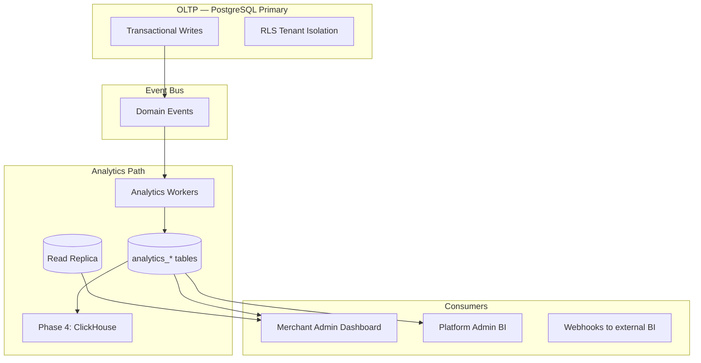

# Chapter 11: Database & Analytics Architecture

**Document ID:** SCP-OPS-001-11  
**Version:** 1.0.0  
**Status:** ✅ Active  
**Traceability:** ADR-002, ADR-009, ADR-011, NFR-062 – NFR-070, FR-025

---

## Purpose

Define **operational database architecture** and the **analytics data pipeline** for SCP — supporting transactional integrity, reporting, merchant dashboards, and platform BI without compromising tenant isolation or Nigeria data residency.

## Scope

- PostgreSQL operational architecture
- Read replica usage for analytics
- Event-driven analytics ingestion
- Merchant-facing analytics data model
- Platform BI and KPIs
- Data retention and archival
- ClickHouse/BigQuery export path (Phase 4)

## Out of Scope

- Application ORM schemas (Volume 3 Ch. 09, Volume 5+)
- Vendor analytics UI (Volume 8 Ch. 08)
- ML feature store (roadmap)

---

## 1. Architecture Overview

**Rule:** Analytics writes never block checkout — async workers only.

---

## 2. PostgreSQL Operational Model

| Component | Role | Phase |
|-----------|------|-------|
| Primary | All writes, critical reads | Phase 1+ |
| PgBouncer | Connection pooling, RLS context | Phase 1+ |
| Read replica | Reporting queries, exports | Phase 2+ |
| Archival R2 | Cold order facts > 24 months | Phase 3 |

### 2.1 Connection Budget

| Consumer | Max Connections | Notes |
|----------|-----------------|-------|
| Octane API | 80 via pool | Per instance |
| Horizon workers | 40 via pool | Analytics workers included |
| BI read-only user | 10 | Replica only |
| On-call ad-hoc | 2 | Bastion + read replica |

---

## 3. Analytics Tables (Owned by Analytics Module)

| Table | Grain | Source Events |
|-------|-------|---------------|
| `analytics_daily_store` | tenant + day | OrderPaid, sessions |
| `analytics_product_sales` | tenant + product + day | OrderPaid line items |
| `analytics_traffic` | tenant + day | CDN/RUM aggregate |
| `analytics_funnel` | tenant + day | Cart, checkout steps |
| `analytics_vendor` | tenant + vendor + day | Marketplace splits |

All tables include `tenant_id`; RLS enforced same as OLTP.

### 3.1 Aggregation Schedule

| Job | Frequency | Lag |
|-----|-----------|-----|
| Order metrics | Hourly | ≤ 1h |
| Product sales | Hourly | ≤ 1h |
| Traffic (RUM) | Daily | ≤ 24h |
| Funnel | Hourly | ≤ 1h |
| Vendor payouts | Daily | ≤ 24h |

Lagos peak sales: hourly jobs prioritized 08:00–23:00 WAT.

---

## 4. Merchant Dashboard Metrics

| Metric | Definition | Source |
|--------|------------|--------|
| Gross sales | Sum OrderPaid total NGN | analytics_daily_store |
| Orders | Count orders | analytics_daily_store |
| AOV | Gross / orders | computed |
| Conversion rate | orders / sessions | analytics_funnel |
| Top products | By revenue 7d | analytics_product_sales |
| Refund rate | Refunds / gross | analytics_daily_store |

**Currency:** Always NGN for Nigeria tenants; display locale `en-NG`.

Real-time order feed: direct OLTP read for last 24h (not aggregated) with cache 30s.

---

## 5. Platform Admin BI

| KPI | Audience | Refresh |
|-----|----------|---------|
| Active merchants | Leadership | Daily |
| GMV (NGN) | Finance | Daily |
| Churn rate | Product | Weekly |
| Infra cost per merchant | DevOps | Monthly |
| Support ticket volume | Ops | Daily |
| AI token spend | Engineering | Daily |
| Marketplace take rate | Product | Weekly |

Platform BI uses **anonymized cross-tenant aggregates** — no shopper PII in executive dashboards.

---

## 6. Event Catalog (Analytics Consumers)

| Event | Analytics Action |
|-------|------------------|
| `OrderPlaced` | Increment funnel checkout |
| `OrderPaid` | Revenue, product sales |
| `OrderRefunded` | Adjust revenue, refund rate |
| `CartUpdated` | Funnel cart step |
| `ProductViewed` | Traffic attribution (sampled 10%) |
| `VendorPayoutCompleted` | Vendor analytics |

Idempotent consumers use `event_id` deduplication table.

---

## 7. Read Replica Usage

| Query Type | Target | Allowed |
|------------|--------|---------|
| Merchant dashboard 7d+ history | Replica | Yes |
| Merchant real-time orders | Primary | Yes |
| Platform BI aggregates | Replica | Yes |
| Checkout / inventory | Primary | **Required** |
| Data export job | Replica | Yes, off-peak |

Replica lag alert: > 30s → pause analytics jobs; > 5 min → SEV2.

---

## 8. Retention & Archival

| Data | Hot (PostgreSQL) | Warm (R2 Parquet) | Delete |
|------|------------------|-------------------|--------|
| Order facts | 24 months | 7 years | After warm |
| Analytics daily | 36 months | 7 years | After warm |
| Audit logs | 24 months | 7 years | NDPA/legal hold |
| Session samples | 90 days | — | Auto purge |
| Webhook delivery logs | 90 days | 1 year | Auto purge |

NDPA erasure: tenant delete cascades analytics rows per Volume 3 Ch. 09 lifecycle rules.

---

## 9. Phase 4 Export Warehouse

| Attribute | Value |
|-----------|-------|
| Engine | ClickHouse or BigQuery (evaluate at Phase 4) |
| Ingest | Nightly Parquet export from analytics tables |
| Residency | Nigeria/West Africa bucket; EU tenant opt-in |
| Use | Enterprise custom reports, data science |
| PII | Pseudonymized customer IDs |

Not required for Nigeria GA.

---

## 10. Operational Procedures

| Procedure | Runbook Ref | Frequency |
|-----------|-------------|-----------|
| Replica lag check | Volume 14 Ch. 06 | Continuous alert |
| Analytics job failure | RB-006 variant | On alert |
| Aggregation backfill | Manual script | After outage |
| Archival job | Scheduled | Monthly |
| BI query kill | `pg_cancel_backend` | On runaway query |

---

## 11. Security

| Control | Detail |
|---------|--------|
| BI DB user | Read-only, replica only, no PII columns on platform role |
| Tenant export | Merchant exports own data only; signed URL |
| Cross-tenant BI | Aggregate queries only; no JOIN across tenants |
| Audit | Analytics export jobs logged |

---

## 12. Acceptance Criteria

- [ ] OLTP vs analytics path diagram with async workers
- [ ] Analytics tables with tenant_id and RLS
- [ ] Merchant dashboard metrics: gross sales, orders, AOV, conversion
- [ ] Platform BI KPIs without shopper PII
- [ ] Read replica rules: checkout on primary only
- [ ] Retention: orders 24mo hot, 7yr warm archive
- [ ] Replica lag alerts at 30s and 5min
- [ ] Phase 4 warehouse marked optional for GA

---

## References

- [Volume 3 Ch. 09 — Data Ownership](../03-architecture/09-data-ownership-and-contracts.md)
- [Volume 8 Ch. 08 — Vendor Analytics](../08-marketplace/08-vendor-analytics.md)
- [Volume 14 Ch. 06 — Database Operations](./06-database-operations.md)
- [ADR-009 — Audit Logging](../00-meta/adr/009-audit-logging.md)
