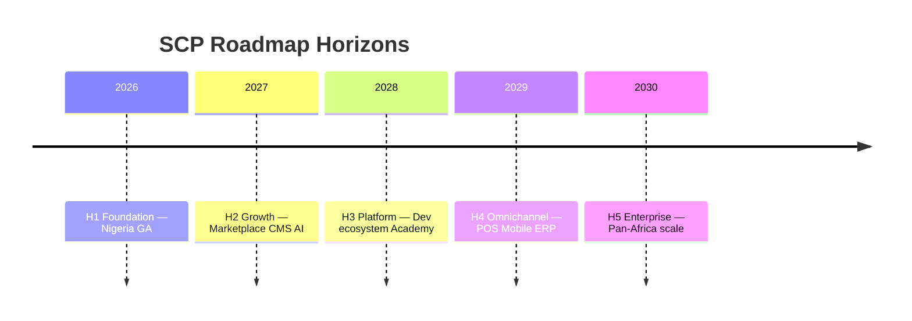
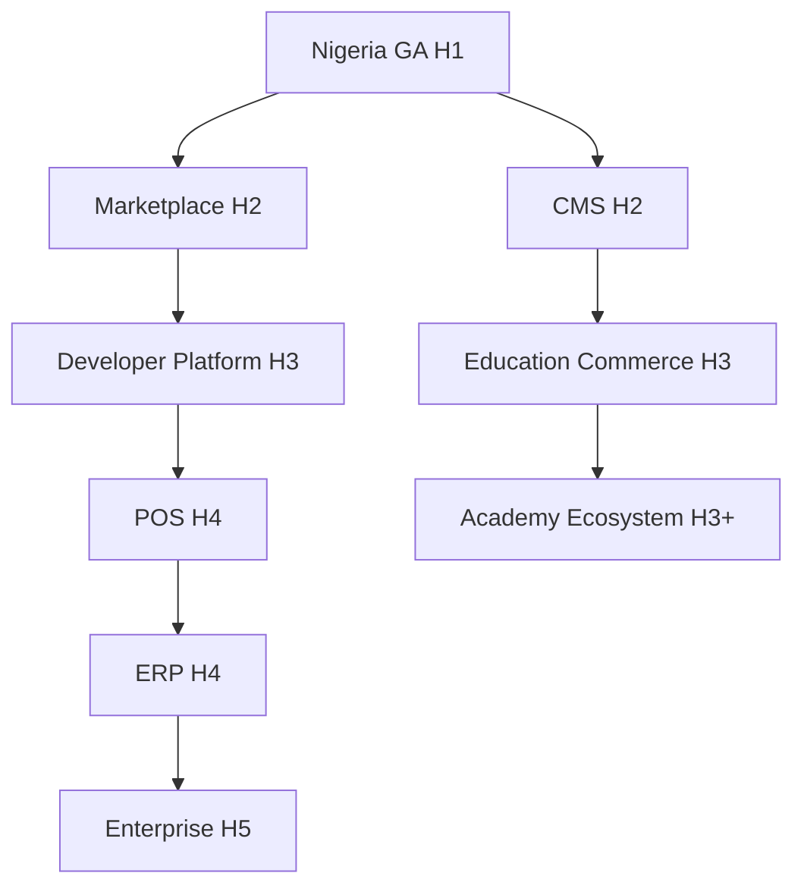

# Chapter 01: Roadmap Overview

**Document ID:** SCP-ROAD-001-01  
**Version:** 1.0.0  
**Status:** ✅ Active  
**Traceability:** PRD-001 – PRD-020, Volume 2 Ch. 10

---

## Purpose

Provide a **unified product and technology roadmap** for SCP from Nigeria GA through 2030 — aligning commerce, marketplace, AI, education, omnichannel, and enterprise capabilities.

## Scope

- Roadmap horizons (Phase 1–4 + 2030 vision)
- Capability map by volume
- Nigeria-first sequencing rules
- Dependencies between major initiatives
- Success metrics per horizon

## Out of Scope

- Sprint-level backlog
- Financial forecasts
- Hiring plan

---

## 1. Roadmap Horizons

| Horizon | Period | Theme | Nigeria Focus |
|---------|--------|-------|---------------|
| **H1 — Foundation** | 2026 | Commerce MVP GA | Paystack, NDPA, mobile storefront |
| **H2 — Growth** | 2026–2027 | Marketplace + CMS + AI v1 | Multi-vendor Lagos; content SEO |
| **H3 — Platform** | 2027–2028 | Developer ecosystem + education | Theme Store, courses, OAuth apps |
| **H4 — Omnichannel** | 2028–2029 | POS, mobile, ERP | Lagos retail; agency integrations |
| **H5 — Enterprise** | 2029–2030 | Pan-Africa + institution scale | Dedicated cells, SSO, analytics warehouse |

---

## 2. Capability Map

| Capability | Volume | H1 | H2 | H3 | H4 | H5 |
|------------|--------|----|----|----|----|-----|
| Core commerce | 5 | ✅ | ✅ | ✅ | ✅ | ✅ |
| Multi-vendor marketplace | 8 | — | ✅ | ✅ | ✅ | ✅ |
| CMS + page builder | 7 | — | ✅ | ✅ | ✅ | ✅ |
| Theme engine + store | 6 | ✅ | ✅ | ✅ | ✅ | ✅ |
| AI agents | 9 | — | ✅ | ✅ | ✅ | ✅ |
| Developer platform | 12 | — | — | ✅ | ✅ | ✅ |
| SaaS billing | 16 | ✅ | ✅ | ✅ | ✅ | ✅ |
| POS | 15 Ch. 02 | — | — | — | ✅ | ✅ |
| Mobile apps | 15 Ch. 03 | — | — | — | ✅ | ✅ |
| ERP integrations | 15 Ch. 04 | — | — | — | ✅ | ✅ |
| Academy ecosystem | 15 Ch. 05 | — | — | ✅ | ✅ | ✅ |
| Global expansion | 15 Ch. 06 | — | — | — | ✅ | ✅ |

---

## 3. Nigeria-First Sequencing Rules

1. **Regulatory readiness before growth marketing** — NDPA, PCI, CBN payment rules.
2. **Mobile web before native apps** — 3G/4G storefront quality (NFR-001).
3. **NGN pricing and Paystack before M-Pesa** — Kenya after Nigeria SLO proof.
4. **Monolith scale before microservices** — ADR-001 extraction criteria.
5. **Education moat early** — Sapphital Academy differentiation in H3.

---

## 4. Key Dependencies

---

## 5. Success Metrics

| Horizon | North Star | Target |
|---------|------------|--------|
| H1 | Active paying merchants (NG) | 500 |
| H2 | GMV (NGN) monthly | ₦500M |
| H3 | Installed third-party apps | 100 |
| H4 | Omnichannel merchants | 1,000 |
| H5 | Pan-Africa merchants | 25,000 |

Supporting metrics: 99.9% availability, NPS ≥ 40, infra cost ≤ 25% ARPU.

---

## 6. Acceptance Criteria

- [ ] Five horizons H1–H5 with dates and themes
- [ ] Capability map across volumes with phase markers
- [ ] Nigeria-first sequencing rules (5 rules)
- [ ] Dependency diagram for major initiatives
- [ ] Success metrics per horizon with numeric targets

---

## References

- [Volume 2 Ch. 10 — Technology Roadmap](../02-market-research/10-technology-roadmap-and-risks.md)
- [Chapter 08 — Platform Vision 2030](./08-platform-vision-2030.md)
- [Volume 16 — SaaS Multi-Tenancy](../16-saas-multi-tenancy/README.md)
