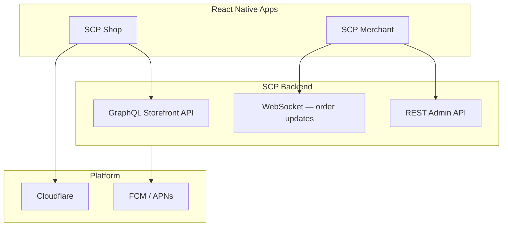

# Chapter 02: Mobile — React Native

**Document ID:** SCP-ROAD-001-02  
**Version:** 1.0.0  
**Status:** 📝 Draft  
**Traceability:** PRD-005, NFR-054 – NFR-056, Research Track 16  

---

## Purpose

Specify SCP's **mobile application strategy** — React Native customer shopping app and merchant operations app — optimized for Nigeria's Android-dominant, mobile-money-native market and architected for shared codebase across iOS and Android.

## Scope

- App types and personas
- Technical architecture (React Native, API consumption)
- Offline and connectivity behavior
- Push notifications and deep linking
- App store distribution (Nigeria, Kenya, Ghana)
- Security and NDPA considerations

## Out of Scope

- Native POS hardware integration (Chapter 03)
- Mobile SDK for third-party developers (Volume 12 Phase 3+)

---

## App Portfolio

| App | Primary user | Phase | Priority |
|-----|--------------|-------|----------|
| **SCP Shop** | End customers (David persona) | 2028 Q1 GA | P2 |
| **SCP Merchant** | Store owners (Amina, James) | 2028 Q2 GA | P2 |
| **SCP Vendor** | Marketplace sellers (Fatima) | 2028 Q3 | P3 |

**Nigeria-first:** Shop app launches with Paystack/Flutterwave in-app WebView checkout (hosted — PCI SAQ A preserved per ADR-004).

---

## Architecture

### Stack

| Layer | Choice | Rationale |
|-------|--------|-----------|
| Framework | React Native 0.76+ | Team React expertise; shared logic with Next.js types |
| Navigation | React Navigation 7 | Standard ecosystem |
| State | TanStack Query + Zustand | Server state + cart session |
| UI | SAPPHITAL Design System mobile tokens (Volume 4) | Brand consistency |
| API | GraphQL (Shop), REST (Merchant) | Volume 12 Phase 3 |
| Auth | OAuth2 PKCE + biometric unlock | Merchant app |

---

## SCP Shop — Customer App

### Core Features (GA)

| Feature | API dependency |
|---------|----------------|
| Store discovery / my stores | Tenant resolution |
| Product browse, search | GraphQL catalog |
| Cart sync (guest + auth) | Cart API |
| Checkout (hosted PSP WebView) | Checkout session URL |
| Order tracking | Orders + notifications |
| AI shopping assistant | Volume 9 agent API |
| Push — order shipped | FCM |

### Nigeria UX Requirements

| Requirement | Implementation |
|-------------|----------------|
| Low bandwidth | Image lazy load; WebP; paginated lists |
| 3G functional | NFR-058; skeleton screens |
| NGN formatting | Locale-aware (NFR-081) |
| Paystack/USSD return | Deep link `sapphital://checkout/callback` |
| Pidgin AI assistant | Volume 9 language routing |

### Offline Behavior

| Data | Offline support |
|------|-----------------|
| Product browse | Cache last viewed collection (24h) |
| Cart | Local persist; sync on reconnect |
| Checkout | Requires connectivity — clear messaging |
| Order history | Read cached; pull-to-refresh |

---

## SCP Merchant — Operations App

### Core Features (GA)

| Feature | Use case (Nigeria) |
|---------|-------------------|
| Order notifications | New order alert — Lagos same-day delivery |
| Order fulfill / cancel | Market run merchants |
| Product quick edit | Price update at Computer Village |
| Inventory adjust | Stock count after physical sale |
| Analytics snapshot | Today's NGN GMV |
| Customer WhatsApp handoff | Deep link to WhatsApp Business |

### Security

- MFA required (Volume 11)
- Biometric unlock after initial session
- No card data display — payment status only
- Remote wipe on password reset
- NDPA: merchant is controller for shopper data viewed in app

---

## Deep Linking and Universal Links

| Path | Action |
|------|--------|
| `{store}.sapphital.com/products/{slug}` | Open in Shop app if installed |
| `sapphital://orders/{id}` | Order detail |
| `sapphital://checkout/complete` | Post-PSP return |

Custom domains (Business tier) supported via Apple App Links / Android App Links verification.

---

## Push Notifications

| Event | Shop app | Merchant app |
|-------|----------|--------------|
| Order confirmed | ✓ | ✓ |
| Shipped | ✓ | — |
| Abandoned cart (merchant) | — | ✓ Phase 2 |
| Low stock | — | ✓ |
| Payout processed (vendor) | — | ✓ Vendor app |

FCM for Android (primary Nigeria); APNs for iOS. Token stored tenant-scoped with consent (NFR-085).

---

## Performance Targets

| Metric | Target |
|--------|--------|
| Cold start | ≤ 2.5s on mid-range Android |
| Screen transition | ≤ 300ms |
| API cache hit (browse) | ≥ 40% |
| Crash-free sessions | ≥ 99.5% |
| App size (initial download) | ≤ 40 MB |

---

## Release Strategy

| Stage | Audience | Region |
|-------|----------|--------|
| Internal alpha | Sapphital team | NG |
| Closed beta | 100 Nigeria merchants + customers | NG |
| Open beta | Play Store Nigeria | NG |
| GA | Play Store + App Store | NG, KE, GH |

**App store accounts:** Nigerian developer entity preferred for Play Store visibility; comply with local tax display rules.

---

## Build and Delivery

| Concern | Approach |
|---------|----------|
| CI | EAS Build or GitHub Actions + Fastlane |
| OTA updates | CodePush for JS-only fixes (not native modules) |
| Feature flags | Same system as web |
| Version skew | API versioning; min app version gate |

---

## Testing Strategy

- Detox E2E for checkout happy path (Paystack sandbox)
- Device farm: Samsung A-series (popular Nigeria), iPhone 12+
- Network throttling profiles: 3G, intermittent
- Volume 13 mobile test matrix

---

## Business Rules

1. Shop app checkout always uses **hosted PSP** — no native card fields (ADR-004).
2. Multi-store: customer follows merchants; no global marketplace cart in v1.
3. Merchant app cannot modify RLS-scoped data without live API — no offline admin writes in GA.

---

## Acceptance Criteria (Beta Gate)

- [ ] Checkout completes via Paystack sandbox on Android + iOS
- [ ] Push notification delivery ≥ 95% in Nigeria test cohort
- [ ] Crash-free ≥ 99% over 7-day beta
- [ ] Deep links verified for 3 merchant custom domains
- [ ] NDPA consent for push tokens documented in RoPA

---

## Sources

- React Native documentation (E1)
- Volume 1 PRD-005 — Multi-channel selling
- Research Track 16 — Mobile architecture
