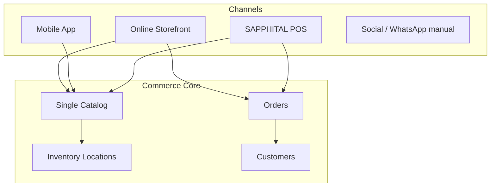

# Chapter 03: POS and Omnichannel

**Document ID:** SCP-ROAD-001-03  
**Version:** 1.0.0  
**Status:** 📝 Draft  
**Traceability:** PRD-005, Volume 1 Phase 4, Research Track 16  

---

## Purpose

Define **SAPPHITAL POS** and omnichannel inventory — enabling Nigerian merchants to sell in physical locations (boutiques, markets, pop-ups) with unified catalog, stock, and customer records alongside online storefronts.

## Scope

- POS product requirements and personas
- Online-first POS architecture with offline roadmap
- Hardware and payment terminal integration (Nigeria)
- Inventory sync and conflict resolution
- Omnichannel customer identity
- Marketplace vendor POS considerations

## Out of Scope

- Full warehouse WMS (Volume 5 Phase 4)
- Custom hardware manufacturing

---

## Problem Statement

Nigerian merchants frequently operate **dual channels**:

- Instagram / SCP online store for discovery
- Physical shop in Balogun, Computer Village, or mall for try-on and cash/card

Without unified inventory, they oversell online or maintain error-prone spreadsheets. SCP POS closes this gap.

---

## Personas

| Persona | Scenario | Need |
|---------|----------|------|
| **Amina** | Fashion boutique, Lagos | iPad POS + online same stock |
| **James** | Electronics retailer | Barcode scan, VAT invoice |
| **Fatima** | Marketplace vendor stall | Vendor-scoped POS, commission-aware |

---

## Omnichannel Model

**Rule:** One `variant_id` — stock decremented atomically regardless of channel.

---

## POS Delivery Phases

### Phase A — Online POS (2027 Q4 Beta)

Web-based POS on tablet browser (PWA):

| Feature | Included |
|---------|----------|
| Product search / barcode (camera) | ✓ |
| Cart and checkout | ✓ |
| Cash payment recording | ✓ |
| Card via Paystack POS / soft POS | ✓ |
| Receipt email/SMS | ✓ |
| Location assignment | ✓ |
| Offline | ✗ |

**Nigeria payment paths:**

- Paystack Terminal (where available)
- Flutterwave POS integration
- Manual card via hosted checkout QR on customer phone
- Cash + bank transfer recording

### Phase B — Native POS App (2028)

React Native POS (shared codebase with Chapter 02):

- Bluetooth receipt printers (ESC/POS)
- USB barcode scanners
- Cash drawer kick via printer
- Staff PIN login per device

### Phase C — Offline Mode (2028 H2)

| Capability | Offline |
|------------|---------|
| Browse catalog | Cached catalog snapshot |
| Create sale | Local queue |
| Card payment | Requires online — queue or fallback to cash |
| Sync | Background sync on reconnect; conflict rules below |

---

## Inventory Sync and Conflicts

### Location Model

| Entity | Description |
|--------|-------------|
| `Location` | Physical store, warehouse, pop-up |
| `InventoryLevel` | `variant_id + location_id → available` |
| `POSRegister` | Device bound to location |

Online storefront defaults to **ship-from location** configurable per store.

### Conflict Resolution

| Scenario | Rule |
|----------|------|
| Online order + in-store sale same last unit | **First commit wins**; loser gets oversell alert + auto-refund workflow |
| Offline POS queue replay | Idempotency key per local sale UUID |
| Price mismatch (offline stale) | POS uses server price at sync; show adjustment notice |

---

## Order Types

| Type | Source | `channel` value |
|------|--------|-----------------|
| Online | Storefront | `online` |
| POS | Register | `pos` |
| Mobile app | Shop app | `mobile` |
| Manual | Admin | `manual` |
| Social | WhatsApp order entry | `social` |

Reporting slices GMV by channel for Nigeria merchant analytics.

---

## Hardware Support (Nigeria Market)

| Device | Protocol | Phase |
|--------|----------|-------|
| Generic ESC/POS thermal | Bluetooth/USB | B |
| Sunmi / Android POS terminals | Android intent | B |
| Honeywell USB scanner | HID | B |
| Paystack Android POS | SDK/partner | A |

**Assumption:** Most Nigeria SMEs use consumer iPad/Android tablet + Bluetooth printer — optimize for this first.

---

## Staff and Permissions

| Role | POS permissions |
|------|-----------------|
| Owner | All + refunds + settings |
| Manager | Sales, refunds ≤ ₦50,000 |
| Cashier | Sales only |
| Vendor (marketplace) | Own products only |

Refund above threshold requires manager PIN + audit event (ADR-009).

---

## Tax and Receipts (Nigeria)

| Requirement | Implementation |
|-------------|----------------|
| VAT display | Configurable per merchant; 7.5% default reference |
| Receipt fields | Merchant name, TIN field (optional), items, VAT, total NGN |
| Fiscal integration | Phase C — assess FIRS e-invoicing mandates |

---

## Marketplace Vendor POS

- Vendor POS scoped to vendor catalog subset
- Commission calculated same as online orders (Volume 8)
- Payout includes POS channel GMV
- Platform operator may provide shared registers at mall locations (future)

---

## Architecture Impact

| Component | Change |
|-----------|--------|
| Orders module | `channel`, `location_id`, `register_id` |
| Inventory | Location-aware reservation |
| Payments | Cash tender type + PSP terminal refs |
| Events | `PosSaleCompleted` → analytics, webhooks |
| Sync service (Phase C) | Extracted worker (ADR-001 trigger) |

---

## Security and PCI

- Card data never on SCP servers — terminal or hosted checkout (ADR-004)
- POS device registration + remote deauth
- NDPA: CCTV in store not SCP scope; customer phone on receipt optional with consent

---

## Acceptance Criteria (Beta)

- [ ] Online POS completes sale decrementing location inventory
- [ ] Online order + POS sale race tested — no double-sell
- [ ] Paystack soft POS or QR checkout path verified in Lagos beta
- [ ] Receipt SMS delivery via Nigeria SMS provider
- [ ] Channel reporting in merchant analytics

---

## Sources

- Square POS patterns (E3)
- Paystack Terminal documentation (E1)
- Volume 1 Phase 4 — POS module
- Research Track 16
