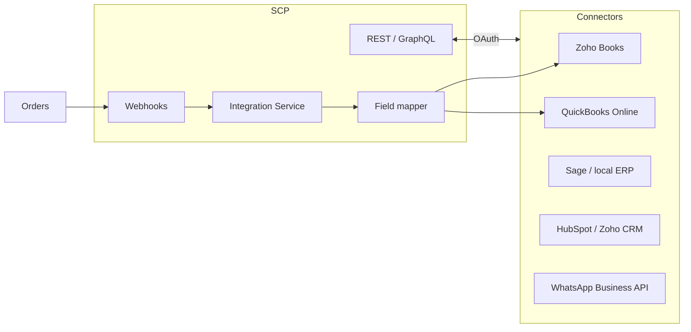

# Chapter 04: ERP and CRM Integrations

**Document ID:** SCP-ROAD-001-04  
**Version:** 1.0.0  
**Status:** 📝 Draft  
**Traceability:** PRD-009, PRD-010, Research Track 17  

---

## Purpose

Define SCP's **integration strategy** with ERP, accounting, and CRM systems — prioritizing tools Nigerian and West African merchants already use — so commerce data flows bidirectionally without manual CSV exports.

## Scope

- Integration architecture (OAuth apps, webhooks, sync jobs)
- Priority connector roadmap
- Data mapping and sync semantics
- SAPPHITAL Academy and WhatsApp CRM adjacency
- Developer/partner extensibility

## Out of Scope

- Full SAPPHITAL ERP product (Platform Vision — Chapter 08)
- Custom enterprise one-off integrations (Professional services)

---

## Integration Philosophy

1. **SCP is system of record for commerce** — orders, products, customers in storefront/POS context.
2. **Accounting system is system of record for ledger** — SCP pushes sales journals; never replaces certified accounting.
3. **Real-time where money moves; batch where reports suffice.**
4. **Nigeria-first connectors** before global ERP giants.

---

## Architecture

Integration Service runs as modular monolith module Phase 3; extractable when connector count > 20 (ADR-001).

---

## Priority Connector Roadmap

### Tier 1 — Nigeria GA (2028 Q1)

| System | Direction | Data |
|--------|-----------|------|
| **Zoho Books** | SCP → Zoho | Invoices, payments, customers |
| **QuickBooks Online** | SCP → QBO | Sales receipts, items |
| **Paystack Settlement** | Paystack → SCP | Reconciliation (already Phase 1) |
| **Flutterwave Settlement** | FLW → SCP | Reconciliation |
| **Google Sheets** | Export | Scheduled order/GMV export |

### Tier 2 — West Africa + CRM (2028 Q2)

| System | Direction | Data |
|--------|-----------|------|
| **HubSpot** | Bidirectional | Contacts, deals from high-value orders |
| **Zoho CRM** | Bidirectional | Leads from abandoned carts |
| **WhatsApp Business API** | SCP → WA | Order notifications, catalog sync |
| **Mailchimp / Brevo** | SCP → ESP | Customer segments |

### Tier 3 — Enterprise (2028+)

| System | Notes |
|--------|-------|
| Microsoft Dynamics | Enterprise Nigeria banking/retail |
| SAP Business One | Large importers |
| Oracle NetSuite | Global enterprise tier |
| Xero | Diaspora merchants |

---

## Sync Patterns

| Pattern | Use case | Example |
|---------|----------|---------|
| **Webhook push** | Real-time order | `OrderPaid` → create Zoho invoice |
| **Polling pull** | External inventory source | ERP stock → SCP `InventoryLevel` |
| **Scheduled batch** | Daily reconciliation | Settlement vs orders |
| **Manual trigger** | Merchant-initiated full sync | Initial catalog import |

### Idempotency

All outbound sync jobs carry `idempotency_key = {tenant_id}:{event_id}:{connector}` — retries must not duplicate invoices.

### Conflict Rules

| Entity | Winner on conflict |
|--------|-------------------|
| Product title/description | SCP (merchant edits in admin) |
| Inventory count | Configurable — default SCP for online, ERP for warehouse-only SKUs |
| Customer email | Merge; SCP stores commerce history |
| Price | SCP at checkout; ERP updated post-sale |

---

## OAuth App Model (Volume 12)

Third-party and first-party connectors register as OAuth applications:

| Scope | Access |
|-------|--------|
| `read_orders` | Fetch orders |
| `write_products` | Catalog sync |
| `read_customers` | CRM sync |
| `read_inventory` | Stock levels |
| `webhooks.manage` | Register endpoints |

Merchants install from **SCP App Marketplace** (Volume 12 Phase 3).

---

## Field Mapping (Zoho Books Example)

| SCP field | Zoho field | Transform |
|-----------|------------|-----------|
| `order.total_minor` | `total` | ÷ 100 → NGN |
| `order.tax_minor` | `tax_total` | VAT line |
| `customer.email` | `contact_email` | |
| `line_item.sku` | `item_sku` | Auto-create item if missing |
| `payment.reference` | `reference_number` | Paystack ref |

Mapping templates stored per tenant; customizable in admin UI Phase 2 integrations panel.

---

## WhatsApp CRM Workflow (Nigeria)

High-priority for Amina persona:

1. Customer messages merchant WhatsApp
2. SCP sends order/shipping templates via WhatsApp Business API
3. Product catalog link → SCP storefront
4. Abandoned cart recovery message (opt-in, NDPA consent)

**Compliance:** WhatsApp marketing requires explicit consent logged per customer (NFR-085).

---

## SAPPHITAL Academy Integration

| Integration | Value |
|-------------|-------|
| Course purchase → SCP order | Education commerce (Volume 7) |
| Academy student → SCP customer | Unified identity (Platform core) |
| Completion certificate → digital product delivery | Automated fulfillment |

Shared auth with Platform core (Volume 1 mission diagram).

---

## Error Handling and Observability

| Failure | Merchant experience | Ops |
|---------|---------------------|-----|
| Connector auth expired | Admin banner + email | Integration health dashboard |
| Rate limit | Exponential backoff | Alert if queue > 1h |
| Mapping error | Row-level error log | Support playbook |
| Partial sync | Resume from cursor | Audit trail |

Volume 14 monitors integration queue depth.

---

## Security

- OAuth tokens encrypted at rest (ADR-007)
- Minimum scopes per connector
- Audit log for every external API call with tenant context
- Enterprise: IP allowlist for ERP callbacks

---

## Business Model

| Model | Pricing |
|-------|---------|
| Tier 1 connectors | Included in Business+ plans |
| Tier 3 / custom | Enterprise add-on |
| Third-party partner apps | 15% revenue share (Volume 12) |

---

## Acceptance Criteria (Integration GA)

- [ ] Zoho Books order→invoice sync ≤ 2 min p95
- [ ] QuickBooks OAuth flow documented and tested
- [ ] Idempotency verified — 100 retry simulation zero duplicates
- [ ] WhatsApp order notification template approved by Meta
- [ ] Integration error UI in merchant admin

---

## Sources

- Zoho Books API (E1)
- QuickBooks Online API (E1)
- Research Track 17 — Automation and integrations
- Volume 12 — Developer Platform (planned)
