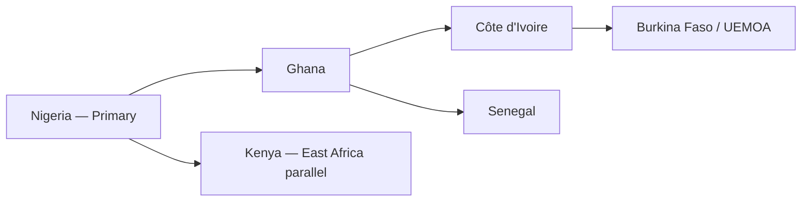

# Chapter 05: West Africa Expansion

**Document ID:** SCP-ROAD-001-05  
**Version:** 1.0.0  
**Status:** 📝 Draft  
**Traceability:** Volume 1 Ch 03, NFR-078, NFR-085, ADR-011  

---

## Purpose

Define SCP's **West Africa expansion playbook** after Nigeria product-market fit — covering Ghana, Côte d'Ivoire, Senegal, and ECOWAS/UEMOA payment and compliance requirements while reusing Nigeria-proven architecture.

## Scope

- Market sequencing and entry criteria
- Localization (language, currency, payments)
- Infrastructure and data residency
- Go-to-market and partnerships
- Operational readiness

## Out of Scope

- East Africa (Kenya parallel track — Volume 1 Phase 1b)
- Southern Africa (Phase 3 in Volume 1)
- Francophone Central Africa deep dive

---

## Expansion Philosophy

**Nigeria is the template, not the only market.**

Each new country reuses:

- Modular monolith codebase (no fork)
- Multi-currency + multi-locale core
- Shared RLS tenancy model
- Pan-Africa privacy framework (NFR-085)

Country launch adds: payment adapters, tax rules, shipping carriers, legal entity disclosures, and localized support content.

---

## Market Sequencing

### Entry Criteria (Per Country)

| Gate | Threshold |
|------|-----------|
| Nigeria retention M6 | ≥ 45% |
| Nigeria ops SLO | 99.9% for 3 consecutive months |
| Payment partner signed | At least one local PSP |
| Legal review | Data protection + consumer law summary |
| Support articles | Minimum 15 country-specific |
| Beta merchants | 25 local merchants 60 days |

---

## Country Profiles

### Ghana (2028 Q1 — First West Africa Expansion)

| Factor | Detail |
|--------|--------|
| Currency | GHS |
| Payments | Paystack GH, Flutterwave, MTN MoMo Ghana |
| Language | English |
| Compliance | Ghana Data Protection Act 2012 + DPC registration |
| Logistics | Jumia Logistics partners, local couriers |

**GTM:** Partner with Ghanaian creator economy; "Sell from Accra to diaspora" campaign.

### Côte d'Ivoire (2028 Q3)

| Factor | Detail |
|--------|--------|
| Currency | XOF (UEMOA) |
| Payments | Flutterwave Francophone, Orange Money, MTN MoMo CI |
| Language | **French primary** |
| Compliance | Ivoirian CDP law — legal review required |
| UI | Full French admin + storefront |

### Senegal (2028 Q4)

| Factor | Detail |
|--------|--------|
| Currency | XOF |
| Payments | Wave, Orange Money, Flutterwave |
| Language | French |
| Hub | Dakar tech ecosystem partnerships |

---

## Technical Enablement

### Multi-Country Tenant Model

| Model | Description |
|-------|-------------|
| Single tenant, multi-store | Nigerian merchant expands to Ghana store under same tenant |
| Country-specific store | `store.country_code`, `store.currency`, `store.default_locale` |
| Tax rules | Per-store tax configuration (Volume 5) |

Nigerian merchant selling to Ghana: storefront currency GHS; settlement via Flutterwave multi-currency.

### Payment Adapter Matrix

| Provider | NG | GH | CI | SN |
|----------|----|----|----|-----|
| Paystack | ✓ | ✓ | — | — |
| Flutterwave | ✓ | ✓ | ✓ | ✓ |
| MTN MoMo | — | ✓ | ✓ | — |
| Orange Money | — | — | ✓ | ✓ |
| Wave | — | — | — | ✓ |

### Infrastructure (ADR-011)

| Phase | Approach |
|-------|----------|
| 2028 | Nigeria (Lagos) primary compute; CDN edge for West Africa |
| 2028 H2 | Evaluate Ghana edge PoP or read replica if latency p95 > 250ms |
| 2029 | Dedicated West Africa region if merchant count > 2,000 outside NG |

Data residency: document cross-border transfers in RoPA per country regulator.

---

## Localization

| Surface | English | French | Pidgin |
|---------|---------|--------|--------|
| Admin | ✓ | 2028 Q3 | — |
| Storefront themes | ✓ | ✓ | NG only |
| AI assistant | ✓ | ✓ | NG |
| Support docs | Per country | FR for UEMOA | — |
| Status page | ✓ | ✓ for FR incidents | — |

Translation workflow: AI draft + human review for French commerce terms (e.g., *commande*, *panier*).

---

## Tax and Compliance

| Country | Sales tax / VAT | Platform obligation |
|---------|-----------------|---------------------|
| Nigeria | VAT 7.5% | Merchant-configurable; SCP displays |
| Ghana | VAT + levies | Same pattern |
| UEMOA | TVA harmonized | French tax labels in UI |

SCP does not file taxes on merchant behalf in Phase 1 expansion — integrations export data for merchant accountants.

### Privacy Registrations

| Country | Authority | Action before GA |
|---------|-----------|------------------|
| Ghana | Data Protection Commission | Registration |
| Côte d'Ivoire | ARTCI/CDP | Legal assessment |
| Senegal | CDP Senegal | Registration |

Extend NFR-085 pan-Africa framework with country annexes.

---

## Go-to-Market (West Africa)

| Tactic | Ghana example |
|--------|---------------|
| Local influencer merchants | Beta showcase stores |
| Agency partner program | Accra web agencies resell SCP |
| Payment co-marketing | Paystack Ghana joint webinar |
| Francophone | Abidjan startup hub sponsorship |
| Pricing | GHS/XOF localized; PPP-adjusted vs Nigeria NGN |

---

## Operations

| Function | Nigeria team + |
|----------|----------------|
| Support | French-speaking agent (CI/SN) |
| On-call | Same rotation; country tag on incidents |
| PSP escalation | Local account managers |
| Holidays | Country calendar on status page |

---

## Success Metrics

| Metric | Ghana 12mo post-GA | Francophone 12mo |
|--------|-------------------|------------------|
| Active merchants | 500 | 300 combined |
| GMV | $2M/month | $1M/month |
| Payment success | ≥ 93% | ≥ 90% |
| French UI satisfaction | — | ≥ 4.0/5 |

---

## Risks

| Risk | Mitigation |
|------|------------|
| XOF/NGN volatility | Real-time FX API; merchant price alerts |
| French localization delay | Launch Ghana English first |
| Regulatory fragmentation | Legal retainer per country |
| PSP coverage gaps | COD + bank transfer fallback |

---

## Acceptance Criteria (Country Launch)

- [ ] Payment adapter live with sandbox + production keys
- [ ] Country privacy registration complete
- [ ] 15+ support articles in local context
- [ ] 25 beta merchants with ≥ 10 active (≥ 1 order/week)
- [ ] SLO dashboard tagged by country
- [ ] RoPA updated with any new subprocessors

---

## Sources

- Volume 1 Chapter 03 — Target Markets
- Flutterwave country coverage (E1)
- Ghana Data Protection Act (E1)
- Research Track 01 — Market research
