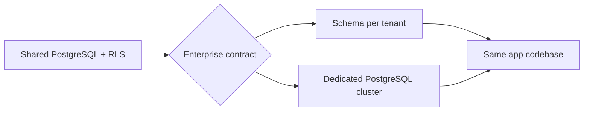

# Chapter 06: Enterprise Tier

**Document ID:** SCP-ROAD-001-06  
**Version:** 1.0.0  
**Status:** ✅ Active  
**Traceability:** ADR-002 Phase 4, NFR-071, Volume 14 SLOs  

---

## Purpose

Define SCP **Enterprise tier** capabilities for large Nigerian and African merchants, marketplaces, and institutions requiring dedicated isolation, custom SLAs, SSO, and compliance artifacts.

## Scope

- Enterprise plan entitlements (Volume 16)
- Schema-per-tenant or dedicated database (ADR-002 Phase 4)
- SSO/SAML, SCIM provisioning
- Custom SLA and support
- Advanced audit and data residency options

## Out of Scope

- Phase 1–2 SMB/Starter tiers (Volume 16)

---

## 1. Target Customers

| Segment | Example | Driver |
|---------|---------|--------|
| Large marketplace | Multi-vendor mall operator | Isolation + SLA |
| Bank / telco commerce | Branded storefront | Compliance |
| University | Sapphital Academy at scale | SSO + residency |
| Enterprise brand | Multi-store, multi-country | Dedicated infra |

---

## 2. Enterprise Capabilities

| Capability | Standard SaaS | Enterprise |
|------------|---------------|------------|
| Tenancy | Shared DB + RLS | Schema-per-tenant or dedicated DB |
| Region | Nigeria shared | Dedicated Lagos or contract region |
| SSO | Email/password + MFA | SAML 2.0, OIDC, SCIM |
| SLA uptime | 99.9% | 99.95% – 99.99% contractual |
| Support | Business hours | 24/7 P1, named CSM |
| Audit export | Self-service | SIEM feed, custom retention |
| Rate limits | Plan-based | Negotiated |
| Impersonation | ADR-010 | Stricter approval workflow |

---

## 3. Architecture Evolution

Migration path: export tenant data → provision isolated schema/DB → DNS cutover → validate isolation tests.

---

## 4. Compliance Package

- NDPC DCPMI support documentation
- Custom DPA and subprocessor review
- Pen test summary sharing (NDA)
- SOC 2 roadmap alignment (Volume 11)
- Kenya ODPC parallel for East Africa enterprise

---

## 5. Pricing Model (Indicative)

- Base platform fee + GMV or seat-based component
- Implementation/onboarding fee
- Dedicated infra pass-through + margin

**Assumption:** Final pricing validated with Nigerian enterprise sales pilots.

---

## 6. Acceptance Criteria (Enterprise GA)

1. SAML SSO login works with test IdP (Okta/Azure AD).
2. Enterprise tenant on schema-per-tenant passes full isolation suite.
3. Contractual SLA dashboards visible to customer admin.
4. Data export completes within 24h for largest catalog benchmark.

---

## Sources

- AWS SaaS Tenant Isolation whitepaper
- ADR-002 migration path
- Volume 16 — Plans and entitlements
