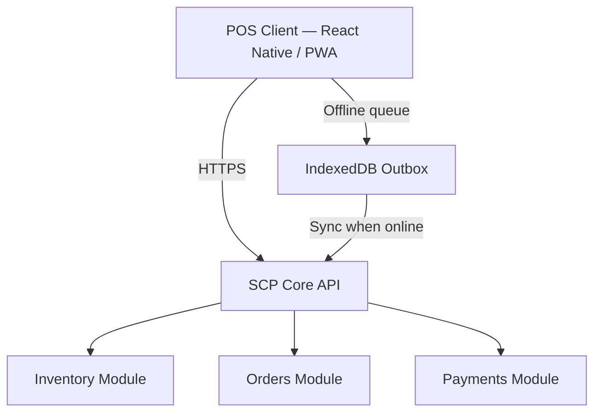

# Chapter 02: POS Module Specification

**Document ID:** SCP-ROAD-001-02  
**Version:** 1.0.0  
**Status:** ✅ Active  
**Traceability:** PRD-014, FR-POS-001–010 (proposed)

---

## Purpose

Specify the future **Point of Sale (POS)** module for SCP — enabling Nigerian retailers to unify in-store and online inventory, payments, and customer records.

## Scope

- POS architecture and offline model
- Hardware integrations (receipt printers, barcode scanners)
- Payment methods at counter (card terminal, cash, transfer)
- Inventory sync with commerce core
- Staff roles and cash drawer management
- Lagos retail pilot requirements

## Out of Scope

- Full restaurant/table management (Phase 5)
- Custom hardware manufacturing
- Tax fiscal printer compliance (country-specific legal review)

---

## 1. Business Context (Nigeria)

| Segment | Need |
|---------|------|
| Lagos fashion boutiques | Same stock online + in-store |
| Electronics shops (Computer Village) | Barcode scan, receipt |
| Pharmacies | Batch/expiry tracking (Phase 2 POS) |
| Pop-up markets | Mobile POS on tablet |

**Opportunity:** Many merchants use separate POS (Excel, local tools) — SCP unified inventory reduces overselling.

---

## 2. Architecture

| Component | Technology |
|-----------|------------|
| POS UI | React Native (tablet) + PWA fallback |
| Offline store | IndexedDB + outbox pattern |
| Device bridge | ESC/POS via Bluetooth (Phase 1 POS) |
| Auth | Staff PIN + Sanctum device token |

---

## 3. Core Features (H4 Launch)

| Feature | Priority |
|---------|----------|
| Product search / barcode scan | P0 |
| Cart + checkout | P0 |
| Cash + bank transfer recording | P0 |
| Paystack Terminal API integration | P1 |
| Receipt print/email | P0 |
| Customer attach to sale | P1 |
| Refund at counter | P1 |
| End-of-day Z-report | P0 |
| Multi-location inventory | P1 |

---

## 4. Offline Model

| Operation | Offline Allowed | Sync Rule |
|-----------|-----------------|-----------|
| Browse catalog (cached) | Yes | Refresh every 4h online |
| Create sale | Yes | Queue in outbox |
| Card payment | No | Requires connectivity |
| Inventory adjust | Yes | Conflict: server wins + alert |
| New product create | No | Admin only online |

Max offline duration: **72 hours**; then read-only mode.

---

## 5. Inventory Sync

- Online order reserves stock → POS reflects within 30s
- POS sale decrements same `inventory_levels` rows
- Conflict detection: negative stock blocked; manager override PIN

---

## 6. Staff & Permissions

| Role | Capabilities |
|------|--------------|
| Cashier | Sell, basic refund |
| Supervisor | Discount up to 10%, void |
| Manager | Full refund, drawer open, reports |

---

## 7. Nigeria Payment at Counter

| Method | Integration |
|--------|-------------|
| Cash | Manual entry; drawer tracking |
| Bank transfer | Reference number capture |
| Paystack Terminal | Terminal API (Phase 1 POS) |
| USSD | QR to Paystack checkout (fallback) |

---

## 8. Acceptance Criteria (When POS Ships)

- [ ] Offline sale queue with 72h max offline
- [ ] Shared inventory with online catalog
- [ ] Barcode scan product lookup < 500ms online
- [ ] Z-report exports CSV
- [ ] Paystack Terminal or documented fallback
- [ ] Staff roles: cashier, supervisor, manager
- [ ] Lagos pilot with 5 merchants documented

---

## References

- [Volume 5 Ch. 04 — Inventory](../05-commerce-engine/04-inventory-and-warehouses.md)
- [Volume 5 Ch. 08 — Payments Nigeria](../05-commerce-engine/08-payments-nigeria-africa.md)
- [Chapter 01 — Roadmap Overview](./01-roadmap-overview.md)
