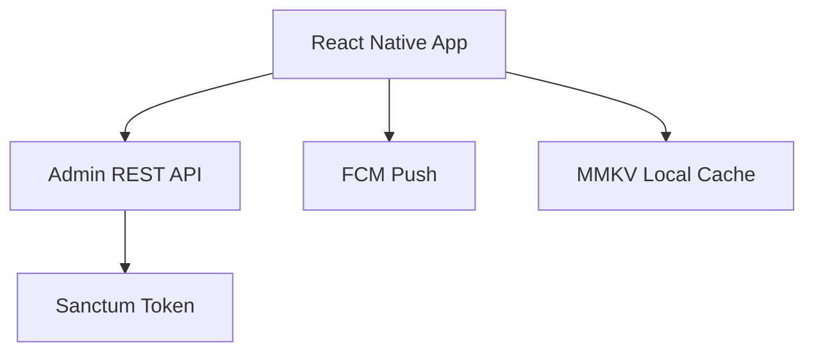

# Chapter 03: Mobile App Architecture

**Document ID:** SCP-ROAD-001-03  
**Version:** 1.0.0  
**Status:** ✅ Active  
**Traceability:** PRD-015, NFR-001, NFR-071

---

## Purpose

Define SCP **mobile application architecture** for merchant administration and shopper engagement — prioritizing Nigeria Android market and low-bandwidth resilience.

## Scope

- Merchant admin app (React Native)
- Shopper PWA and optional native wrapper
- API consumption patterns
- Push notifications
- Offline capabilities
- App distribution (Play Store)

## Out of Scope

- iOS-first features (parity target, not lead platform)
- Mobile POS (Chapter 02)
- Consumer social features

---

## 1. Market Context

| Fact | Implication |
|------|-------------|
| Android ~85% Nigeria smartphone share | Android-first RN |
| Intermittent 3G/4G | Offline caches, optimistic UI |
| WhatsApp as primary comms | Deep links; share intents |
| App size sensitivity | Target < 25 MB APK |

---

## 2. Application Portfolio

| App | User | Phase | Stack |
|-----|------|-------|-------|
| **SCP Merchant** | Store owner/staff | H4 | React Native |
| **SCP Shop** | Repeat shoppers | H4+ | PWA → optional RN shell |
| **SCP Vendor** | Marketplace sellers | H3 | Web-first; RN Phase 4 |

---

## 3. Merchant App Architecture

| Layer | Choice |
|-------|--------|
| Navigation | React Navigation |
| State | TanStack Query + Zustand |
| Auth | Biometric unlock + refresh token |
| Forms | React Hook Form |

---

## 4. Feature Priority (Merchant App)

| Feature | Priority |
|---------|----------|
| Order notifications + detail | P0 |
| Product quick edit (price, stock) | P0 |
| Order fulfill / mark paid | P0 |
| Analytics snapshot | P1 |
| Customer lookup | P1 |
| Camera product photo upload | P1 |
| AI ops assistant chat | P2 |
| Multi-store switch | P2 |

---

## 5. Shopper PWA

| Capability | Detail |
|------------|--------|
| Install prompt | Add to home screen |
| Push | Web push via FCM (Chrome Android) |
| Offline | Cached PLP/PDP for enrolled customers |
| Deep links | `sapphital.shop` universal links |

Native shell optional for Play Store discovery — wraps PWA WebView with native push bridge.

---

## 6. Push Notifications

| Event | Merchant | Shopper |
|-------|----------|---------|
| New order | ✅ | — |
| Low stock | ✅ | — |
| Shipment update | — | ✅ |
| Abandoned cart | — | ✅ (opt-in) |
| Course lesson drip | — | ✅ |

Termii SMS fallback for critical merchant alerts if push undelivered 5 min.

---

## 7. Security

| Control | Detail |
|---------|--------|
| Token storage | Keychain/Keystore |
| Certificate pinning | Phase 2 mobile |
| Jailbreak/root detect | Warn, not block Phase 1 |
| Session timeout | 30 min inactive |
| Biometric | Optional per device |

---

## 8. API Contracts

Merchant app consumes **Admin API only** (Volume 12) — no direct DB. GraphQL admin API evaluated Phase 4; REST default.

Bandwidth optimization: field filtering `?fields=id,title,status` on list endpoints.

---

## 9. Acceptance Criteria (When Mobile Ships)

- [ ] React Native merchant app Android target
- [ ] APK size target < 25 MB
- [ ] Order notification delivery < 30s p95
- [ ] Offline order list cache (last 50)
- [ ] Biometric unlock optional
- [ ] PWA install + push documented for shoppers
- [ ] SMS fallback for merchant critical alerts

---

## References

- [Volume 12 — Developer Platform](../12-developer-platform/README.md)
- [Volume 4 Ch. 12 — Performance Budgets](../04-design-system/12-performance-and-ux-budgets.md)
- [Chapter 02 — POS](./02-pos-module-specification.md)
