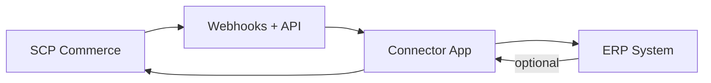

# Chapter 04: ERP Integration

**Document ID:** SCP-ROAD-001-04  
**Version:** 1.0.0  
**Status:** ✅ Active  
**Traceability:** PRD-016, FR-INT-001–008 (proposed)

---

## Purpose

Define **ERP and accounting integration** strategy for SCP enterprise merchants — connecting commerce data to Nigerian and international accounting systems.

## Scope

- Integration patterns (connector apps vs native)
- Target ERP systems
- Data sync entities and direction
- Reconciliation and error handling
- Enterprise connector hub (H4)

## Out of Scope

- Building a full native ERP
- Tax filing automation (merchant/accountant responsibility)
- Payroll integrations

---

## 1. Nigeria Enterprise Context

| System | User Profile | Priority |
|--------|--------------|----------|
| **QuickBooks Online** | SMEs, diaspora-connected | P0 connector |
| **Sage Business Cloud** | Mid-market | P1 |
| **Xero** | Agencies, exporters | P1 |
| **Local tools (Excel, Tally)** | CSV export fallback | P0 |
| **SAP / Oracle** | Large enterprise | Phase 5 custom |

CBN reporting and VAT (when applicable) — export formats, not auto-file.

---

## 2. Integration Patterns

| Pattern | Use |
|---------|-----|
| **Outbound events** | OrderPaid → invoice in ERP |
| **Scheduled sync** | Nightly product/inventory pull |
| **On-demand export** | CSV/JSON manual upload |
| **Bi-directional** | Inventory levels from ERP (enterprise) |

Connectors implemented as **marketplace apps** (Volume 12 Ch. 10), not core forks.

---

## 3. Sync Entities

| Entity | Direction | Frequency |
|--------|-----------|-----------|
| Customers | SCP → ERP | On create/update |
| Products / SKUs | Bi-dir | Daily + on change webhook |
| Inventory levels | Bi-dir | Hourly |
| Orders / invoices | SCP → ERP | Real-time on OrderPaid |
| Refunds / credit notes | SCP → ERP | Real-time |
| Payouts (marketplace) | SCP → ERP | Daily |
| Chart of accounts mapping | ERP → SCP config | Manual setup |

---

## 4. Mapping & Configuration

| Setting | Example |
|---------|---------|
| Revenue account | `4000-Sales` |
| Shipping income | `4100-Shipping` |
| Paystack fees | `6200-PaymentFees` |
| VAT line | Mapped if merchant enabled |
| Location → warehouse | Lagos store → WH-01 |

Admin UI: **Integration mapping wizard** with test transaction.

---

## 5. Reconciliation

| Check | Frequency |
|-------|-----------|
| Order count SCP vs ERP | Daily |
| Payment total vs PSP settlement | Daily |
| Inventory variance > 5% | Alert |

Discrepancy dashboard in merchant admin; export for accountant.

---

## 6. Error Handling

| Failure | Action |
|---------|--------|
| ERP API down | Retry 48h; queue visible in admin |
| Mapping missing | Block sync; notify merchant |
| Duplicate invoice | Idempotency key `order_id` |
| Rate limit | Exponential backoff |

---

## 7. Connector Hub (H4)

Pre-built connectors in marketplace:

| Connector | Price Model |
|-----------|-------------|
| QuickBooks Online | ₦15,000/mo subscription |
| Xero | ₦15,000/mo |
| Sage | ₦20,000/mo |
| CSV Export Pro | Free (platform) |

Sapphital maintains QBO connector; partners maintain others.

---

## 8. Security & Compliance

- OAuth to ERP; tokens encrypted per tenant
- Minimum scopes
- NDPA: ERP listed as merchant-controlled subprocessor
- Audit log of all sync jobs

---

## 9. Acceptance Criteria (When ERP Ships)

- [ ] Connector app pattern via marketplace documented
- [ ] Real-time OrderPaid → invoice sync specified
- [ ] Idempotency on order_id for invoices
- [ ] Mapping wizard for chart of accounts
- [ ] Daily reconciliation checks defined
- [ ] QuickBooks Online named P0 connector
- [ ] CSV export fallback for all merchants

---

## References

- [Volume 12 Ch. 04 — Webhooks](../12-developer-platform/04-webhooks-and-events.md)
- [Volume 5 Ch. 07 — Orders](../05-commerce-engine/07-orders-and-fulfillment.md)
- [Volume 8 Ch. 05 — Split Payouts](../08-marketplace/05-split-payments-payouts-nigeria.md)
