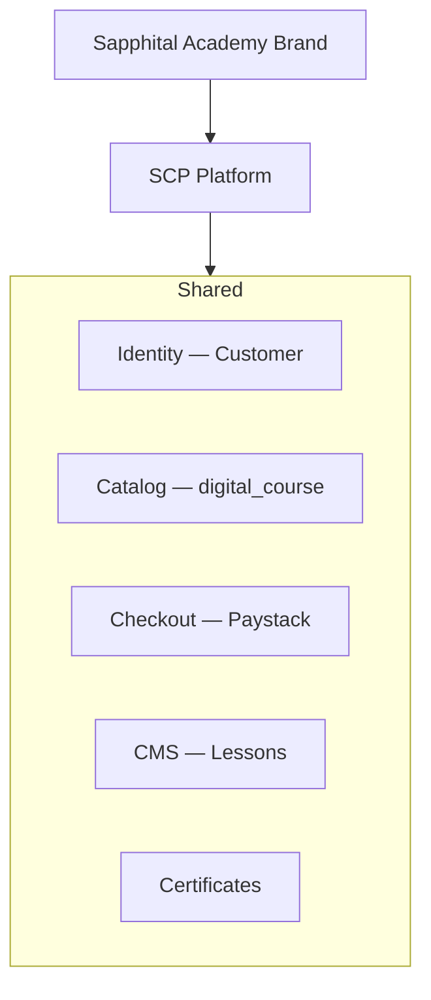
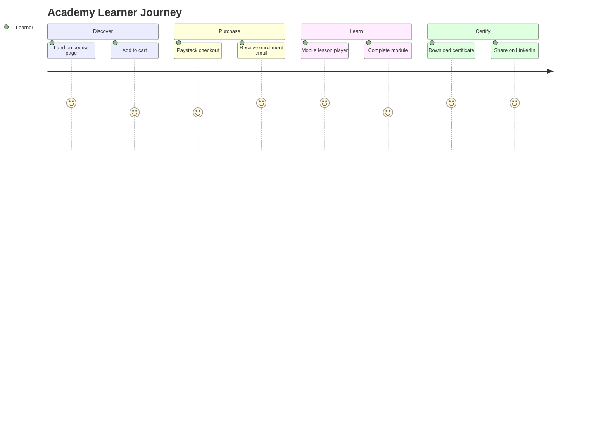

# Chapter 05: Sapphital Academy Integration

**Document ID:** SCP-ROAD-001-05  
**Version:** 1.0.0  
**Status:** ✅ Active  
**Traceability:** PRD-012, Proposed ADR-016, FR-CMS-009–010

---

## Purpose

Define how **Sapphital Academy** integrates with SCP as the education commerce moat — unified identity, catalog, checkout, and certification across learning and retail.

## Scope

- Academy brand and positioning
- Identity federation (learner = customer)
- Course catalog on SCP
- Cohort programs and B2B training sales
- Certificate verification network
- Cross-sell: courses + physical products

## Out of Scope

- Non-Sapphital white-label LMS replacement
- Government accreditation
- MOOC scale (100k+ free users)

---

## 1. Strategic Position

| Dimension | SCP + Academy Advantage |
|-----------|---------------------------|
| vs Teachable | NGN pricing; local payments; no USD FX pain |
| vs Udemy | Owned audience; merchant brand |
| vs Shopify + plugin | Native learning + commerce single admin |
| Nigeria fit | Mobile lessons; download for offline; WhatsApp cohorts |

**Thesis:** Sapphital Learning Company sells **commerce infrastructure** and **education outcomes** as one operating system.

---

## 2. Integration Architecture

| Component | Integration |
|-----------|-------------|
| Identity | Academy signup creates `Customer` + optional `User` staff |
| Storefront | `academy.sapphital.com` or merchant custom domain |
| Billing | Same subscription engine (Volume 16) |
| Content | Volume 7 Ch. 09 course model |
| Analytics | Learning progress in merchant dashboard |

---

## 3. Academy Product Lines

| Product | Model | Phase |
|---------|-------|-------|
| **SCP for Educators** | SaaS plan with course limits | H3 |
| **Sapphital Certified Courses** | First-party IP on SCP demo store | H2 |
| **B2B corporate training** | Bulk enrollment codes | H3 |
| **Creator marketplace** | Top merchants featured on Academy hub | H4 |
| **Bootcamps / cohorts** | Fixed-date drip + live sessions | H3 |

---

## 4. Learner Journey

---

## 5. Cross-Sell Patterns

| Pattern | Example |
|---------|---------|
| Course + kit bundle | Baking course + ingredient box |
| Completion coupon | 10% off physical product |
| Learning path | Beginner → advanced courses |
| Membership | Monthly access subscription |

Implemented via standard promotions engine (Volume 5 Ch. 11).

---

## 6. Certificate Network

| Feature | Detail |
|---------|---------|
| Verification URL | Public `/certificates/verify/{code}` |
| QR on PDF | Links to verification |
| Academy registry | Optional listing of Sapphital-approved programs |
| Employer verify | Free lookup; no PII beyond name |

---

## 7. B2B & Institutions (Nigeria)

| Segment | Offering |
|---------|----------|
| Corporate L&D | Invoice billing; SSO Phase 5 |
| Universities | Cohort licenses; SCORM Phase 4 |
| NGOs / DFID programs | Reporting exports |
| Government skills programs | Custom analytics; residency guarantee |

---

## 8. Revenue Model

| Stream | Share |
|--------|-------|
| Educator SaaS plans | Platform ARR |
| Transaction fee on course sales | 0.5–1% platform (below physical goods) |
| Academy first-party courses | 100% Sapphital |
| Certification fees | Optional premium |

---

## 9. Acceptance Criteria (Academy Integration GA)

- [ ] Shared customer identity documented
- [ ] Course catalog uses Volume 7 education model
- [ ] Certificate verification URL public
- [ ] B2B bulk enrollment codes specified
- [ ] Cross-sell via promotions engine
- [ ] NGN Paystack checkout for courses
- [ ] Academy brand positioning vs Teachable documented

---

## References

- [Volume 7 Ch. 09 — Education Commerce](../07-cms/09-education-commerce-pages.md)
- [Volume 5 Ch. 14 — Digital Products](../05-commerce-engine/14-digital-products-and-services.md)
- [Volume 16 — Plans & Entitlements](../16-saas-multi-tenancy/03-plans-and-entitlements.md)
