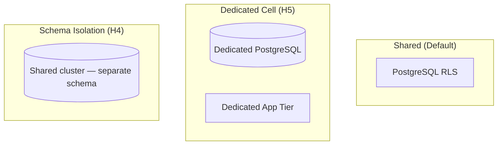

# Chapter 07: Enterprise Features Roadmap

**Document ID:** SCP-ROAD-001-07  
**Version:** 1.0.0  
**Status:** ✅ Active  
**Traceability:** PRD-017, PRD-018, NFR-013, NFR-071

---

## Purpose

Define **enterprise-grade capabilities** for SCP — dedicated infrastructure, SSO, advanced security, custom contracts, and SLA tiers for Nigerian corporates, banks, and pan-African institutions.

## Scope

- Enterprise tier definition
- Dedicated tenancy models
- SSO / SAML / OIDC
- Advanced audit and compliance exports
- Custom SLA and support
- Procurement and legal requirements

## Out of Scope

- Government secret classification systems
- On-premise SCP install (evaluate case-by-case H5)
- Custom core forks

---

## 1. Enterprise Customer Profile

| Segment | Examples (Nigeria/Africa) |
|---------|---------------------------|
| Retail chains | Multi-location fashion, pharmacy |
| Banks / fintech | Branded merchandise stores |
| Telcos | Device + plan commerce |
| Universities | Campus commerce + learning |
| NGOs / multilaterals | Procurement marketplaces |
| Government agencies | Tender-compliant storefronts |

**Deal size:** ₦5M–₦50M+ ARR; 6–18 month sales cycle.

---

## 2. Enterprise Tier Capabilities

| Capability | Standard Pro | Enterprise |
|------------|--------------|------------|
| Tenancy | Shared + RLS | Dedicated cell or DB schema |
| SSO | — | SAML 2.0 / OIDC |
| SLA | 99.9% | 99.95% contractual |
| Support | Business hours | 24×7 P1 phone |
| Audit export | CSV | SIEM + real-time stream |
| Rate limits | Standard | Custom |
| Data residency | Nigeria | Nigeria + optional EU cell |
| Custom domain | 1 | Unlimited |
| Marketplace | Standard fees | Negotiated |
| AI tokens | Plan cap | Dedicated budget |

---

## 3. Dedicated Tenancy Models

| Model | When | Cost Premium |
|-------|------|--------------|
| Shared + RLS | < ₦5M ARR | Baseline |
| Schema isolation | Security requirement | +30% infra |
| Dedicated cell | Regulatory / scale | +100% infra |
| On-prem | Air-gapped (rare) | Custom SOW |

---

## 4. SSO Integration (H5)

| Protocol | Support |
|----------|---------|
| SAML 2.0 | IdP-initiated + SP-initiated |
| OIDC | Authorization code + PKCE |
| SCIM | User provision/deprovision Phase 2 enterprise |

Mapped roles: IdP groups → SCP `admin`, `editor`, `viewer`.

---

## 5. Compliance Exports

| Export | Format | Frequency |
|--------|--------|-----------|
| Audit log | JSON Lines, CEF | Real-time stream |
| Access report | CSV | Monthly |
| Data processing record | PDF | On request |
| Pen test summary | PDF | Annual |
| Subprocessor list | CSV | Quarterly |

SIEM integrations: Splunk HEC, Azure Sentinel webhook.

---

## 6. Procurement Support (Nigeria)

| Requirement | SCP Response |
|-------------|--------------|
| CAC vendor registration | Sapphital Learning Company |
| TIN / VAT certificate | Provided |
| NDPA DPA | Enterprise DPA annex |
| Local content | Nigeria HQ + Lagos infra |
| Bank guarantee | Case-by-case |
| POC period | 90-day enterprise pilot |

---

## 7. Custom Development

| Type | Delivery |
|------|----------|
| Private app | Marketplace unlisted app |
| Custom connector | Partner SOW |
| White-label admin | Theme + domain only; no fork |
| API extension | Webhook + scoped endpoints |

**Policy:** No core forks; upstream contributions preferred.

---

## 8. Enterprise Roadmap Timeline

| Feature | Horizon |
|---------|---------|
| Schema isolation | H4 |
| SAML SSO | H5 |
| Dedicated cell | H5 |
| SIEM streaming | H4 |
| 99.95% SLA | H5 |
| SCIM provisioning | H5 |

---

## 9. Acceptance Criteria (Enterprise GA)

- [ ] Enterprise vs Pro capability matrix
- [ ] Three tenancy models: shared, schema, dedicated cell
- [ ] SAML/OIDC SSO specified
- [ ] Audit SIEM export formats
- [ ] Nigeria procurement document list
- [ ] No core fork policy stated
- [ ] 99.95% SLA as enterprise tier target

---

## References

- [Volume 16 — SaaS Plans](../16-saas-multi-tenancy/03-plans-and-entitlements.md)
- [Volume 11 — Security](../11-security/README.md)
- [Volume 3 Ch. 05 — Multi-Tenancy](../03-architecture/05-multi-tenancy-and-isolation.md)
- [Chapter 06 — Global Expansion](./06-global-expansion-strategy.md)
