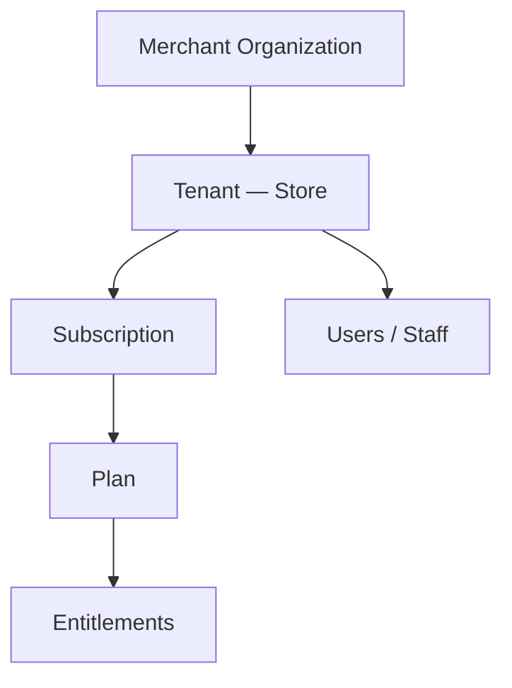

# Chapter 01: SaaS Overview

**Document ID:** SCP-SAAS-001-01  
**Version:** 1.0.0  
**Status:** ✅ Active  
**Traceability:** PRD-003, ADR-002, NFR-040, NFR-071

---

## Purpose

Define SCP's **SaaS business and technical model** — how merchants subscribe to the platform, how tenants are provisioned, and how commercial rules map to technical entitlements.

## Scope

- SaaS positioning vs marketplace/commerce
- Tenant as commercial unit
- Billing relationship (platform ↔ merchant)
- High-level module map
- Nigeria pricing philosophy

## Out of Scope

- Investor pitch materials
- Merchant pricing psychology research (Volume 2)

---

## 1. SaaS Identity

SCP is sold as **subscription SaaS** with optional usage overages:

| Layer | Description |
|-------|-------------|
| **Platform SaaS** | Merchant pays Sapphital for store, admin, themes, APIs |
| **Commerce GMV** | Merchant keeps sales revenue (minus PSP fees) |
| **Marketplace fee** | Separate take rate on vendor sales (Volume 8) |
| **App subscriptions** | Third-party app fees (Volume 12) |

---

## 2. Tenant Commercial Unit

One **tenant** = one commerce store with isolated data. Enterprise may have multiple tenants under organization (H5).

---

## 3. Nigeria Pricing Philosophy

| Principle | Implementation |
|-----------|----------------|
| NGN-native | Plans priced in Naira; annual discount |
| Mobile money friendly | Paystack card, bank, USSD for subscription |
| Affordable starter | ₦15,000/mo entry vs Shopify USD barrier |
| Transparent limits | Products, staff, storage explicit per plan |
| Growth path | Clear upgrade triggers in admin |

---

## 4. SaaS Module Map

| Submodule | Responsibility |
|-----------|----------------|
| `tenancy.provisioning` | Signup, trial, suspend |
| `billing.subscriptions` | Plan assignment, renewals |
| `billing.invoicing` | Invoices, receipts, tax lines |
| `billing.usage` | Metering, overages |
| `billing.entitlements` | Feature + quota enforcement |
| `platform.domains` | Custom domain SSL |

Owned by **Billing** bounded context (Volume 3 Ch. 09).

---

## 5. Technical Enforcement

Entitlements checked at:

1. **HTTP middleware** — feature flags (Chapter 06)
2. **Use case layer** — quota checks before create
3. **Domain events** — usage recorded async
4. **Admin UI** — upgrade prompts

Fail closed: over-quota returns `402 Payment Required` with upgrade URL.

---

## 6. Trial Model

| Attribute | Value |
|-----------|-------|
| Duration | 14 days |
| Credit card | Not required (Nigeria conversion optimization) |
| Limits | Growth plan entitlements |
| Extension | 7 days once via support |
| Expiry | Read-only 7 days → suspend |

---

## 7. Acceptance Criteria

- [ ] SaaS vs GMV vs marketplace fee distinction clear
- [ ] Tenant = store mapping documented
- [ ] NGN pricing philosophy with starter ₦15,000 reference
- [ ] Billing submodule map listed
- [ ] Entitlement enforcement layers: middleware, use case, events
- [ ] 14-day trial without card documented

---

## References

- [Chapter 03 — Plans & Entitlements](./03-plans-and-entitlements.md)
- [Volume 3 Ch. 05 — Multi-Tenancy](../03-architecture/05-multi-tenancy-and-isolation.md)
- [Volume 10 Ch. 11 — Cost Models](../10-infrastructure/11-cost-models.md)
