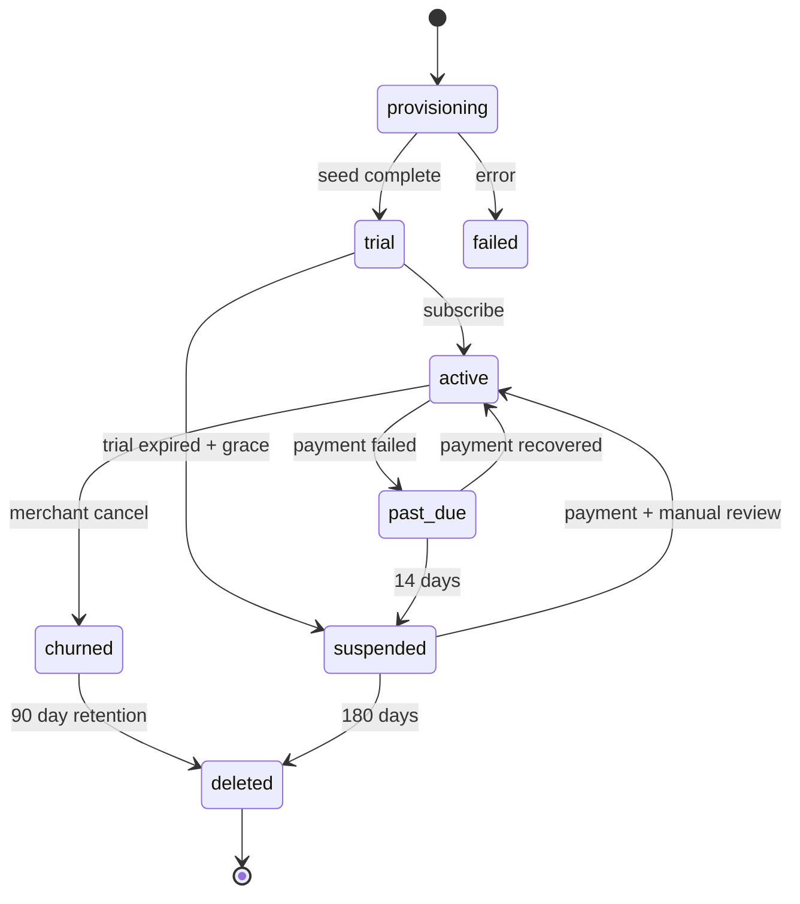
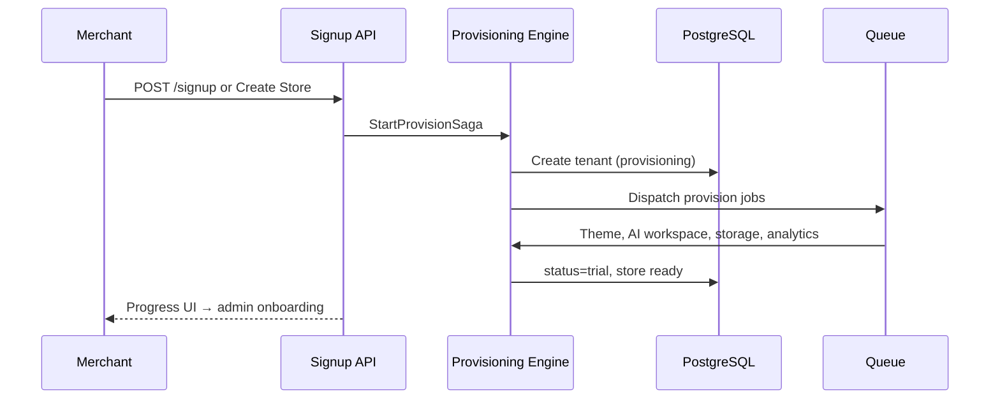

# Chapter 02: Tenant Lifecycle

**Document ID:** SCP-SAAS-001-02  
**Version:** 1.0.0  
**Status:** ✅ Active  
**Traceability:** ADR-002, NFR-040, NFR-083, FR-TEN-001–008

---

## Purpose

Define **tenant lifecycle states**, provisioning, suspension, deletion, and data handling — aligned with NDPA subject rights for Nigeria merchants.

## Scope

- Tenant state machine
- Signup and provisioning pipeline
- Trial conversion
- Suspension and reactivation
- Tenant deletion and data export
- Impersonation (platform admin)

## Out of Scope

- Merchant customer lifecycle (Volume 5 CRM)
- Vendor lifecycle (Volume 8)

---

## 1. Tenant State Machine

---

## 2. Provisioning Pipeline

Orchestrated by **Tenant Provisioning Engine (TPE)** — see [Chapter 10](./10-tenant-provisioning-engine.md) (ADR-022).

**SLA:** Store ready for customization within **60 seconds** p95 (async jobs may continue for AI content).

### 2.1 Default Seed

| Item | Default |
|------|---------|
| Theme | Lagos |
| Currency | NGN |
| Timezone | Africa/Lagos |
| Sample products | 3 (deletable) |
| Pages | About, Contact |
| Payment | Paystack test mode |

---

## 3. Onboarding (AI-Guided)

Per [Chapter 09 — AI-Guided Merchant Onboarding](./09-ai-guided-merchant-onboarding.md) (ADR-021):

| Step | Required for GA store |
|------|----------------------|
| Complete AI business interview (or manual equivalent) | Yes |
| Paystack connect live (Nigeria) | Yes |
| First real product | Yes |
| Shipping zone | Yes |
| Privacy policy page | Yes (NDPA) |
| Readiness score ≥ threshold | Yes |

Starter flow target: draft store ≤ 60s after interview; go-live ≤ 45 min.

---

## 4. Suspension

| Trigger | Behavior |
|---------|----------|
| Trial expired | Storefront read-only banner |
| Payment past due 14d | Admin read-only; storefront offline |
| Abuse / fraud | Immediate suspend all surfaces |
| NDPA breach investigation | Platform admin suspend |

Storefront shows: "This store is temporarily unavailable."

---

## 5. Deletion & NDPA

| Phase | Timeline | Data |
|-------|----------|------|
| Cancel | Day 0 | `churned`; export offered |
| Retention | 90 days | Restorable on request |
| Hard delete | Day 90 | Cascade tenant data |
| Audit logs | 7 years | Anonymized tenant ID |
| Billing records | 7 years | Legal retention |

**Export:** Self-serve JSON/CSV within 48h (NFR-083).

---

## 6. Platform Admin Impersonation

Per ADR-010:

- MFA required
- Audit: `impersonation.start`, `impersonation.end`
- Banner visible to impersonated session
- Max duration 2 hours
- Merchant notification email optional Phase 2

---

## 7. Events

| Event | Consumers |
|-------|-----------|
| `TenantProvisioned` | Analytics, welcome email |
| `TenantActivated` | Billing, success metrics |
| `TenantSuspended` | Storefront cache purge |
| `TenantDeleted` | R2 cleanup, search purge |

---

## 8. Acceptance Criteria

- [ ] State machine: provisioning, trial, active, past_due, suspended, churned, deleted
- [ ] Provisioning SLA 60s with default NGN/Lagos seed
- [ ] Suspension blocks storefront on payment failure
- [ ] Hard delete at 90 days with 7yr billing/audit retention
- [ ] NDPA export within 48h documented
- [ ] Impersonation audit per ADR-010
- [ ] Onboarding checklist for Nigeria GA store

---

## References

- [ADR-002 — Multi-Tenancy](../00-meta/adr/002-multi-tenancy-shared-db-rls.md)
- [Volume 11 — NDPA](../11-security/02-africa-regulatory-compliance.md)
- [Chapter 04 — Billing](./04-billing-and-invoicing.md)
