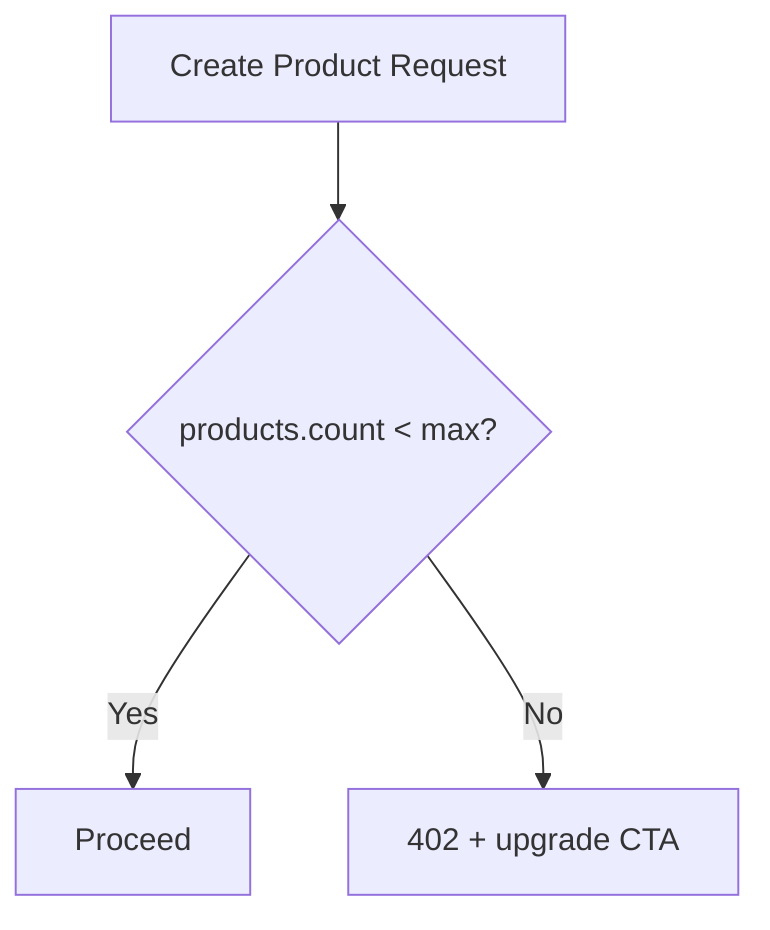

# Chapter 03: Plans & Entitlements

**Document ID:** SCP-SAAS-001-03  
**Version:** 1.0.0  
**Status:** ✅ Active  
**Traceability:** PRD-003, NFR-013, Volume 10 Ch. 11

---

## Purpose

Define **subscription plans**, **entitlements**, and **quotas** for SCP merchants — mapping commercial tiers to enforceable technical limits.

## Scope

- Plan catalog (Nigeria NGN)
- Entitlement keys and quota types
- Plan comparison matrix
- Upgrade/downgrade rules
- Grandfathering policy

## Out of Scope

- Promotional coupon mechanics (marketing)
- Enterprise custom contracts (Volume 15 Ch. 07)

---

## 1. Plan Catalog (Phase 1 Nigeria)

| Plan | Monthly (NGN) | Annual (NGN) | Target Merchant |
|------|---------------|--------------|-----------------|
| **Starter** | ₦15,000 | ₦150,000 (2 mo free) | Solo, new business |
| **Growth** | ₦45,000 | ₦450,000 | SME, growing GMV |
| **Pro** | ₦150,000 | ₦1,500,000 | Established brand |
| **Enterprise** | Custom | Custom | Chain, institution |

Prices include VAT display where merchant registered.

---

## 2. Entitlement Matrix

| Entitlement Key | Starter | Growth | Pro | Enterprise |
|-----------------|---------|--------|-----|------------|
| `stores.max` | 1 | 5 | 20 | Unlimited |
| `products.max` | 100 | 1,000 | 10,000 | Unlimited |
| `staff.max` | 2 | 10 | 50 | Custom |
| `warehouses.max` | 1 | 3 | 10 | Custom |
| `storage.gb` | 5 | 50 | 500 | Custom |
| `domains.custom` | 0 | 1 | 5 | Unlimited |
| `marketplace.enabled` | — | ✅ | ✅ | ✅ |
| `cms.advanced` | — | ✅ | ✅ | ✅ |
| `ai.tokens.monthly` | 10,000 | 100,000 | 1,000,000 | Custom |
| `api.rate_limit` | 60/min | 120/min | 300/min | Custom |
| `webhooks.max` | 3 | 10 | 50 | Custom |
| `themes.custom` | 1 | 3 | Unlimited | Unlimited |
| `courses.max` | — | 10 | 100 | Unlimited |
| `vendors.max` | — | 20 | 200 | Custom |
| `support.tier` | email | priority | phone | dedicated |
| `analytics.retention_days` | 30 | 90 | 365 | Custom |
| `transaction.fee.percent` | 0.5% | 0.3% | 0.1% | Negotiated |

---

## 3. Entitlement Enforcement

| Enforcement Point | Pattern |
|-------------------|---------|
| TPE | `stores.max` on create store ([Ch. 10](./10-tenant-provisioning-engine.md)) |
| Middleware | Feature booleans (`marketplace.enabled`) |
| Use case | Quota counters (`products.max`) |
| Cron | Soft warnings at 80% quota |

Cache entitlements in Redis: `t:{id}:entitlements` TTL 5 min; invalidate on plan change.

---

## 4. Upgrade / Downgrade

| Change | Timing | Proration |
|--------|--------|-----------|
| Upgrade | Immediate | Prorated charge NGN |
| Downgrade | End of billing period | No refund |
| Downgrade over quota | Block until compliant | Merchant must archive excess |

---

## 5. Transaction Fee

Platform fee on GMV (not subscription) — collected via weekly invoice or deducted from Paystack settlement (Phase 2).

| Plan | Fee | Cap |
|------|-----|-----|
| Starter | 0.5% | ₦50,000/mo |
| Growth | 0.3% | ₦200,000/mo |
| Pro | 0.1% | — |

Transparent dashboard: "Platform fee this month: ₦X."

---

## 6. Grandfathering

| Scenario | Policy |
|----------|--------|
| Price increase | 90-day notice; 12-month grandfather optional |
| Feature moved to higher tier | 6-month grace access |
| Plan deprecated | Migrate to nearest tier |

---

## 7. Acceptance Criteria

- [ ] Four plans with NGN monthly/annual pricing
- [ ] Entitlement matrix ≥ 15 keys across plans
- [ ] 402 response on quota exceed
- [ ] Upgrade immediate with proration; downgrade end of period
- [ ] Transaction fee per plan documented
- [ ] Redis entitlement cache with invalidation
- [ ] Grandfathering notice periods stated

---

## References

- [Chapter 05 — Usage Metering](./05-usage-metering.md)
- [Volume 10 Ch. 11 — Cost Models](../10-infrastructure/11-cost-models.md)
- [Volume 8 — Marketplace](../08-marketplace/README.md)
